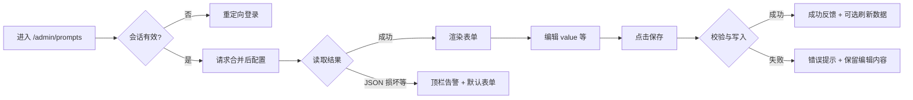

# 设计说明：提示词管理（`/admin/prompts`）

## 文档信息

| 项 | 内容 |
| --- | --- |
| 版本 | `0.0.4` |
| 对应 PRD | `iterations/0.0.4/product/prd-prompt-management.md` |
| 管理后台壳对齐 | `iterations/0.0.3/design/spec-admin-console.md`（ProLayout、深色主题、PageContainer、a11y、响应式） |
| 范围 | 替换 `src/app/admin/prompts/page.tsx` 占位，实现「合并配置展示 + 表单编辑 + 保存」的交互与视觉规范 |

---

## 与壳层一致性（硬约束）

- **布局**：页面仍为 admin 子路由，外层 **ProLayout** 不变；内容区使用 **`PageContainer`**，`ghost` 是否与占位页一致由前端与壳统一（建议与现页一致 `ghost`，减少内容区双层卡片感）。
- **标题**：`title="提示词管理"`，与侧栏「提示词管理」及 `spec-admin-console.md` §6.2 一致。
- **主题**：继承 admin **ConfigProvider 深色 token**，表单、按钮、Alert、Tooltip、Input 均走 antd 深色变量，**不使用**浅色 `EmptyStateCard` 作为主容器。
- **响应式 / 无障碍**：遵循壳文档 §6、§7、§8：窄屏内容区全宽、可横向滚动兜底；表单控件可 Tab 聚焦、可见焦点环；说明文案与 `lang="zh-CN"` 一致。

---

## 1. 流程与页面

### 1.1 用户主流程

### 1.2 页面信息架构（对应 PRD **D1**）

| 区域（自上而下） | 内容 | 说明 |
| --- | --- | --- |
| **PageContainer 标题区** | 标题「提示词管理」 | 可选 `subTitle`：一句「查看与编辑运行时提示词模板（与 `data/promptConfig.json` 合并）」；**非必须**，避免与 PRD 冲突时可省略 |
| **全局告警区（条件）** | `Alert` | 仅在「JSON 无法解析」等**整文件级**问题时展示（见 §3）；与 US-3 一致 |
| **表单主体** | 按 **权威 key 列表**（与 `DEFAULT_PROMPT_CONFIG` 的 key 顺序一致）**纵向排列** | **单列布局**：每个 key 一块表单项组，便于长文案扫描；key 数量少时无需 Tabs/折叠分组 |
| **每项结构** | 标签行 + `value` 编辑区 + 可选辅助行 | 见 §2.1 |
| **页脚操作区** | 主按钮「保存」+ 可选「重置为当前已加载值」 | 见 **D4** |
| **页尾说明区（可选）** | 占位符简短说明 | 对应 **D6** |

**长 `value` 策略（D1 落实）**：

- 使用 **`Input.TextArea`**（antd），**默认 `autoSize={{ minRows: 6, maxRows: 20 }}`**：短内容不占过高，极长时在 **20 行后内部滚动**，避免单屏无限拉长。
- **不**对单项做「折叠/展开」首屏隐藏（运营需直接看到正文）；若未来 key 增多再考虑 `Collapse` 按分组折叠，**本期以单列 + TextArea 滚动为主**。

### 1.3 路由与鉴权

- 与 PRD **F3**、壳 **§9** 一致：未登录 **不展示**本页业务表单，**redirect** 至 `/login?redirect=/admin/prompts`（或当前完整路径）。
- 本页**无**独立子路由；深链即 `/admin/prompts`。

---

## 2. 状态与交互

### 2.1 表单项结构（单 key）

| 元素 | 交互 / 展示 | 组件建议 |
| --- | --- | --- |
| **标签** | 展示合并后的 `name` | `Form.Item` 的 `label` |
| **说明（desc）** | 标签右侧 **问号图标**，**点击 / 聚焦 / hover** 出 **Tooltip**（见 **D2**） | `Tooltip` + `QuestionCircleOutlined` |
| **配置 key（可选展示）** | 次要信息：`camelCase` key，便于对照代码与文档 | 标签行尾或 `Form.Item` 下方 `Typography.Text type="secondary"` 小号字 |
| **value** | 多行编辑，占位符原样 | `Input.TextArea` |

**可编辑字段（与 PRD §5 待确认对齐的设计默认）**：

- **推荐默认**：**仅 `value` 可编辑**；`name` / `desc` 仅用于展示（标签 + Tooltip），**不在表单内提供**对 name/desc 的输入框。  
- **若产品改确认**：改为 `name`、`desc` 同步可编辑并写回 JSON 时，在每项下增加两行 `Input` / `TextArea`（desc 可仍用多行），并调整校验与保存 payload 说明。  
- **标注**：以上为实现前推荐交互默认，**若产品改确认则调整**。

### 2.2 Tooltip（对应 **D2**）

- **触发方式（推荐默认）**：**问号图标**触发为主（避免长 `desc` 在 hover 时误触）；图标需 **`tabIndex={0}` + `onKeyDown`（Enter/Space）** 可键盘打开（与 a11y 一致）。  
- **若产品改确认**：可改为标签整体 hover 出 Tooltip，但长文案仍建议保留图标或「查看说明」链接。  
- **样式**：`overlayStyle={{ maxWidth: 420 }}`（或 token 等价），`desc` 超出高度时 **Tooltip 内滚动**（antd Tooltip 内容区可包一层 `div` 设 `max-height` + `overflow-y: auto`）。  
- **空 desc**：不展示问号图标（或展示禁用态图标 + Tooltip「暂无说明」——**推荐直接隐藏图标**）。

### 2.3 保存操作（对应 **D4**）

| 项 | 推荐默认 | 说明 |
| --- | --- | --- |
| 提交粒度 | **整表一次保存** | 降低并发写文件风险；与 PRD 待确认表「默认倾向」一致 |
| 按钮位置 | **表单下方右侧**（`Form` 的 `footer` 或 `Space` 右对齐） | 符合 admin 表单习惯；移动端全宽堆叠时主按钮仍置顶或置底由前端按断点微调 |
| 主按钮文案 | 「保存」 | 成功后可短暂改为「已保存」或依赖 `message.success` |
| Loading | 提交中 **主按钮 `loading`**，**可选**整表 `disabled` 防重复改 | 避免双次提交 |
| 禁用态 | 初始加载完成前保存按钮 **disabled** 或隐藏 | 与加载态区分 |

**若产品改确认**：若改为「分 key 保存」，每项增加次要按钮「保存此项」，并需在设计中补充并发与文件锁提示（由后端文档细化）。

### 2.4 默认态

- 进入页面：展示**上一次成功加载的合并结果**；首次进入在数据返回前为 **加载态**（见下）。

### 2.5 加载态

- **首屏拉取配置**：内容区可用 **`Spin` 包裹表单区域**或 **Skeleton**（2～3 行占位），**不**使用假数据表单，避免闪烁误导。
- **保存中**：主按钮 loading；可选顶部细 **Progress** 非必须。

### 2.6 空态

- **无业务空列表**：本期 key 集合由常量决定，**不存在「零 key」空表」**；若未来常量为空，展示 `Empty` + 文案「暂无配置项，请联系开发扩展 DEFAULT_PROMPT_CONFIG」。
- **文件不存在**：不属于空态，属于**成功合并**（全默认），表单正常展示，**无需** Empty。

### 2.7 错误与边界（对应 **D5**、US-3）

| 场景 | 用户可见反馈 | 行为 |
| --- | --- | --- |
| **JSON 文件无法解析**（整文件坏） | 顶部 **`Alert` `type="warning"` 或 `error"`**（按后端最终策略），文案示例：「配置文件无法解析，已使用内置默认提示词。保存将按当前表单生成合法配置（若允许写回）。」 | 表单仍展示 **合并降级结果**（与 PRD US-3 AC1 倾向一致：**提示错误 + 各 key 回退默认**） |
| **某 key 字段缺失 / 类型非法** | **单项不崩溃**；缺失字段用默认补齐，**不打断整表**（F1） | 可选：在对应项下 `Form.Item` `help` 灰色提示「部分字段已用默认值填充」（**非必须**，避免噪讯时可省略） |
| **网络错误 / 5xx** | `message.error` + 简短原因；表单 **保留用户已编辑内容** | 提供「重试」可二次拉取（按钮或 `Result` 次要操作） |
| **保存校验失败**（空 value 等） | **字段级 `validateStatus` + `help`**；同时可 `notification` 汇总 | 与 US-2 AC2 一致 |
| **权限不足 / 401** | 与壳一致跳转登录；**403** 用 `Result` 403 或 Alert「无权保存」 | 只读展示可由后端决定；设计预留 **保存按钮 disabled + Tooltip「无权限」** |
| **磁盘写入失败** | `message.error` / `Modal.error` 明确「保存失败，请稍后重试或联系运维」 | 不清空表单 |

**PRD §5 JSON 校验策略的设计默认**：

- **推荐默认**：坏文件时 **Alert + 表单展示全量默认合并结果**，用户可编辑后 **尝试保存修复**（若实现允许写回覆盖坏文件）。  
- **若产品改确认**：改为「禁止保存直至运维修复文件」时，保存按钮 **disabled** + Alert 内说明。  
- **标注**：**若产品改确认则调整**。

### 2.8 成功反馈

- **保存成功**：`message.success('保存成功')`（或 `notification` 若需附「重启后生效」说明——见 §4.2）。  
- **可选**：保存后 **重新请求**合并结果，使 UI 与文件一致（由前端与 API 约定）。

---

## 3. 设计说明（布局、组件、断点、a11y）

### 3.1 布局与间距

- 表单最大宽度：**`maxWidth: 960px`** 内内容区居中或左对齐（admin 内容区已有限宽时跟随容器）；**避免**过宽行导致难读。
- 表单项 **`labelCol` / `wrapperCol`** 与 admin 其他未来表单页对齐（建议 24 栅格下 **label 6 / wrapper 18** 或可全宽垂直排列 **label 在上**）；长 TextArea 建议 **垂直布局**（标签置顶）以减少折行。
- 项与项之间 **`margin-bottom: 24px`**（antd `Form.Item` 默认即可）。

### 3.2 组件选型（antd / ProComponents）

| 用途 | 组件 |
| --- | --- |
| 页面容器 | `@ant-design/pro-components` **`PageContainer`** |
| 表单 | **`Form`**（antd）；若团队统一 ProForm 亦可，但本期字段为固定 key，**原生 Form + map** 足够 |
| 多行编辑 | **`Input.TextArea`** |
| 说明展示 | **`Tooltip`** + **`Typography`** |
| 全局告警 | **`Alert`** |
| 加载 | **`Spin`** |
| 成功/失败轻反馈 | **`message` / `notification`** |
| 图标 | `@ant-design/icons` |

与壳 **深色主题** 一致：**不**自定义浅色输入框背景 unless token 已统一。

### 3.3 断点（与壳 §6 一致）

| 断点 | 行为 |
| --- | --- |
| **≥ 992px** | 常规模块宽度；保存按钮右对齐 |
| **768px–991px** | 表单仍单列；侧栏行为遵循壳 |
| **< 768px** | 抽屉侧栏下，表单 **全宽**；保存按钮 **宽度 100%** 或底栏固定（二选一，推荐 **全宽主按钮** 便于触控） |

### 3.4 无障碍（a11y）

- 每个 **`Form.Item`** 关联 **`htmlFor` / `id`**，屏幕阅读器可读标签与说明。
- 问号图标：`aria-label="查看说明：{name}"` 或「关于此项的说明」；Tooltip 打开时焦点管理符合 antd 默认行为即可。
- **错误**：`role="alert"` 由 `Form` 校验错误自动关联；全局 Alert 使用语义化标题。
- **`prefers-reduced-motion`**：不新增强依赖动画；若有展开动效须减弱（与壳 §8.2 一致）。

### 3.5 占位符说明（**D6**）

- **推荐默认**：在表单下方增加 **`Alert type="info"` `showIcon`** 或 **`Collapse` 默认折叠**「占位符说明」，文案示例：「正文支持占位符，需与业务约定一致；当前示例：`{{content}}`（摘要内容注入点）。」  
- 内容以后端/产品最终占位符列表为准；若仅 `{{content}}` 可写死。  
- **若产品改确认**：可下放到每项 `extra` 或取消整块说明。

---

## 4. 与 PRD「待确认」的设计默认值汇总（§5）

以下与 PRD 第 5 节对应，便于产品一次性确认；**凡标注「若产品改确认则调整」的条目，以后续产品决策为准**。

| PRD 主题 | 设计推荐默认 | 备注 |
| --- | --- | --- |
| 持久化 | 交互上按「保存写回文件」呈现：成功提示 + 再次进入可读最新 | 只读文件系统等由后端/运维决定；**若不改写文件则隐藏或禁用保存并改文案** |
| 可编辑字段 | **仅 `value` 可编辑**；`name`/`desc` 只读展示 | 若产品改确认则增加表单项 |
| 运行时生效 | 成功提示可附 **次要说明**（小字或 `notification` description）：「实际生效时间取决于部署与进程加载方式。」 | 是否强制重启由产品/文档决定 |
| 权限与审计 | 无额外 UI；错误态见 §2.7 | — |
| JSON 校验 / 坏文件 | **Alert + 默认表单 + 允许保存修复**（倾向） | 若产品改确认则禁用保存 |
| 多环境 | 无界面差异；可选页脚灰字「配置文件路径：`data/promptConfig.json`」**仅开发/内部环境显示**（实现可选） | 与运维约定 |

---

## 5. 需求追溯矩阵

### 5.1 用户故事与验收标准

| US / AC | 设计落实 |
| --- | --- |
| **US-1** | §1 流程、§1.2 IA、§2.1 标签/desc/value 展示、§2.6 无「无文件」空态 |
| **US-1 AC1** | key 集合与顺序绑定常量展示（界面不展示动态增删） |
| **US-1 AC2～AC3** | 合并结果即表单初值（加载成功态）；不依赖用户理解文件是否存在 |
| **US-1 AC4** | `name`→label，`desc`→Tooltip，`value`→TextArea |
| **US-2** | §2.1、§2.3、§2.8；占位符不转义为前端约束（不引入会剥离字符的富文本） |
| **US-2 AC1** | `Input.TextArea`，纯文本 |
| **US-2 AC2** | §2.7 校验展示 |
| **US-2 AC3** | 成功反馈 + 建议保存后 refetch |
| **US-3** | §2.7 整文件错误 + 默认回退；§4 JSON 策略 |
| **US-3 AC1** | Alert + 默认表单 |
| **US-3 AC2** | 不整表失败；缺失字段默认补齐（无额外阻断 UI） |

### 5.2 待设计项 D1～D6

| ID | 落实章节 |
| --- | --- |
| **D1** | §1.2 单列、TextArea `minRows`/`maxRows` |
| **D2** | §2.2 问号 Tooltip、maxWidth、滚动 |
| **D3** | §2.1 次要展示 key |
| **D4** | §2.3 整表保存、按钮位置、loading |
| **D5** | §2.7 分场景 Alert / message / Result |
| **D6** | §3.5 底部说明 |

### 5.3 功能范围（PRD §2）

| 编号 | 设计侧说明 |
| --- | --- |
| **F1** | 初值与展示即合并结果，不单独做「源码/合并」双视图 |
| **F2** | 同 US-1 AC4 |
| **F3** | §1.3 |
| **F4** | §2.7 与字段校验呈现 |

---

## 6. 与下游的交接说明

- **后端**：保存 payload 结构、坏文件策略、是否写完整对象或仅 diff，以 `iterations/0.0.4/backend/` 为准；本设计假设存在「读取合并配置」「提交整表保存」类 API（路径与方法由后端定义）。
- **前端**：替换 `AdminModulePlaceholder`，实现 §1～§3；常量 `DEFAULT_PROMPT_CONFIG` 的 key 为表单项数据源。
- **验收**：产品可按 §5 矩阵对 UI 走查；与 PRD 成功指标 §1.4 对齐。

---

## 7. 修订记录

| 版本 | 日期 | 说明 |
| --- | --- | --- |
| 0.0.4 | 2026-04-10 | 初稿：流程、状态、D1–D6、§5 待确认默认值、US 追溯 |
