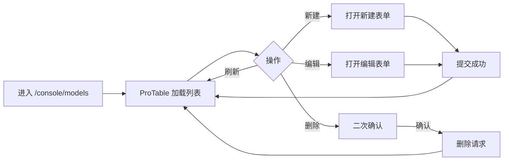

# 设计说明：控制台「模型管理」（0.0.8）

## 文档信息

| 项 | 内容 |
| --- | --- |
| 版本 | `0.0.8` |
| 对应 PRD | `iterations/0.0.8/product/prd-model-management.md` |
| 路由 | `/console/models` |
| 壳与基调 | 与现有控制台一致：`ConsoleShell` + `PageContainer`（`ghost`），与 `assistants` / `settings` / `knowledge` 等页同一模式（见 `src/app/console/*/page.tsx`） |
| 范围 | 本页 ProTable 列表、新建/编辑表单、**删除（二次确认）**及全链路状态；**不含**对话侧模型选用策略（PRD Out of Scope） |

---

## 需求追溯矩阵（US / AC）

| PRD 用户故事 | AC | 本文档章节 |
| --- | --- | --- |
| **US-1** 查看模型列表 | AC1–AC4 | §2、§3、§5、§6 |
| **US-2** 新增模型 | AC1–AC4 | §2、§4、§5、§6 |
| **US-3** 修改模型 | AC1–AC3 | §2、§4、§5、§6 |
| **US-4** 删除模型 | AC1–AC3 | §2、§3、§6 |
| PRD 待设计项 **D1–D6** | — | §2–§7 |
| PRD §5 待产品确认 | 设计侧默认见 **§8**（均标注为假设） | §8 |

---

## 1. 用户流程与页面结构（信息架构）

### 1.1 主流程

### 1.2 页面自上而下（对齐 D1）

与现有控制台子页一致：**单栏内容区**，不额外引入与侧栏重复的标题层级。

| 区域 | 说明 |
| --- | --- |
| **页头** | `PageContainer`：`title` = **模型管理**；`ghost` 与占位页及他页一致。可选 `subTitle` 一句：「管理已登记的 LLM 接入配置（Provider、模型名与密钥）。」——实现可省略以控复杂度。 |
| **工具栏**（ProTable `toolBarRender`） | **左侧**：主按钮 **「新建模型」**（`type="primary"`）。**右侧**：**「刷新」**（`icon` 建议 `ReloadOutlined`），行为为重新请求当前列表（分页参数保持不变，与 US-1 AC3 一致）。 |
| **主列表** | **ProTable**（`@ant-design/pro-components`），占满内容区宽度；表格外层与 `PageContainer` 内容区间距遵循 Pro 默认或与项目内 Pro 页一致。 |
| **分页** | 表格底部分页器：**页码** + **每页条数**；总条数展示以后端为准。数据量预期较小时可采用**前端分页**或**简单服务端分页**，由后端文档约定；设计侧要求两种方案下**刷新**行为一致（见 §3.3）。 |

### 1.3 与现有控制台的对齐点（快速参考）

- **壳**：`/console` 下页面均在 `ConsoleShell` 的 `ProLayout` 内容区渲染；本页**不**改变侧栏选中逻辑（菜单已有「模型管理」入口）。
- **页容器**：沿用 **`PageContainer` + `ghost` + `title="模型管理"`**，与当前 `models/page.tsx` 占位结构一致，仅将占位替换为 ProTable 区块。
- **文案语气**：控制台面向登录用户，与 `/admin` 运维后台区分；避免「系统账号运维」类 admin 专用措辞。

---

## 2. ProTable：列、操作、分页与刷新（对齐 D2）

### 2.1 列定义（建议顺序）

| 列 | 宽度建议 | 内容 | 展示组件 |
| --- | --- | --- | --- |
| **模型名称** | `minWidth` 160–200，可 `ellipsis` | 用户录入的展示名 | 纯文本；过长省略 + Tooltip `title` 全文 |
| **Provider** | 120–140 | 三键之一的人类可读名（见 PRD 附录） | **`Tag`** 着色区分（见下表）；**不用**自由文本 |
| **API Key** | 180–220 | 仅**脱敏**展示（见 §4） | 等宽或次要色文字；**不**展示完整明文 |
| **操作** | 固定右侧 ~140–180 | 单行操作 | **「编辑」**（`Button type="link"`，可加 `EditOutlined`）+ **「删除」**（`danger` 链接样式或 `DeleteOutlined`）；删除见 **2.3** |

**Provider → Tag 配色（建议，可随主题微调）**

| 键（提交值） | 展示文案 | Tag 建议 |
| --- | --- | --- |
| `ALYUN` | 阿里云百炼 | `color="blue"` 或 `cyan` |
| `GLM` | 智谱 | `color="purple"` 或 `geekblue` |
| `DEEPSEEK` | 深度求索 | `color="green"` 或 `lime` |

> 验收：列表中不得出现非三键的 Provider（US-1 AC4）；若后端返回异常数据，前端应拒绝展示未知键或显式「数据异常」态（与后端约定）。

### 2.2 可选列

若后端提供 **创建/更新时间**，可增加 **`updatedAt`**（或 `createdAt`）列，宽度固定、右对齐或次要色，便于排障；**非** US-1 硬性列，以 API 为准。

### 2.3 行操作

- **编辑**：打开 **第 5 节**所选载体（Modal），带入当前行 `id` 与可编辑字段。
- **删除**（对齐 US-4）：操作列提供 **「删除」**；使用 **`Popconfirm`**（或等价）二次确认，标题/描述建议包含 **模型名称** 与 **「删除后不可恢复」** 语义。确认后调用 `DELETE` API；**进行中**按钮 loading，避免重复提交。成功后面板 **刷新列表**（与第 3 节「删除成功」一致）；失败用 `message.error` 保留当前页数据。

### 2.4 分页与排序

- **默认排序**：建议按 `updatedAt` 降序（若后端支持）；否则按后端默认。
- **分页变更**：切换页码或 `pageSize` 后重新请求；保持与刷新按钮语义一致（当前查询条件下重拉数据）。

---

## 3. 分页 / 刷新行为（约定）

| 操作 | 行为 |
| --- | --- |
| **刷新**（工具栏） | 以**当前页码、每页条数、排序**为参数重新请求列表；成功后面板数据与后端一致（US-1 AC3）。 |
| **新建成功** | 关闭表单后 **刷新列表**；可选跳转到 **第一页** 以确保新记录可见（与后端排序约定一致时也可保持当前页）。 |
| **编辑成功** | 关闭表单后刷新当前页或仅更新当前行（以后端是否返回完整行决定）；最低要求：**列表反映最新数据**（US-3 AC3）。 |
| **删除成功** | 刷新列表；若当前页被删至空且 `page > 1`，建议 **回到上一页** 或请求 `page - 1`（与 ProTable 分页惯例一致，US-4 AC2）。 |

---

## 4. API Key：列表展示、编辑输入与「留空不变」（对齐 D3 + PRD §5）

### 4.1 列表脱敏（设计定稿）

- **默认**：仅展示**掩码**，例如保留 **前 4 + 后 4** 字符，中间固定为 `••••••`（长度不暴露真实密钥长度时可统一占位）；或统一展示为 **`********`（无首尾）** 若后端只返回布尔/无片段。
- **不提供**行内「显示完整密钥」开关：**假设**列表与列表接口**永不返回完整明文**（PRD §5 问题 5 —— 设计侧推荐，见 §8.5）。
- **可选增强**（非必须）：行内 **「复制」** 仅当产品明确允许复制**脱敏串**或**占位符**时再加；默认**不提供**复制完整 Key。

### 4.2 新建表单

- **API Key**：**`Input.Password`**（或 ProForm 等价），必填；**trim** 前后空格后再校验非空（与 US-2 AC2 一致）。

### 4.3 编辑表单

- **API Key**：仍使用 **`Input.Password`**。
- **「留空表示不修改」**（PRD §5 问题 3）  
  - **设计侧推荐默认（假设）**：支持 **留空 = 不更新密钥**；占位提示文案：**「留空则不修改已保存的 API Key」**（见 §8.3）。
- **若用户输入新值**：视为完整替换（仍 trim）。

### 4.4 可访问性

- Password 字段保持浏览器/屏幕阅读器对「敏感字段」的常规语义；错误提示见 §5.2。

---

## 5. 新建 / 编辑载体与表单（对齐 D4）

### 5.1 Modal vs Drawer（拍板）

| 方案 | 结论 |
| --- | --- |
| **Modal** | **推荐（本迭代采用）**：字段少（3 项），任务为短时填表提交；与控制台轻量操作心智一致，焦点循环与 ESC 关闭行为成熟。 |
| Drawer | 适合长表单或需对照列表；本场景非必须。 |
| 独立子页 | 增加路由与返回成本，**不推荐**。 |

**Modal 参数建议**：宽度 **520px**（或 `md` 断点下全宽减边距）；`destroyOnClose` 避免表单实例残留；`maskClosable={false}` 可选，避免误触关闭导致未保存（产品可放宽）。

### 5.2 字段顺序与标签

| 顺序 | 字段 | 控件 | 规则 |
| --- | --- | --- | --- |
| 1 | **Provider** | `Select`，三选项，**仅** `ALYUN` / `GLM` / `DEEPSEEK`；选项 **label** 为中文名，**value** 为英文键 | 必填（US-2 AC1） |
| 2 | **模型名称** | `Input` 单行文本 | 必填；trim；可设 `maxLength` 与后端一致 |
| 3 | **API Key** | `Input.Password` | 新建必填；编辑见 §4.3 |

### 5.3 校验与错误展示

- **即时校验**：失焦或提交时校验必填项；Provider 无自定义输入路径（US-2 AC4）。
- **错误展示**：表单项 **`help` + `validateStatus="error"`**（antd 惯例）；顶部可汇总一条 **`Alert type="error"`**（当后端返回 400 多字段错误时）。
- **提交中**：主按钮 **loading**，禁用重复提交；Modal **不**可因误点遮罩关闭（若采用 `maskClosable={false}`）。

### 5.4 标题与按钮

| 场景 | Modal `title` | 主按钮 | 次按钮 |
| --- | --- | --- | --- |
| 新建 | 新建模型 | 确定 / 创建 | 取消 |
| 编辑 | 编辑模型 | 保存 | 取消 |

---

## 6. 空态、加载、错误态（对齐 D5 + 全链路）

### 6.1 空列表（D5）

- 使用 **ProTable / Table 内置 `locale.emptyText`** 或包裹 **`Empty`**。
- **文案**：标题如 **「暂无模型配置」**；描述 **「点击右上角「新建模型」添加第一条接入配置。」**
- **主操作**：在空态区域提供 **`Button type="primary"`「新建模型」**，与工具栏「新建」同行为（打开同一新建 Modal）。

### 6.2 加载中

- ProTable **`loading`**：首屏与刷新时为 `true`；**骨架或 Spin** 以 ProTable 默认为准（避免整块白屏）。
- 工具栏「刷新」按钮可加 `loading` 与表格同步（可选）。

### 6.3 列表请求失败

- 表格上方 **`Alert type="error"`**：如 **「模型列表加载失败」** + 后端 message（若有）。
- 提供 **「重试」** 按钮，等价于再次执行列表请求。
- **401 / 403**：与控制台既有模式对齐（如 401 跳转登录、403 展示禁止提示）；具体与 `ConsoleShell` / API 约定一致，不在此重复实现细节。

### 6.4 提交失败

- **`message.error`** 展示原因；Modal **保持打开**，便于用户修正。
- **并发 / 版本冲突**（US-3 AC3）：若后端返回 409 等，Alert 或 message 明确提示 **「数据已被更新，请刷新后重试」**，并提供刷新列表入口。

---

## 7. 响应式（对齐 D6）

| 断点 / 场景 | 策略 |
| --- | --- |
| **桌面** | 表格列完整展示；操作列固定在右侧（`fixed: 'right'`）可选，列不多时可不固定。 |
| **窄屏 / 小宽度** | `ProTable` 设置 **`scroll={{ x: 最小宽度 }`**（建议最小总宽约 **640–720px**），出现**横向滚动条**，避免挤压不可读。 |
| **Modal** | 小屏下宽度 **`calc(100vw - 32px)`** 或 antd Modal 默认自适应。 |

若项目后续有统一「控制台表格断点」规范，以实现为准，本设计以上述为最低要求。

---

## 8. PRD「待产品确认」— 设计侧推荐默认（均为假设）

以下供后端 / 前端实现时收敛口径；**若产品变更，以产品为准并回写 PRD**。

| # | PRD 问题 | 设计侧推荐默认 | 标注 |
| --- | --- | --- | --- |
| 1 | 删除 / 停用 | **已采纳产品决策：本期提供删除**；**物理删除**（与 API `DELETE` 一致）；**无「停用」态**。交互：**Popconfirm** 二次确认。若未来需审计追溯，可再评估软删除 + `deletedAt`。 | 已与 PRD / `api-spec` 对齐（2026-04-12） |
| 2 | Provider 是否可改 | **允许在编辑时修改 Provider**（Select 与新建一致），便于纠正误选。 | 假设：与 US-3「更换 Provider」叙述一致；若其他模块引用模型 ID，由后端保证引用稳定性。 |
| 3 | API Key 编辑回显 | **编辑时不回显明文**；仅展示 §4.1 掩码或占位；**留空提交表示不修改密钥**；若需改键则重新输入完整新 Key。 | 假设 |
| 4 | 权限 | **凡能进入控制台 `/console` 的登录用户均可管理模型**（与当前无角色拆分一致）。 | 假设：与 PRD 依赖表「单用户/单租户」一致；后续若分角色，再在菜单或 API 层限制。 |
| 5 | 密钥安全 | **列表接口与前端列表均不展示完整明文**；审计日志本期**不**额外规定 UI（属合规扩展）。 | 假设 |

---

## 9. 与 Pro Components 的对接提示（非代码）

- 列表：**`ProTable`** + `request` 或受控 `dataSource` + 手动 `loading`（与项目惯例一致即可）。
- 表单：可用 **`ModalForm` / `DrawerForm`**（若选 Modal）或 `Modal` + **`ProForm`** 组合，保证 **`onFinish` 提交**与 **`modalProps` 行为**统一。
- **Provider 枚举**：在表单与表格 **`valueEnum`** 或统一常量映射中维护 **键 → 中文名**，避免散落字符串。

---

## 10. 修订记录

| 日期 | 版本 | 说明 |
| --- | --- | --- |
| 2026-04-12 | 0.0.8 | 初稿：阶段 2 设计说明（D1–D6、US/AC 映射、待确认项设计默认） |
| 2026-04-12 | 0.0.8 | 增补 US-4：操作列删除 + Popconfirm；主流程图含删除；第 8 节删除策略改为物理删除 |
