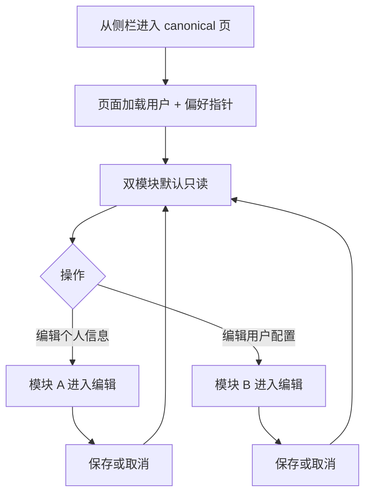

# 设计说明：控制台「个人信息 + 用户配置」合并页（0.0.9）

## 文档信息

| 项 | 内容 |
| --- | --- |
| 版本 | `0.0.9` |
| 对应 PRD | `iterations/0.0.9/product/prd-profile-settings.md` |
| 壳与基调 | 与现有控制台一致：`ConsoleShell` + `ConfigProvider` 的 `shellDarkTheme`；子页使用 `PageContainer` + `ghost`，信息密度与 `src/app/console/models/page.tsx` 等页对齐（`max-w-[1400px]` 内容区可参考） |
| 关联 | 与 `0.0.8`「模型管理」衔接：用户配置模块的候选项与列表展示规则与 `/console/models` 数据源一致（`UserModelConfig`） |

---

## 需求追溯矩阵（US / AC）

| PRD 用户故事 | AC 要点 | 本文档章节 |
| --- | --- | --- |
| **US-1** 单页只读查看 | 默认只读、邮箱只读、昵称/手机空态、配置摘要、无登记空态 | §1、§3、§4、§5、§6 |
| **US-2** 编辑个人信息 | 显式进入编辑、邮箱不可编辑、保存/取消、错误提示 | §2、§3、§4 |
| **US-3** 编辑用户配置 | 显式进入编辑、仅已登记项、不输入密钥、持久化反馈 | §2、§3、§4、§5 |
| **US-4** 导航与入口 | 至少一入口、双 URL 一致性 | **§7（路由/菜单拍板）**、§1 |
| PRD **§6 待设计项 D1–D6** | — | §5–§10 |
| PRD **§7 待确认** | 设计侧默认（假设） | **§11** |

---

## 1. 用户流程与信息架构

### 1.1 主流程（概览）

- **进入**：用户从控制台侧栏进入本页（见 §7 路由方案）；首屏并行或串行拉取「当前用户资料」与「偏好模型配置 id / 列表」。
- **默认**：两模块均为**只读**；无「全局整页编辑」模式。
- **退出编辑**：每模块独立 **保存** 成功或 **取消** 后回到只读；取消丢弃该模块未提交变更。

### 1.2 页面自上而下（模块顺序）

与 PRD「单页双模块」一致，采用**单栏纵向堆叠**（对齐 D1、与 `models` 页单栏习惯一致）：

| 顺序 | 区域 | 说明 |
| --- | --- | --- |
| 1 | **页头** | `PageContainer`：`ghost`；`title` 与侧栏主入口文案一致（见 §7，推荐为合并后的名称，如「账号与偏好」）。可选一行 `subTitle` 简述页用途（实现可省略）。 |
| 2 | **模块一：个人信息** | 卡片或带标题的内容块（建议 `Card` / `ProCard` 与控制台密度一致）；标题：**个人信息**。 |
| 3 | **模块二：用户配置** | 同上；标题：**默认模型配置**（或产品与 §11 语义确认后的最终文案）。 |

**不推荐**左右分栏作为主布局：控制台内容区在 `lg` 断点侧栏存在时宽度有限，双栏会导致表单项与选择器过窄；若未来需在超宽屏增强，可作为 P2 响应式增强，本期以**上下分区**为准。

---

## 2. 预览 / 编辑切换（落实 D2）

### 2.1 推荐：**模块级**独立编辑（非整页统一编辑）

| 维度 | 决策 |
| --- | --- |
| 粒度 | **每个模块一套**「编辑 → 保存 / 取消」；两模块的编辑态**互不强制联动**（允许「只改个人信息」或「只改默认模型」）。 |
| 只读展示 | **个人信息**：`Descriptions` 或「标签 + 文本」行布局；**用户配置**：一行摘要（见 §5.3）。 |
| 进入编辑 | 模块工具栏右侧主操作：**编辑**（`Button`，可选 `EditOutlined`）。 |
| 编辑态 | 该模块内切换为 `Form`（个人信息）或 `Select` + 辅助说明（用户配置）；**邮箱**使用 `Input` `disabled` 或只读展示，**不提供**可编辑样式。 |
| 操作栏 | **保存**（`type="primary"`）+ **取消**（`default`）；保存中按钮 `loading`，禁用重复提交。 |

**理由**：与 PRD「默认只读、明确操作再改」一致；与 `models` 页「表格 + 独立弹窗编辑」的心智相近（局部编辑、局部提交）；避免「整页编辑」时一半字段未改却需理解整页提交的歧义。

### 2.2 未保存离开是否拦截

| 场景 | 行为 |
| --- | --- |
| **模块内取消** | 直接丢弃该模块草稿，回到只读，**不**弹窗（变更未提交）。 |
| **浏览器刷新 / 关闭标签** | 若该模块处于编辑态且表单相对初始状态有脏数据，使用 `beforeunload` 提示（浏览器原生文案）；实现成本与收益由前端权衡，**设计接受**「仅提示、不阻断路由」的降级。 |
| **同页切换到另一模块编辑** | 允许；两模块脏数据独立。若产品要求强一致，可升级为「另一模块进入编辑前提示」，列为 **P1**，本期不强制。 |
| **离开控制台去其他路由** | 与刷新类似：有脏数据时尽力提示；**不**强制 Modal 阻断（与 Next.js 客户端路由组合成本较高），PRD P0 以「取消即丢」为主。 |

---

## 3. 状态总表（加载 / 只读 / 编辑 / 错误）

两模块分别维护状态机，下表为**单模块**抽象。

| 状态 | 个人信息模块 | 用户配置模块 |
| --- | --- | --- |
| **初始加载** | 骨架或 `Spin`（建议与 `models` 首屏一致，避免整块白屏）；不展示可编辑控件。 | 同上；若依赖列表接口，可与 profile 并行请求。 |
| **加载失败** | `Alert` `type="error"` + **重试**按钮；模块级，不拖死整页另一模块（若另一模块已成功，仍可只读展示）。 | 同上。 |
| **只读（默认）** | 展示昵称、邮箱、手机；空字段见 §6。 | 展示当前选中项摘要或空态。 |
| **编辑中** | 表单可编辑（邮箱除外）；显示 保存/取消。 | `Select` 或单选列表；显示 保存/取消；无密钥输入。 |
| **保存中** | 保存按钮 loading，表单禁用。 | 同上。 |
| **保存失败** | `message.error` + 服务端文案；保持编辑态以便修正。 | 同上。 |
| **保存成功** | `message.success`，回到只读并刷新展示。 | 同上。 |

**401**：与现有控制台一致，跳转登录并带 `redirect`（实现参照 `models/page.tsx`）。

---

## 4. 与现有控制台的对齐（实现约束）

| 项 | 说明 |
| --- | --- |
| **壳** | `ConsoleShell`：`shellDarkTheme`、`ProLayout` 内容区背景 `#0a0a0f`、padding 已由壳统一，本页不再额外覆盖页面背景色。 |
| **页容器** | `PageContainer` + `ghost` + 单一 `title`，与 `models/page.tsx` 一致。 |
| **内容最大宽度** | 建议外层 `div` 使用 `className="max-w-[1400px]"`（与模型管理页一致），避免表单在超宽屏过度拉伸。 |
| **组件库** | Ant Design + Pro Components；图标风格与 `models` 页统一（`@ant-design/icons`）。 |
| **可访问性** | 主内容区已有「跳到主要内容」链接；表单控件需 `label`；保存/取消在编辑态内可被键盘聚焦。 |

---

## 5. 单页双模块布局细节（落实 D1）

- **页面总标题**：与侧栏合并项一致（§7），**不**再为两个模块各设一级 `PageContainer` 子标题重复页面标题。
- **模块标题**：二级标题使用 `Card` 的 `title` 或 `Typography.Title` level 5，与 Pro 卡片密度一致。
- **模块间距**：模块之间 `margin-bottom` 建议 16–24px（与 `PageContainer` 子元素间距习惯一致）。

---

## 6. 用户配置：选择控件与只读摘要（落实 D3）

### 6.1 只读态摘要

与模型管理列表可区分逻辑一致，至少展示：

- **Provider**：使用与 `models/page` 相同的 **Tag** 规则（`providerTagProps` / `MODEL_PROVIDER_OPTIONS` 人类可读名）。
- **模型名称**：`modelName` 文本；过长 `ellipsis` + `Tooltip`。

可选：末尾展示简短 `id` 后四位（调试用，产品可关），**默认不展示**。

### 6.2 编辑态控件

| 方案 | 说明 |
| --- | --- |
| **推荐** | **`Select`**（`showSearch`，按 provider/modelName 过滤）；选项列表为当前用户已登记 `UserModelConfig` 行；选项 `label` 建议为「`[ProviderTag] modelName`」与列表视觉一致。 |
| **备选** | **单选列表**（`Radio.Group` + 每行 Tag + 名称）：候选项 ≤5 时更直观；项多时占用纵向空间，不如 Select。 |

**禁止**：在本模块内出现 API Key 输入框或完整密钥展示（PRD 明确）。

---

## 7. 路由与菜单拍板（落实 D4）

### 7.1 方案对照（PRD A / B / C）

| 方案 | 做法 | 优点 | 缺点 |
| --- | --- | --- | --- |
| **A** | 保留「个人信息」「用户配置」**两项**菜单，`path` 均指向**同一** canonical URL | 用户原有两个心智入口仍可见 | 侧栏**两项同路径**时，ProLayout 高亮可能异常或双高亮，需自定义 `selectedKeys`；**信息重复** |
| **B** | **合并为一项**菜单（如「账号与偏好」），单一 canonical 路径 | 结构清晰、侧栏高亮唯一 | 需处理旧路径书签 |
| **C** | 单一路由，另一路径 **301/302** | 书签与外链可统一到新 URL | 与 B 常组合使用 |

### 7.2 **设计推荐：B + C（合并菜单 + 旧路径重定向）**

1. **Canonical 路径**：推荐 **`/console/profile`**（延续「个人信息」既有路径与 `ConsoleShell` 中 `onMenuHeaderClick` 跳转目标一致）。
2. **侧栏菜单**：将原「个人信息」「用户配置」**合并为一项**，例如：
   - 名称：**账号与偏好**（或 **个人信息与配置**）；
   - `path`：`/console/profile`；
   - 图标：建议保留 `UserOutlined`，或 `UserOutlined` + 与设置语义不冲突的单一主图标（避免与「模型管理」混淆）。
3. **`/console/settings`**：服务端或 Next 配置 **302 至 `/console/profile`**（或 308，按项目惯例），保证旧书签与文档链接仍可达**同一页面**。
4. **与 US-4 对应**：至少一个入口；两 URL **内容一致**（重定向后一致）。

**推荐理由**：解决 A 的双菜单同 URL 带来的高亮与冗余；与「单页双模块」信息架构一致；C 弥补合并后对旧 `/console/settings` 书签的兼容。

**SEO**：控制台需登录页，搜索引擎权重非主诉求；302 对站内书签友好即可。

---

## 8. 空态、错误与降级（落实 D5）

### 8.1 无 `UserModelConfig` 登记（US-1）

| 态 | 设计 |
| --- | --- |
| **只读** | 模块内 `Empty` 或简洁文案：**尚未登记模型**；辅文案：「请先在模型管理中新增接入配置。」 |
| **主操作** | **前往模型管理**（`Button` / `Link` → `/console/models`），新开标签**不**强制，默认当前页跳转即可。 |
| **编辑按钮** | 「编辑」可**禁用**，禁用原因用 `Tooltip` 或行内说明：「请先登记至少一条模型配置」；或允许进入编辑态但 Select **无选项** + 同样引导（推荐前者，减少无效进入）。 |

### 8.2 保存失败 / 网络错误

- 使用 **`message.error`** 展示后端可读文案；模块保持编辑态。
- 网络异常：文案区分「网络异常，请重试」与业务 4xx/5xx（以后端为准）。

### 8.3 选中项已被删除或失效（降级）

当持久化的「偏好 id」在后端已不存在（登记被删或数据不一致）：

| 态 | 设计 |
| --- | --- |
| **只读** | **Alert** `warning`：「原默认配置已失效，请重新选择。」；展示区域可为空或显示「未选择」。 |
| **编辑** | Select 默认**无选中**或占位「请选择」；保存需选择有效项（若业务允许清空，以后端为准，见 §11）。 |

---

## 9. 移动端 / 窄屏（落实 D6）

控制台 `ProLayout` 已在 `breakpoint="lg"` 处理侧栏；本页：

| 规则 | 说明 |
| --- | --- |
| **布局** | 维持**纵向堆叠**；模块一、模块二全宽，**不再**改为左右分栏。 |
| **表单** | 表单项单列；`Input` 100% 宽度。 |
| **操作按钮** | 「编辑 / 保存 / 取消」在窄屏可 **纵向排列** 或 **保存全宽**（主按钮在上或右，与 antd 习惯一致）。 |
| **Select** | 下拉在移动浏览器上使用系统/ antd 默认行为即可，无需单独抽屉。 |

---

## 10. 与 0.0.8 模型管理的衔接（设计侧）

- **列表一致性**：候选项展示字段与 `/console/models` 表格区分逻辑一致（Provider Tag + modelName），降低用户认知成本。
- **跳转**：从本页「前往模型管理」进入登记后，用户可返回本页刷新或通过重新进入完成偏好选择；**不要求**本页实时 WebSocket 同步列表（P0），返回页面时重新请求即可。

---

## 11. PRD §7 待确认 — 设计侧推荐默认（均为**假设**，供产品/后端/前端收敛）

| # | 议题 | 设计侧推荐默认 | 说明 |
| --- | --- | --- | --- |
| 1 | 「可用模型」语义 | **假设 (a)**：作为**全站/全局默认**（新对话等默认使用该 `UserModelConfig`） | 界面文案倾向 **「默认模型配置」**；若最终为 (b)/(c)，仅改副标题与帮助文案，布局不变 |
| 2 | 未登记模型时 | **允许页面其余部分可用**；用户配置模块空态 + 引导模型管理；**不强制**全页拦截 | 与 PRD「最小空态」一致 |
| 3 | 手机号 | **非必填**；本期**无短信验证**，以前端格式 + 后端唯一性/格式校验为准 | 表单项 `required={false}`；错误提示以后端 |
| 4 | 国际化 | **本期仅中文** | 文案不加 i18n 结构硬性要求 |
| 5 | 模型管理页「当前默认」角标 | **本期不做**（P1/P2） | 避免与 0.0.8 表格局部返工；本页只读摘要即可 |

---

## 12. 修订记录

| 日期 | 说明 |
| --- | --- |
| 2026-04-12 | design 阶段 2 初稿：D1–D6、§7 假设、US 追溯 |
