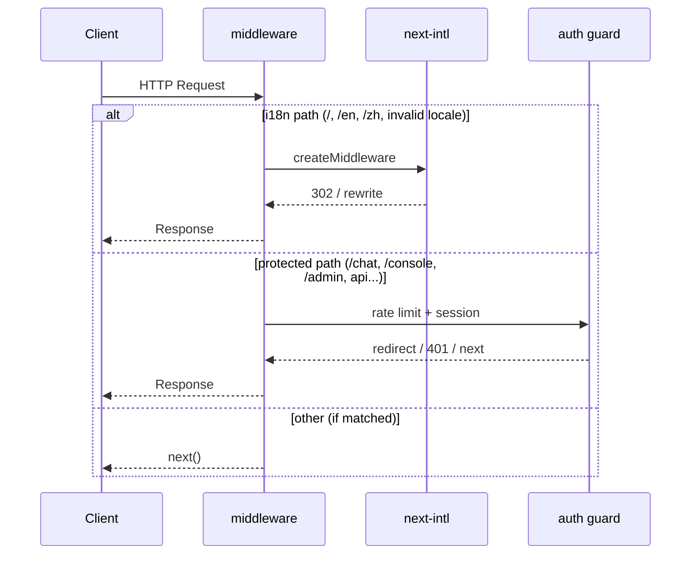

# API / HTTP 路由与 Middleware 行为规格（version 0.1.13）

| 项 | 内容 |
| --- | --- |
| 版本 | `0.1.13` |
| 阶段 | 3A 文档 |
| 说明 | 本文「API」涵盖 **REST API 变更声明**、**HTTP 路由行为**、**middleware 规格**、**Cookie 规范** |

---

## 1. REST API 变更声明

> **本期无 REST API 变更。**

| 项 | 结论 |
| --- | --- |
| 新增/修改 Route Handler | **无** |
| 请求/响应体 schema | **无** |
| 鉴权逻辑 | **无** |
| API 错误 message 多语言 | **非目标**；`jsonError(..., "未登录")` 等仍为中文 |
| 语言偏好同步 API | **不做**（无 `PATCH /api/user/locale` 等） |

**前端 `api` message 分组**：`messages/{locale}/api/message.json` 为**占位**，供后续迭代将 API 错误码映射到 i18n key，**本期后端不读取**。

**验证要求（3B）**：`fetch('/api/auth/me')`、`fetch('/api/console/...')` 等路径 **不受 locale 前缀影响**；URL 仍为 `/api/...`，非 `/en/api/...`。

---

## 2. HTTP 路由行为规格

### 2.1 路由总表

| 路径 | 方法 | 行为 | locale | 备注 |
| --- | --- | --- | --- | --- |
| `/` | GET | **302** → `/{resolvedLocale}` | 解析后 | 见 §3 |
| `/en` | GET | **200** 英文首页 | `en` | `app/[locale]/page.tsx` |
| `/zh` | GET | **200** 中文首页 | `zh` | 同上 |
| `/fr`、`/en-US`、`/xx` 等 | GET | **302** → `/en` | 强制 `en` | 非法 locale，非 404 |
| `/chat` | GET | 现网行为 | **无** | 未接入 i18n；auth 守卫 |
| `/console` | GET | 现网行为 | **无** | 同上 |
| `/login` | GET | 现网行为 | **无** | 同上 |
| `/admin/*` | GET | 现网行为 | **无** | 同上 |
| `/api/*` | * | 现网 API | **无** | 排除 i18n rewrite |

**不存在**的路由（本期勿实现）：`/en/chat`、`/zh/console`、`/en/login` 等。

### 2.2 `/` 重定向（302）

**触发**：浏览器或爬虫 `GET /`（含 query string；locale 解析**忽略** query，除非产品后续另行规定）。

**解析顺序**（Q2-C 已定稿）：

```
1. URL locale prefix     → 不适用（路径为 /）
2. Cookie NEXT_LOCALE    → 值 ∈ { en, zh } 则采用
3. Accept-Language       → 首个 tag 匹配 zh* → zh；否则 → en
4. 默认                  → en
```

**响应**：

```http
HTTP/1.1 302 Found
Location: /en
Set-Cookie: NEXT_LOCALE=en; Path=/; SameSite=Lax; ...
```

或 `Location: /zh`（当解析为 zh 时）。

**与 next-intl 关系**：由 `createMiddleware(routing)` + `localeDetection: true` + `defaultLocale: 'en'` 实现；3B 集成时对照 next-intl 实际 `Set-Cookie` 行为，必要时在 `@/common/constants` 统一 cookie 名。

### 2.3 非法 locale 处理（302 → `/en`）

| 请求示例 | HTTP | Location | 说明 |
| --- | --- | --- | --- |
| `/fr` | 302 | `/en` | 不支持的语言 |
| `/en-US` | 302 | `/en` | BCP47 完整 tag 非 supported locale |
| `/xx` | 302 | `/en` | 任意非法单 segment |
| `/en/foo`（若 foo 非本期路由） | 404 | — | 合法 locale 下的未知子路径走 Next.js notFound |

**实现位置**：middleware **阶段 1a**（在 next-intl 之前或配置 `localePrefix` 白名单），见 `implementation-plan.md` §4.4。

**验收**：AC-E3 — 无未捕获异常、无白屏。

### 2.4 语言切换（客户端主导）

| 操作 | HTTP / 导航 | Cookie |
| --- | --- | --- |
| 在 `/zh` 选 English | 客户端导航 **GET `/en`**（soft navigation） | 写入 `NEXT_LOCALE=en` |
| 在 `/en` 选 中文 | **GET `/zh`** | 写入 `NEXT_LOCALE=zh` |

**写入时机**：

1. 用户通过 **LanguageSwitcher** 显式切换（Client 写 cookie + `router.replace`）。
2. middleware / next-intl 在访问 locale 路径时 **同步** cookie（与 URL 一致）。

**不要求**额外 REST 调用。

### 2.5 跨页链接（未接入 i18n）

| 来源 | 链接目标 | 行为 |
| --- | --- | --- |
| `/en` 首页 CTA | `/chat` | 无 locale 前缀；页面仍中文 |
| `/en` 首页 Sign in | `/login?redirect=/en` | redirect 指向 locale 首页（design §2.3） |
| 任意 | `/api/auth/me` | 绝对路径 `/api/...` |

---

## 3. `Accept-Language` 解析规则

| 规则 | 说明 |
| --- | --- |
| 输入 | 请求头 `Accept-Language`（标准格式，如 `zh-CN,zh;q=0.9,en;q=0.8`） |
| 解析 | 取 **首个** language tag（q 值排序后首选） |
| 映射 | tag **以 `zh` 开头**（大小写不敏感）→ locale **`zh`**；**否则** → **`en`** |
| 示例 | `zh-TW` → `zh`；`en-US` → `en`；`ja-JP` → `en`（回退默认） |
| 空/缺失 | 跳过，进入默认 `en` |

**优先级**：仅当 **无有效 URL locale** 且 **无有效 cookie** 时启用（Q2-C）。

**与 next-intl**：`localeDetection: true` 时 next-intl middleware 内置等价逻辑；3B 以 next-intl 为准，本文档为验收契约。

---

## 4. Cookie 规范：`NEXT_LOCALE`

| 属性 | 值 | 说明 |
| --- | --- | --- |
| **名称** | `NEXT_LOCALE` | 与 next-intl 默认一致；3B 在 `@/common/constants` 导出 `LOCALE_COOKIE` 别名 |
| **值** | `en` \| `zh` | 小写；非法值 middleware **忽略**，按无 cookie 继续检测 |
| **Path** | `/` | 全站可读（供后续未接入页迭代读取） |
| **SameSite** | `Lax` | 默认；跨站 GET 不携带 |
| **Secure** | 生产 `true` | `NODE_ENV === 'production'` 或 HTTPS 部署时设置 |
| **HttpOnly** | **false** | Client 语言切换器需可写（与 next-intl 默认一致） |
| **Max-Age** | 建议 `31536000`（1 年） | 与 next-intl 默认长期偏好一致；3B 可配置 |
| **Domain** | 不设置 | 当前 host 默认 |

### 4.1 写入时机

| 场景 | 写入方 |
| --- | --- |
| LanguageSwitcher 切换 | Client：`document.cookie` 或 next-intl `useRouter` 封装 |
| 首次 `/` 重定向至 `/en` 或 `/zh` | middleware `Set-Cookie` |
| 直接访问 `/en`、`/zh` | middleware 同步 cookie 与 URL |

### 4.2 读取时机

| 场景 | 读取方 |
| --- | --- |
| `GET /` 重定向 | middleware |
| 后续迭代未接入页 | Client / 未来 middleware 扩展 |

### 4.3 清除行为

用户清除站点数据后 cookie 消失 → `GET /` 按 Accept-Language → 默认 `en`（AC-B7）。

---

## 5. Middleware 行为规格

### 5.1 总览

**文件**：`src/middleware.ts`（3B 合并实现）

**执行顺序**：



### 5.2 i18n 分支

| 条件 | 动作 |
| --- | --- |
| `pathname === '/'` | 按 §3 解析 locale → **302** `/{locale}` |
| `pathname` 为 `/en` 或 `/zh`（及子路径若本期存在） | next-intl **rewrite** 至 `app/[locale]/...`；同步 cookie |
| 首 segment 为非法 locale 尝试 | **302** `/en` |
| 其他 | 不进入 i18n 分支 |

**不重写**：`/chat`、`/console`、`/login`、`/admin`、`/api/*`（通用）。

### 5.3 Auth / 限流分支（现网保留）

| 条件 | 动作 |
| --- | --- |
| 全站限流超限 | **429** JSON `RATE_LIMITED` |
| IP 限流超限 | **429** JSON |
| `pathname` 以 `/api/auth/` 开头 | **next()**（仅限流） |
| 无 session + `/api/admin` 或 `/api/console` | **401** JSON `UNAUTHORIZED` |
| 无 session + 页面 `/chat`、`/console`、`/admin` | **302** `/login?redirect={pathname+search}` |
| `pathname` 以 `/admin` 开头 | 设置 `x-admin-login-redirect` header + **next()** |

**错误 message**：仍为**中文**（非目标）。

### 5.4 Matcher 规格

见 `implementation-plan.md` §4.5。核心约束：

- **包含**：`/`, `/en`, `/zh`, auth 守卫路径, 非法 locale segment
- **排除**：`/_next/*`、含 `.` 的静态资源、**通用** `/api/*`（`/api/auth` 等按名单单独包含）

### 5.5 `/api/*` 排除保证

| 请求 | middleware 命中 | i18n rewrite | 预期 |
| --- | --- | --- | --- |
| `GET /api/auth/me` | 是（auth matcher） | **否** | API Route Handler 正常执行 |
| `POST /api/auth/login` | 是 | **否** | 同上 |
| `GET /api/console/sessions` | 是 | **否** | 401 或 200 由 API 决定 |
| `GET /api/health`（若存在） | 否（若未列入 matcher） | **否** | 直出 |

**禁止**：任何将 `/api/...` rewrite 为 `/en/api/...` 的行为。

---

## 6. 响应头与 SEO（HTTP 层）

| 项 | 本期 |
| --- | --- |
| `Content-Language` | 不强制；依赖 `html lang` |
| `hreflang` | **可选**（Q12），非阻塞 |
| `Cache-Control` | 沿用 Next.js 默认；locale 路径可区分缓存键（CDN 按 URL） |

---

## 7. 错误与边界 HTTP 语义

| 场景 | 状态码 |  body |
| --- | --- | --- |
| 限流 | 429 | JSON `{ code: RATE_LIMITED, message: "..." }`（中文） |
| 未登录 admin/console API | 401 | JSON `{ code: UNAUTHORIZED, message: "未登录" }` |
| 非法 locale | 302 | 无 body；Location: `/en` |
| 合法 locale 未知子路径 | 404 | Next.js notFound 页面（仍中文壳，本期可接受） |

---

## 8. 与前端对接要点

| 项 | 约定 |
| --- | --- |
| 首页 API 调用 | 无新增 |
| 翻译 namespace | `page.home` ← `messages/{locale}/page/home.json` |
| 切换语言 | Client 导航至 `/en` \| `/zh`，勿调用后端 |
| 登录 redirect | query `redirect=/en` 或 `/zh` |
| Link 组件 | 未接入页使用普通 `<Link href="/chat">`；已接入页使用 next-intl `Link` |

---

## 9. 关联文档

- 实现计划与 matcher 细节：`implementation-plan.md`
- Cookie / 枚举 / message 目录：`data-models.md`
- 风险：`risks-and-open-items.md`
