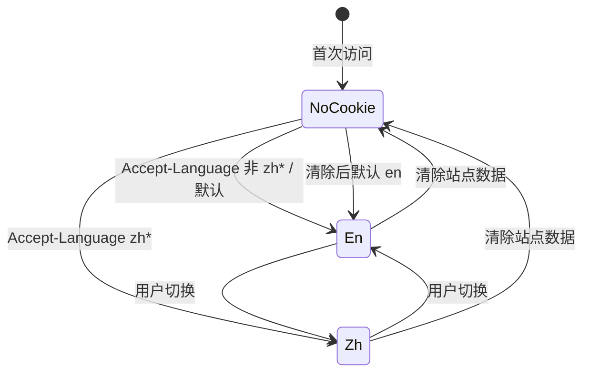

# 数据模型 — i18n（version 0.1.13）

| 项 | 内容 |
| --- | --- |
| 版本 | `0.1.13` |
| 阶段 | 3A 文档 |
| 持久化 | **无 SQLite / TypeORM 变更** |

---

## 1. 数据库变更声明

> **本期无数据库 schema 变更。**

| 项 | 结论 |
| --- | --- |
| 新增/修改 Entity | **无** |
| Migration | **无** |
| User 表「界面语言」字段 | **非目标** |
| 语言偏好存储 | **浏览器 Cookie `NEXT_LOCALE` only** |

---

## 2. Locale 枚举与类型

### 2.1 支持的语言

| 内部 locale | BCP 47（html lang） | 显示名（UI） |
| --- | --- | --- |
| `en` | `en` | English / EN（窄屏） |
| `zh` | `zh-CN` | 中文 |

**不支持**：`zh-TW`、`ja`、`en-US` 作为独立 locale（`Accept-Language: zh-TW` **映射**为 `zh`）。

### 2.2 TypeScript 建模（3B 新建）

**文件建议：** `src/common/enums/locale.ts`

```typescript
/** 站点支持的 App Router locale segment（URL 与 cookie 值） */
export enum AppLocale {
  En = "en",
  Zh = "zh",
}

/** 所有支持 locale 的有序列表（默认 locale 放在首位） */
export const APP_LOCALES = [AppLocale.En, AppLocale.Zh] as const;

export type AppLocaleCode = (typeof APP_LOCALES)[number];

/** html lang 属性映射 */
export const HTML_LANG_BY_LOCALE: Record<AppLocaleCode, string> = {
  [AppLocale.En]: "en",
  [AppLocale.Zh]: "zh-CN",
};
```

**导出：** 经 `@/common/enums/index.ts` 聚合导出。

**与 next-intl 关系：** `routing.locales` 使用 `APP_LOCALES`；避免魔法字符串。

### 2.3 类型守卫（3B 可选）

```typescript
export function isAppLocale(value: string | undefined): value is AppLocaleCode {
  return value === AppLocale.En || value === AppLocale.Zh;
}
```

**用途：** middleware 解析 cookie、非法 segment 判断。

---

## 3. 常量（Cookie 与 i18n 配置）

**文件建议：** `src/common/constants/i18n.ts`

```typescript
import { AppLocale } from "@/common/enums";

/** next-intl / middleware 共用的 locale 偏好 cookie 名 */
export const LOCALE_COOKIE = "NEXT_LOCALE";

/** 无 cookie / 非法 cookie 时的默认 locale */
export const DEFAULT_LOCALE = AppLocale.En;

/** cookie Max-Age：1 年（秒） */
export const LOCALE_COOKIE_MAX_AGE = 60 * 60 * 24 * 365;
```

**导出：** 经 `@/common/constants/index.ts` 聚合。

**与现网常量并列：**

| 常量 | 现网 | 本期 |
| --- | --- | --- |
| `SESSION_COOKIE` | `7ai_session` | 不变 |
| `LOCALE_COOKIE` | — | **新增** `NEXT_LOCALE` |

---

## 4. Cookie 数据模型

逻辑结构（非 DB）：

| 字段 | 类型 | 约束 |
| --- | --- | --- |
| name | `NEXT_LOCALE` | 固定 |
| value | `"en" \| "zh"` | 非法值视为未设置 |
| path | `/` | |
| sameSite | `Lax` | |
| secure | boolean | 生产 true |
| maxAge | number | 见 `LOCALE_COOKIE_MAX_AGE` |

**状态转换：**



**不与 `7ai_session` 联动**：登录/登出不修改 `NEXT_LOCALE`。

---

## 5. Message 目录结构

### 5.1 物理布局（项目根 `messages/`）

```
messages/
├── en/
│   ├── page/
│   │   └── home.json          # 首页完整文案（语义源）
│   └── api/
│       └── message.json       # 占位 — API 用户可见 message
└── zh/
    ├── page/
    │   └── home.json          # 与 en 同 key 树，值为中文
    └── api/
        └── message.json       # 占位
```

**原则（PRD / Q10 已定稿）：**

| 规则 | 内容 |
| --- | --- |
| 外层 | `{locale}` |
| 中层分组 | `page`（UI）、`api`（API message 映射） |
| page 子组织 | **按页面独立文件**，如 `home.json` |
| key 语言 | **英文** camelCase 或点分层级 |
| 语义源 | **`en`** 文件为英文展示文案 |
| 缺失回退 | 生产环境回退 **`en`** |

### 5.2 Namespace 映射（next-intl）

| 文件路径 | next-intl namespace | 消费方 |
| --- | --- | --- |
| `messages/{locale}/page/home.json` | `page.home` | `getTranslations('page.home')` / `useTranslations('page.home')` |
| `messages/{locale}/api/message.json` | `api.message` | **占位**；后续 API 错误 i18n |

**加载配置（3B `src/i18n/request.ts` 示意）：**

```typescript
// 伪代码 — 按 locale 动态 import
const messages = {
  ...(await import(`../../messages/${locale}/page/home.json`)).default,
  // namespace 嵌套由 next-intl messages 结构决定，3B 按官方示例组装
};
```

推荐 message 顶层结构：

```typescript
{
  "page": {
    "home": { /* home.json 内容 */ }
  },
  "api": {
    "message": { /* message.json 占位 */ }
  }
}
```

或采用 next-intl **多文件 merge** 至 namespaces `page.home`、`api.message`（3B 择一并在实现说明记录）。

### 5.3 `page/home.json` key 树（摘要）

完整文案见 `../design/copy-home-en-zh.md` 与 `design-spec-i18n.md` §10。

| 前缀 | 用途 |
| --- | --- |
| `meta.title` / `meta.description` | `generateMetadata` |
| `nav.*` | 顶栏导航 |
| `langSwitcher.*` | 语言选择器 |
| `userMenu.*` | 首页 variant 用户菜单 |
| `hero.*` | Hero 区 |
| `cta.*` | 按钮 |
| `features.01`–`04` | 特性列表（`[01]` 前缀由组件渲染） |
| `footer.*` | 页脚（备案号、邮箱不翻译） |

### 5.4 `api/message.json` 占位（3B）

本期最小占位，便于目录与 namespace 就绪：

```json
{
  "_comment": "Placeholder for future API user-visible messages. Not used in 0.1.13.",
  "unauthorized": "Unauthorized",
  "rateLimited": "Too many requests"
}
```

`zh` 文件提供对应中文；**后端 Route Handler 本期不引用**。

---

## 6. Accept-Language 解析模型

逻辑输入输出（非持久化）：

| 输入 header 示例 | 输出 locale |
| --- | --- |
| （缺失） | 跳过 |
| `zh-CN,en;q=0.9` | `zh` |
| `zh-TW` | `zh` |
| `en-US,en;q=0.9` | `en` |
| `ja-JP,en;q=0.5` | `en` |

**算法：**

1. 解析 header 为有序 language range 列表（按 q 降序）。
2. 取第一个 range 的主 tag（strip region）。
3. 若主 tag 以 `zh` 开头 → `zh`；否则 → `en`。

---

## 7. 路由 Segment 模型

| URL segment | 分类 | 处理 |
| --- | --- | --- |
| （空） | 根 `/` | 302 → `/{locale}` |
| `en` | 合法 locale | rewrite → `[locale]` |
| `zh` | 合法 locale | rewrite → `[locale]` |
| `chat` | 应用路由 | auth middleware，**非 locale** |
| `console` | 应用路由 | 同上 |
| `login` | 应用路由 | 同上 |
| `admin` | 应用路由 | 同上 |
| `api` | API 根 | 不 i18n |
| `fr`、`en-US` 等 | 非法 locale 尝试 | 302 → `/en` |

---

## 8. 与 antd / dayjs locale 映射（预留）

本期 **不强制**改造 Shell；架构预留：

| App locale | antd | dayjs |
| --- | --- | --- |
| `en` | `enUS` from `antd/locale/en_US` | `en` |
| `zh` | `zhCN` from `antd/locale/zh_CN` | `zh-cn` |

**接入点：** `app/[locale]/layout.tsx` 内 `ConfigProvider`（仅首页子树或全 locale layout）。

---

## 9. 关联文档

- Middleware / HTTP 行为：`api-spec.md`
- 实现步骤：`implementation-plan.md`
- 风险：`risks-and-open-items.md`
