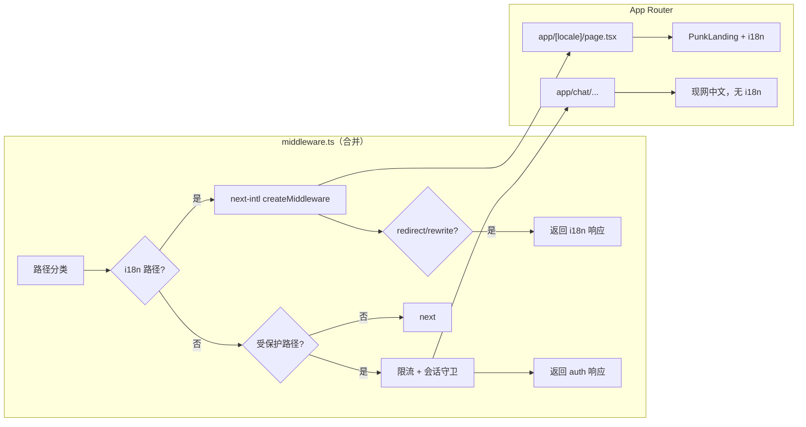

# 实现计划 — i18n 服务端/架构（version 0.1.13）

| 项 | 内容 |
| --- | --- |
| 版本 | `0.1.13` |
| 阶段 | **3A — 服务端/架构文档**（本文档）；**3B — 代码实现**（待用户确认后执行） |
| 范围 | middleware + next-intl + App Router；**无 REST API / 数据库变更** |
| 上游 | `../product/prd.md`、`../design/design-spec-i18n.md` |

---

## 1. 目标与边界

### 1.1 本期服务端/架构职责

| 职责 | 说明 |
| --- | --- |
| locale 路由 | `/` → 302 至解析后的 `/{locale}`；`/en`、`/zh` 渲染首页 |
| 非法 locale | `/fr`、`/en-US` 等 → 302 `/en` |
| Cookie 持久化 | `NEXT_LOCALE` 读写与 middleware 检测顺序 |
| middleware 合并 | 在保留现有限流 + 会话守卫前提下接入 i18n |
| message 约定 | `messages/{locale}/page|api/*.json` 目录与加载配置 |
| **不做** | API 错误消息多语言、账号级语言同步、未接入页面 locale 前缀 |

### 1.2 与 PRD 非目标对齐

- API 响应体、`jsonError` message **仍为中文硬编码**，本期不改造。
- `/chat`、`/console`、`/login`、`/admin` **不加** `/[locale]` 前缀，middleware **不重写**这些路径。
- 语言偏好 **仅存 cookie**，不写入 User 表或后端配置 API。

---

## 2. 技术选型

### 2.1 推荐：`next-intl`（^4.x）

| 维度 | 说明 |
| --- | --- |
| **选型结论** | 采用 **`next-intl`** 作为唯一 i18n 库 |
| **版本约束** | `next-intl@^4.13.0`（或同 major 最新 patch）；peer 声明支持 **Next.js 12–16**、**React ≥19** |
| **与项目栈** | 与 Next.js **15.1.x**、React **19**、App Router、RSC 兼容 |
| **替代方案不采纳原因** | `react-i18next` 需自建 App Router SSR 层；纯 cookie 无 URL 前缀不利于 SEO/分享（与 Q3-A 冲突） |

**选用理由（对照 PRD 约束）：**

1. **App Router 一等支持**：`getTranslations`（RSC）、`useTranslations`（Client）、`generateMetadata` 同源 message。
2. **locale 前缀路由**：内置 `defineRouting` + `createMiddleware`，与 Q3-A（`/en`、`/zh`）一致。
3. **检测顺序可配置**：`localeDetection: true` 时 middleware 按 **URL prefix → cookie → Accept-Language → defaultLocale** 解析（与 Q2-C 一致；`/` 无 prefix 时从 cookie 起算）。
4. **类型安全**：可基于 message JSON 生成 key 类型，满足 AC-A8。
5. **按 namespace 分包**：`messages/{locale}/page/home.json` 映射为 namespace `page.home`。

**依赖变更（3B 执行）：**

```json
{
  "dependencies": {
    "next-intl": "^4.13.0"
  }
}
```

**Next.js 配置（3B）：** 在 `next.config.ts` 增加 `createNextIntlPlugin` 包装（官方 App Router 入门流程），并确保与现有 `serverExternalPackages` 共存。

---

## 3. 架构总览



---

## 4. middleware 与现有 auth middleware 合并策略

### 4.1 现状（`src/middleware.ts`）

| 项 | 现网行为 |
| --- | --- |
| **matcher** | 仅 `/chat`、`/console`、`/admin` 及 `/api/admin`、`/api/console`、`/api/auth` |
| **限流** | 全站 + IP 级（在 matcher 命中时执行） |
| **会话** | 无 `7ai_session` 时：页面 → `/login?redirect=...`；admin/console API → 401 JSON |
| **例外** | `/api/auth/*` 仅限流，不重定向 |
| **i18n** | **无** |

> **3B 注意**：现网 middleware 存在多处 `res = ...` 赋值，末行 `NextResponse.next()` 可能覆盖前述 redirect/错误响应；合并 i18n 时应**一并重构为 early return**，避免 auth 逻辑被覆盖（见 `risks-and-open-items.md` R1）。

### 4.2 合并原则

1. **单文件单入口**：Next.js 仅允许一个 `middleware.ts`；i18n 与 auth **必须在同一函数内编排**，不可拆成两个 middleware 文件。
2. **路径互斥优先**：i18n 与 auth 守卫的路径集合**基本不交叠**；按 pathname **先分类、再分支**，避免对 `/chat` 做 locale rewrite。
3. **early return**：每一分支产生最终响应后立即 `return`，禁止末尾统一覆盖。
4. **i18n 优先于 auth（仅对 i18n 路径）**：`/`, `/en`, `/zh` 及非法 locale 尝试 **不经过** 登录重定向。
5. **auth 路径跳过 i18n**：`/chat` 等 **不调用** `createMiddleware`，防止被加上 locale 前缀或 rewrite 到 `[locale]` 树。

### 4.3 路径分类表

| 分类 | 路径示例 | middleware 行为 |
| --- | --- | --- |
| **A · i18n** | `/`、`/en`、`/zh`、`/fr`（非法） | 执行 next-intl + 非法 locale 兜底 → `/en` |
| **B · 受保护（页面+API）** | `/chat`、`/console`、`/admin`、`/api/admin/*`、`/api/console/*` | 限流 + 会话守卫（**现有逻辑**） |
| **C · 认证 API** | `/api/auth/*` | 仅限流，`NextResponse.next()` |
| **D · 未接入、非 i18n** | `/login`、`/api/*`（除 B/C）、静态资源 | **不重写**；若不在 matcher 内则不进入 middleware |
| **E · 静态/内部** | `/_next/*`、`favicon.ico`、`*.png` 等 | **排除在 matcher 外** |

**未接入路由清单（design §2.1）：** `/chat`、`/console`、`/login`、`/admin/*` — **不加 locale 前缀**，middleware **不重写**。

### 4.4 执行顺序（伪代码）

```typescript
// 3B 实现示意 — 非现网代码
export function middleware(request: NextRequest) {
  const { pathname } = request.nextUrl;

  // --- 阶段 1：i18n（仅 locale 相关路径）---
  if (isI18nPath(pathname)) {
    // 1a. 非法 locale segment → 302 /en（design §2.5）
    if (isInvalidLocaleSegment(pathname)) {
      return NextResponse.redirect(new URL("/en", request.url), 302);
    }

    // 1b. next-intl 标准处理：/ → /{locale}、cookie 同步、Accept-Language 等
    const i18nResponse = handleI18nRouting(request); // createMiddleware(routing)
    if (shouldReturnImmediately(i18nResponse)) {
      return i18nResponse; // 302 redirect 或 rewrite 至 app/[locale]/...
    }
    return i18nResponse;
  }

  // --- 阶段 2：受保护路由（现有 auth + 限流）---
  if (isProtectedPath(pathname)) {
    return handleAuthAndRateLimit(request); // 自现网 middleware 提取，early return
  }

  return NextResponse.next();
}
```

**`/` 重定向解析顺序**（Q2-C，由 next-intl + routing 配置实现）：

| 优先级 | 来源 | 规则 |
| --- | --- | --- |
| 1 | URL locale prefix | `/` 无 segment，跳过 |
| 2 | Cookie `NEXT_LOCALE` | 值为 `zh` / `en` 时采用 |
| 3 | `Accept-Language` | 首个 tag 以 `zh` 开头 → `zh`；否则 → `en` |
| 4 | 默认 | `en` |

结果：**302 → `/en` 或 `/zh`**（`localePrefix: 'always'`）。

### 4.5 matcher 扩展方案

**目标**：i18n 路径进入 middleware；`/api/*`（除已在 auth matcher 中的子集）、静态资源**默认不进入**或进入后立即 `next()`。

**推荐 matcher（3B）：**

```typescript
export const config = {
  matcher: [
    // i18n：根路径、locale 首页、非法 locale 尝试（单 segment）
    "/",
    "/(en|zh)",
    "/(en|zh)/:path*",

    // 现有 auth 守卫（保持不变）
    "/chat",
    "/chat/:path*",
    "/console",
    "/console/:path*",
    "/admin",
    "/admin/:path*",
    "/api/admin/:path*",
    "/api/console/:path*",
    "/api/auth/:path*",

    // 非法 locale 单 segment（如 /fr、/en-US）— 302 /en
    // 注意：勿匹配 /chat、/login 等已知的非 locale 应用路由
    "/((?!api|_next|_vercel|chat|console|login|admin|.*\\..*)[^/]+)",
  ],
};
```

**matcher 设计要点：**

| 要点 | 说明 |
| --- | --- |
| **排除 `/api/*`** | 通用 API 不在 matcher 内；`/api/auth` 等因 auth 需要单独列出 |
| **排除静态文件** | 文件名含 `.` 的路径不匹配（`favicon.ico`、`icon.svg`） |
| **排除未接入应用路由** | negative lookahead 排除 `chat|console|login|admin` |
| **`fetch('/api/auth/me')`** | 仅命中 `/api/auth/:path*` 分支 → 限流 + `next()`，**无 locale 前缀** |

**可选简化**：i18n 采用 next-intl 文档推荐的全局 matcher  
`'/((?!api|trpc|_next|_vercel|.*\\..*).*)'`，  
在函数体内对 `/chat` 等 **先判断 `isProtectedPath` 跳过 i18n**。两种方案二选一，3B 实现时择一并在 `implementation-notes` 记录。

### 4.6 next-intl routing 配置（3B 新建）

**文件：** `src/i18n/routing.ts`

```typescript
import { defineRouting } from "next-intl/routing";

export const routing = defineRouting({
  locales: ["en", "zh"],
  defaultLocale: "en",
  localePrefix: "always", // Q3-A：/en、/zh 均带前缀
  localeDetection: true,  // cookie + Accept-Language（Q2-C）
  // localeCookie 可显式命名，与 @/common/constants 对齐
});
```

**文件：** `src/i18n/request.ts` — `getRequestConfig` 按 locale 加载 message namespaces。

**文件：** `src/middleware.ts` — 合并入口，导出 `createMiddleware(routing)` 的包装。

---

## 5. App Router 结构调整（3B）

### 5.1 路由迁移

| 现网 | 3B 目标 |
| --- | --- |
| `src/app/page.tsx` | 删除或改为仅文档说明；首页迁至 `src/app/[locale]/page.tsx` |
| `src/app/layout.tsx` | 保留 `ConfirmProvider`、icons；**移除**固定 `lang="zh-CN"` |
| — | **新建** `src/app/[locale]/layout.tsx`：输出 `html lang`（`zh`→`zh-CN`，`en`→`en`）、`NextIntlClientProvider` |
| `src/app/chat/**` 等 | **保持路径不变** |

### 5.2 `html lang` 映射

| locale | `html lang` |
| --- | --- |
| `zh` | `zh-CN` |
| `en` | `en` |

由 `app/[locale]/layout.tsx` 的 `<html lang={...}>` 设置（嵌套 layout 时须与 Next.js + next-intl 文档对齐，避免双层 `<html>`；3B 按官方示例调整根 layout 结构）。

---

## 6. 文件清单（3B 新建/修改）

### 6.1 新建

| 路径 | 职责 |
| --- | --- |
| `src/i18n/routing.ts` | locale 枚举、defaultLocale、localePrefix |
| `src/i18n/request.ts` | `getRequestConfig`、message 动态 import |
| `src/app/[locale]/layout.tsx` | locale layout、Provider、`html lang` |
| `src/app/[locale]/page.tsx` | 首页 + `generateMetadata` |
| `src/common/enums/locale.ts` | `Locale` enum：`En`、`Zh`（或 `AppLocale`） |
| `src/common/constants/i18n.ts` | `LOCALE_COOKIE`、`SUPPORTED_LOCALES` 等 |
| `messages/en/page/home.json` | 英文首页文案（语义源） |
| `messages/zh/page/home.json` | 中文翻译 |
| `messages/en/api/message.json` | **占位**（本期无 API 多语言） |
| `messages/zh/api/message.json` | **占位** |
| `src/components/home/LanguageSwitcher.tsx` | 语言选择器（前端，design spec） |

### 6.2 修改

| 路径 | 职责 |
| --- | --- |
| `src/middleware.ts` | **合并** i18n + auth；扩展 matcher；修复 early return |
| `src/app/layout.tsx` | 移除固定 `lang`；配合 `[locale]` layout |
| `src/components/home/PunkLanding.tsx` | 文案改 i18n |
| `src/components/home/PunkHomeHeader.tsx` | nav i18n + LanguageSwitcher + login redirect |
| `src/components/user/UserAvatarMenu.tsx` | home variant logout 文案 i18n |
| `next.config.ts` | `createNextIntlPlugin` |
| `package.json` | 添加 `next-intl` |

### 6.3 不修改（本期）

- `src/app/api/**` — 无 REST 变更
- `src/server/**` 业务逻辑 — 无变更
- TypeORM 实体 / SQLite — 无变更
- `ConsoleShell` / `AdminShell` antd locale — 保持 `zhCN`

---

## 7. 3B 实现步骤（按优先级）

| 优先级 | 步骤 | 负责 | 说明 |
| --- | --- | --- | --- |
| **P0** | 安装 `next-intl`；新建 `routing.ts`、`request.ts` | Backend | 基础设施 |
| **P0** | 新建 `messages/**` 占位与 `page/home` 完整 key | Backend + Frontend | 与 `copy-home-en-zh.md` 对齐 |
| **P0** | 合并 `middleware.ts`（i18n + auth + matcher） | **Backend** | 本文 §4 核心 |
| **P0** | 迁移 `app/[locale]/page.tsx`、`layout.tsx` | Backend + Frontend | 路由与 metadata |
| **P1** | `PunkLanding` / `PunkHomeHeader` i18n 改造 | Frontend | `getTranslations` / `useTranslations` |
| **P1** | `LanguageSwitcher` 组件 | Frontend | cookie + `router.replace('/{locale}')` |
| **P1** | 登录链 `redirect=/{locale}` | Frontend | design §2.3 |
| **P2** | `[locale]/layout` 内可选 antd `ConfigProvider`（`UserAvatarMenu`） | Frontend | Q9 |
| **P2** | 根 layout 结构调整、`html lang` 验证 | Backend + Frontend | AC-A5–A7 |
| **P3** | middleware 单测 / E2E 冒烟 | Backend | 见 §8 |
| **P3** | 迭代 README / frontend 实现说明 | Frontend | AC-D4 |

**标注**：表中标 **Backend** 的步骤在 3B 由服务端 subagent 实现；**Frontend** 由前端 subagent 实现；合并 middleware 与 i18n 配置属 **Backend 主责**。

---

## 8. 测试要点

### 8.1 middleware 场景（应用层验证 / 3B 单测）

| # | 场景 | 期望 |
| --- | --- | --- |
| T1 | `GET /`，无 cookie，`Accept-Language: en-US` | 302 → `/en` |
| T2 | `GET /`，无 cookie，`Accept-Language: zh-CN,en` | 302 → `/zh` |
| T3 | `GET /`，cookie `NEXT_LOCALE=zh` | 302 → `/zh` |
| T4 | `GET /en`、`GET /zh` | 200；`Set-Cookie` 同步 locale（若 next-intl 配置写入） |
| T5 | `GET /fr`、`GET /en-US`、`GET /xx` | 302 → `/en` |
| T6 | `GET /chat`，无 session | 302 → `/login?redirect=/chat`（**无** locale 前缀） |
| T7 | `GET /api/auth/me`，无 session | 200/401 由 API 处理；middleware **不** 302 登录页 |
| T8 | `GET /api/console/*`，无 session | 401 JSON；**无** locale 重写 |
| T9 | `GET /login` | 不进入 i18n；**不** 强制 `/en/login` |
| T10 | 限流触发（auth 路径） | 429 JSON，与现网一致 |
| T11 | `GET /favicon.ico`、`/icon.svg` | 不进入 middleware 或直出静态 |
| T12 | 语言切换后 `GET /` | cookie 生效 → 对应 `/zh` 或 `/en` |

### 8.2 测试基础设施

- 现网 **无** Jest/Vitest 配置；3B 可选：
  - **方案 A**：引入 Vitest + `@edge-runtime/jest-environment` 测 middleware 纯函数；
  - **方案 B**：Playwright / curl 脚本做集成冒烟（优先覆盖 T1–T9）。
- 3B 在 `iterations/0.1.13/backend/implementation-notes.md`（实现后补充）记录所选方案。

### 8.3 回归冒烟（与 PRD 一致）

- 登录 → `/chat` → 控制台主流程不因 middleware 变更失败。
- 首页中英切换、刷新保持、metadata 与 `html lang` 正确。
- 备案链接、mailto 两种语言下可点击。

---

## 9. 依赖与协作

| 依赖 | 说明 |
| --- | --- |
| 设计文案 | `../design/copy-home-en-zh.md` → `messages/*/page/home.json` |
| 语言选择器 | `../design/spec-language-switcher.md` → Frontend 3B |
| 开放问题 | Q3-A、Q4-A 等产品决策若变更，须回溯更新 middleware 与 matcher |

---

## 10. 关联文档

- HTTP / middleware 行为规格：`api-spec.md`
- Cookie / 枚举 / message 结构：`data-models.md`
- 风险与开放项：`risks-and-open-items.md`
