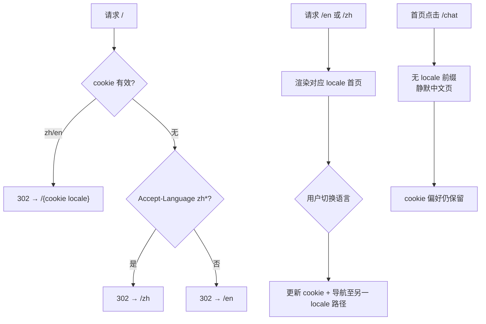

# 设计说明 — 多语言 i18n（version 0.1.13）

| 项 | 内容 |
| --- | --- |
| 版本 | `0.1.13` |
| 阶段 | 设计（阶段 2） |
| 上游 | `iterations/0.1.13/product/prd.md`、`user-stories-i18n.md`、`open-questions.md` |
| 文案终稿 | `copy-home-en-zh.md` |
| 语言选择器 | `spec-language-switcher.md` |

---

## 1. 已确认产品决策（设计基线）

| 编号 | 决策 | 设计落点 |
| --- | --- | --- |
| Q1-A | 仅首页完整双语 | 翻译范围 = `PunkLanding` + `PunkHomeHeader` + 首页 metadata + 首页 variant 下 `UserAvatarMenu` 可见文案 |
| Q2 | cookie/URL → Accept-Language → 默认 `en` | middleware 检测顺序见 §2 |
| Q3-A | locale 路径前缀 `/en`、`/zh` + cookie 同步 | 首页路由 `app/[locale]/page.tsx`；切换语言更新 URL 与 cookie |
| Q4-A | 跨页静默：偏好已保存，目标页仍为中文，无 banner | §2.3、§5 |
| Q5-B | 中文 Hero「解构智能」；英文独立 slogan | §6、`copy-home-en-zh.md` |
| Q6 | 下拉或缩写，不用国旗 | `spec-language-switcher.md` |
| key 规范 | 英文 key；`page`/`api` 分组；`en` 语义源；缺失回退 `en` | §9 |

---

## 2. 信息架构与路由

### 2.1 路由树（本期）

```
/                          → 302 重定向至解析后的 locale 首页（见 §2.2）
/en                        → 英文首页（PunkLanding）
/zh                        → 中文首页（PunkLanding）

/chat                      → 未接入 i18n（保持现网中文，无 locale 前缀）
/console                   → 未接入 i18n
/login                     → 未接入 i18n
/admin/*                   → 未接入 i18n
/api/*                     → 不受 locale 影响
```

**原则**：仅**已接入 i18n 的页面**使用 `/[locale]` 前缀；未接入页面维持现有路径，避免假双语 URL（如 `/en/chat` 本期不存在）。

### 2.2 `/` 重定向策略

middleware 在请求 `/` 时按以下顺序解析目标 locale，并 **302 重定向**至 `/{locale}`（无 trailing slash 与现网一致即可）：

| 优先级 | 来源 | 规则 |
| --- | --- | --- |
| 1 | URL | 不适用（路径为 `/`） |
| 2 | Cookie | 读取 `NEXT_LOCALE`（或实现等价名，见 §8）；值为 `zh` / `en` 时采用 |
| 3 | `Accept-Language` | 首个语言 tag 若以 `zh` 开头（含 `zh-CN`、`zh-TW` 等）→ `zh`；否则 → `en` |
| 4 | 默认 | `en` |

**示例**：

- 首次访问、无 cookie、`Accept-Language: en-US` → `/en`
- 首次访问、无 cookie、`Accept-Language: zh-CN,en` → `/zh`
- 曾选中文、cookie=`zh` → `/zh`

### 2.3 未接入页面的链接行为（Q4-A）

| 场景 | 行为 |
| --- | --- |
| 用户在 `/en` 点击「Chat / 进入对话」 | 导航至 **`/chat`**（无 locale 前缀）；页面仍为中文硬编码 |
| 用户在 `/zh` 点击「对话」 | 同上 **`/chat`** |
| 用户在 `/en` 点击「Sign in / 登录」 | 导航至 **`/login?redirect=...`**；redirect 目标建议为 **`/en`** 或 **`/`**（由实现统一，须保证回首页仍为英文） |
| 语言偏好 | 切换语言时**始终写入 cookie**；即使用户随后进入未翻译页，偏好仍保留供后续迭代读取 |
| UI 提示 | **不展示** banner、Toast 或 inline 说明（静默策略） |

**redirect 参数建议**：首页登录链使用 `redirect` 指向当前 locale 首页路径（如 `/en`），避免登录后落回 `/` 再经历一次重定向。

### 2.4 语言切换与 URL

| 操作 | 结果 |
| --- | --- |
| 在 `/zh` 选择 English | 客户端/服务端导航至 **`/en`**，写入 cookie=`en`，首页文案全量切换 |
| 在 `/en` 选择 中文 | 导航至 **`/zh`**，cookie=`zh` |
| 刷新 | URL + cookie 一致，保持当前语言 |

### 2.5 非法 locale（D7）

| 请求 | 行为（定稿） |
| --- | --- |
| `/fr`、`/en-US`、`/xx` 等不支持 segment | **302 重定向至 `/en`**（非 404） |
| 理由 | 默认语言为 `en`；避免白屏；与「缺失 key 回退 en」策略一致 |

若团队更倾向严格 REST，可改为 `notFound()`；**本期设计推荐重定向 `/en`**，验收以 AC-E3 对齐实现说明为准。

### 2.6 流程图



---

## 3. 页面结构与布局（首页）

现网结构保持不变，仅文案与顶栏控件来源改为 i18n：

```
PunkLanding
├── PunkHomeHeader (h=56px)
│   ├── BrandMark（品牌不翻译）
│   └── 右侧操作区
│       ├── nav: Chat / Console
│       ├── LanguageSwitcher（新增，见 spec-language-switcher.md）
│       └── Sign in | UserAvatarMenu
├── main（Hero + CTA + features）
└── footer（SYS 行 + 邮箱 + 备案）
```

**断点**：沿用现网 `sm`/`md`/`lg`；Hero 标题 `text-4xl → sm:6xl → md:7xl` 不变。英文 Hero 主标题字符较长时，**不缩小字号**；允许在 `sm` 以下自然换行（`max-w-4xl` 已约束宽度）。

---

## 4. 语言选择器（摘要，详见子规格）

| 项 | 定稿 |
| --- | --- |
| 位置 | `PunkHomeHeader` 右侧：**导航 `对话/控制台` 之后、登录/头像之前** |
| 形式 | **下拉**：触发器显示**当前语言全称**（`English` / `中文`）；展开后仅另一语言一项 |
| 窄屏 | `max-width: 639px` 触发器改用 **缩写** `EN` / `中文`（不用国旗） |
| 样式 | 复用 `headerActionLinkClass` 基底 + 语言专用 token（§4.1） |
| 交互 | 单击展开 → 选另一项 → 立即切换（无确认框） |
| a11y | `aria-label`、`aria-expanded`、`role="listbox"` / `option`、Esc 关闭、↑↓ 导航 |

完整规格见 **`spec-language-switcher.md`**。

### 4.1 样式 token（与 Punk 顶栏协调）

| Token | 值 | 用途 |
| --- | --- | --- |
| 触发器基础 | `headerActionLinkClass` | 与 nav 链接同高、同 hover/focus ring |
| 触发器文字色 | `text-zinc-300/90` | 略弱于 nav cyan，避免抢主操作 |
| 触发器 hover | `hover:text-cyan-200/90` | 与站点 accent 一致 |
| 选中/当前 | 触发器文案即当前语言，**不加**额外 badge | 选中态 = 触发器显示的语言名 |
| 下拉面板 | `border border-cyan-500/20 bg-zinc-950/95 backdrop-blur-md shadow-lg` | 赛博半透明 |
| 下拉项 hover | `bg-cyan-500/10 text-cyan-100` | |
| 下拉项 focus | `focus-visible:bg-cyan-500/15 ring-1 ring-cyan-400/50` | |
| 分隔 | 语言控件与登录按钮间距 `gap-2 sm:gap-3`（与 nav 一致） | |
| 字体 | `font-mono text-sm`（与 nav 一致） | |
| Chevron | `h-3.5 w-3.5 opacity-60`，展开时 `rotate-180` | 可选，不强制图标 |

**实现建议**：首版用 **原生 `<button>` + 绝对定位面板** 或 **Headless UI Listbox**，避免为首页单独包一层 antd `ConfigProvider`；若用 antd `Dropdown`，须在 locale layout 注入 `enUS`/`zhCN`（见 §8）。

---

## 5. 跨页过渡（D4 · Q4-A 细化）

| 维度 | 说明 |
| --- | --- |
| 用户预期 | 产品已知本期仅首页双语；静默策略不额外教育用户 |
| 持久化 | cookie 在切换瞬间写入，**不**因进入 `/chat` 而清除 |
| 视觉 | 进入中文页时**无**语言不一致 banner、无 modal |
| 回首页 | 用户从 `/chat` 返回 `/` 或品牌链接时，middleware 按 cookie 重定向至 `/en` 或 `/zh`，恢复双语首页 |
| 文档 | 在迭代 README 或 `0.1.13` backend/frontend 实现说明中记录「未接入页面仍为中文」，**不在 UI 暴露** |

---

## 6. Hero 与 glitch 层（D2 · Q5-B）

### 6.1 文案策略

| 元素 | `zh` | `en` |
| --- | --- | --- |
| 标签 `hero.tag` | `PERSONAL · AI LEARNING`（保留英文 Punk 标签） | 同左 |
| 主标题 `hero.title` | **解构智能** | **CRACK THE STACK**（独立英文 slogan，非「解构智能」直译） |
| 副标题 `hero.subtitle` | `DECONSTRUCT · LEARN · BREAK THINGS` | 同左（全球 Punk tagline，双语共用） |
| 描述 `hero.description` | 现网中文 | 英文意译，见 `copy-home-en-zh.md` |

**英文主标题立意**：「CRACK THE STACK」强调实验、拆解技术栈的 Punk 气质，与副标题 *DECONSTRUCT · LEARN · BREAK THINGS* 呼应，且与中文「解构智能」语义平行但**非直译**。

### 6.2 Glitch 层处理

现网结构（`PunkLanding.tsx`）：

- 前景主标题 + 背景 `punk-glitch-layer`（同色文案、blur、gradient）
- 背景层与前景**使用同一 `hero.title` 文案源**

| locale | glitch 层文案 | 说明 |
| --- | --- | --- |
| `zh` | 解构智能 | 与前景一致 |
| `en` | CRACK THE STACK | 与前景一致；**禁止** glitch 仍显示中文 |

**动画**：glitch 动画 class（`punk-glitch-layer`、`punk-glitch-bg-sync` 等）**不随语言变化**；切换语言时仅替换文本节点。

**长标题**：英文 `CRACK THE STACK` 长度适中；若未来 slogan 加长，glitch 层与前景同步 `max-w-4xl`，必要时 `sm` 断点允许两行，保持 `leading-[1.05]`。

---

## 7. 切换动效（D3）

| 方案 | 定稿 | 说明 |
| --- | --- | --- |
| A · 即时替换 | **推荐默认** | `router.push('/en'|'/'zh')` 或 soft navigation 后 RSC 重新渲染；顶栏与 main 同步更新 |
| B · 轻微 fade | **可选增强** | 仅 **`main`** 区域：`opacity 1→0→1`，**150ms** ease-out/in；**header/footer 不参与 fade**，避免顶栏闪烁 |
| 禁用 | 全页 reload、`window.location` 硬刷新 | 除非 soft navigation 失败 |

**metadata**：随 locale 路由一并更新；无需单独动效。

---

## 8. 页脚双语排版（D6）

### 8.1 内容与翻译范围

| Key | zh | en | 备注 |
| --- | --- | --- | --- |
| `footer.sysLine` | `SYS://local · learning mode · no warranty` | 同左 | 系统美学字符串，**双语均保留英文** |
| `footer.emailLabel` | `作者邮箱：` | `Author email:` | 标签翻译 |
| 邮箱地址 | `kuangyssky@163.com` | 同左 | **不翻译** |
| 备案号 | `皖ICP备2026009633号-1` | 同左 | **不翻译**；链接 `https://beian.miit.gov.cn/` |

### 8.2 排版

| 断点 | 布局 |
| --- | --- |
| 默认（`< sm`） | `flex-col items-center gap-1`，三行垂直堆叠 |
| `sm+` | `flex-row justify-center gap-3`，单行居中 |

**英文标签较长时**：`Author email:` 与邮箱地址**同一 `<a>` 内**拼接（与现网「作者邮箱：xxx」一致），避免换行拆断 mailto。

**行高**：维持 `text-[10px] sm:text-xs`、`font-mono`；英文词长不触发缩小字号。

---

## 9. i18n 技术方向（设计层建议，不含实现代码）

### 9.1 推荐方案：`next-intl` + `[locale]` 路由

| 理由 | 说明 |
| --- | --- |
| App Router 一等支持 | Server Component `getTranslations`、`generateMetadata` 与 Client `useTranslations` 同源 |
| 与 Q3-A 一致 | 内置 locale prefix、`Link` locale 感知 |
| middleware 成熟 | cookie、`Accept-Language`、redirect `/` 有文档化模式 |
| 类型安全 | 可生成 key 类型，满足 PRD AC-A8 |
| 分包加载 | 按 locale + namespace 动态 import message |

### 9.2 目录结构（建议）

```
src/
  app/
    [locale]/
      layout.tsx          # html lang、NextIntlClientProvider（若需）
      page.tsx              # 首页 + generateMetadata
    layout.tsx              # 根 shell（逐步弱化 lang，交由 [locale] layout）
    chat/ ...               # 未迁移路由保持原位
  i18n/
    routing.ts              # locales: ['en','zh'], defaultLocale: 'en'
    request.ts              # getRequestConfig
  middleware.ts             # locale 检测；matcher 排除 api/static
messages/
  en/page/home.json
  zh/page/home.json
  en/api/message.json       # 本期可仅占位
  zh/api/message.json
```

### 9.3 middleware 排除项（Q8）

matcher **须排除**：

- `/api/*`
- `/_next/*`
- 静态资源（`favicon.ico`、`icon.svg`、`*.png` 等）
- 未接入 i18n 的应用路由（`/chat`、`/console`、`/login`、`/admin`）——这些路径**不**加 locale 前缀，middleware **不重写**它们

### 9.4 Cookie

| 项 | 建议 |
| --- | --- |
| 名称 | `NEXT_LOCALE`（与 next-intl 默认一致）或项目统一常量 |
| 值 | `en` \| `zh` |
| 写入时机 | 用户通过语言选择器切换；middleware 在 locale 路由访问时同步 |
| 作用域 | `Path=/`；`SameSite=Lax`；生产 `Secure` |

### 9.5 `html lang` 映射

| locale | `html lang` |
| --- | --- |
| `zh` | `zh-CN` |
| `en` | `en` |

由 `app/[locale]/layout.tsx` 设置；切换语言后随 navigation 更新（AC-A5/A6/A7）。

### 9.6 antd locale（Q9）

| 场景 | 本期 |
| --- | --- |
| 语言选择器用原生实现 | **不强制**改 `ConfirmProvider` / 根 antd |
| `UserAvatarMenu` 仍用 antd `Dropdown` | 在 **`[locale]/layout`** 或首页子树包一层 `ConfigProvider locale={zhCN\|enUS}`，仅覆盖首页子树 |
| `ConsoleShell` / `AdminShell` | 本期保持 `zhCN` 硬编码；架构文档说明后续改为读取 cookie/locale |

---

## 10. message 文件结构示例

与 **`copy-home-en-zh.md`** 一一对应。`en/page/home.json` 完整 key 树：

```json
{
  "meta": {
    "title": "7AI·CLUB",
    "description": "Personal AI playground — experiment with models, prompts, and pipelines."
  },
  "nav": {
    "ariaLabel": "Main navigation",
    "chat": "Chat",
    "console": "Console",
    "signIn": "Sign in"
  },
  "langSwitcher": {
    "ariaLabel": "Language",
    "label": {
      "en": "English",
      "zh": "中文",
      "enShort": "EN",
      "zhShort": "中文"
    }
  },
  "userMenu": {
    "ariaLabel": "User menu",
    "ariaLabelWithName": "User menu: {name}",
    "logout": "Sign out"
  },
  "hero": {
    "tag": "PERSONAL · AI LEARNING",
    "title": "CRACK THE STACK",
    "subtitle": "DECONSTRUCT · LEARN · BREAK THINGS",
    "description": "An AI playground for models, prompts, and pipelines — play first, pitch never, break things on purpose."
  },
  "cta": {
    "chat": "Enter chat",
    "console": "Open console"
  },
  "features": {
    "01": "Streaming chat · Multi-model",
    "02": "Prompts & config",
    "03": "Knowledge base · Intent routing",
    "04": "Assistants · Custom personas"
  },
  "footer": {
    "sysLine": "SYS://local · learning mode · no warranty",
    "emailLabel": "Author email:",
    "email": "kuangyssky@163.com",
    "icp": "皖ICP备2026009633号-1"
  }
}
```

`zh/page/home.json`：**相同 key 树**，值为中文（见 copy 文档）。`features.01`–`04` 在 UI 仍显示 `[01]`–`[04]` 前缀，前缀为 presentation 逻辑，**不**写入 message（或可选拆为 `features.01.index` + `features.01.text`，本期建议 **单 key 含全文**，组件负责 `[01]` 着色前缀）。

---

## 11. 组件改造清单

| 组件/文件 | 改造要点 | 引用 AC |
| --- | --- | --- |
| `src/app/page.tsx` | 迁移为 `src/app/[locale]/page.tsx`；`generateMetadata` 读 `page/home`；原 `page.tsx` 删除或仅 re-export redirect | AC-B8–B10 |
| `src/app/[locale]/layout.tsx` | 新建；`html lang`；`NextIntlClientProvider`；可选 antd `ConfigProvider` | AC-A5–A7 |
| `src/app/layout.tsx` | 保留全局 `ConfirmProvider`、icons；**移除**固定 `lang="zh-CN"`（改由 locale layout 输出） | AC-A5 |
| `src/middleware.ts` | 新建；`/` 重定向、非法 locale → `/en`、cookie 同步；排除 `/api` 等 | AC-E3 |
| `src/components/home/PunkLanding.tsx` | 全量文案改 `useTranslations('page.home')` 或 RSC `getTranslations`；CTA `href` 仍为 `/chat`、`/console` | AC-C4–C6 |
| `src/components/home/PunkHomeHeader.tsx` | nav 文案 i18n；嵌入 `LanguageSwitcher`；登录 `redirect` 指向 `/{locale}` | AC-B1、AC-C1–C2 |
| `src/components/home/LanguageSwitcher.tsx` | **新建** Client 组件，见 `spec-language-switcher.md` | AC-B1–B4、AC-E1–E2 |
| `src/components/user/UserAvatarMenu.tsx` | `variant="home"` 时 menu `logout` 标签走 i18n（可通过 prop 或 context） | AC-C3 |
| `messages/en/page/home.json` | 新建 | AC-A2 |
| `messages/zh/page/home.json` | 新建 | AC-A2 |
| `src/i18n/routing.ts`、`request.ts` | 新建配置 | AC-A1、AC-A4 |

**不在本期改造**：`BrandMark`、`/chat` 页面、`ConsoleShell`、`AdminShell`、登录页 metadata。

---

## 12. 状态与边界

### 12.1 语言选择器

| 状态 | 表现 |
| --- | --- |
| 默认 | 显示当前 locale 全称（或窄屏缩写） |
| 展开 | 面板仅含**另一**语言；当前项不在列表重复 |
| 切换中 | 触发器 `aria-busy="true"`；可选 disabled 防连点（≤300ms） |
| 错误 | 导航失败时保持原语言，console 记录；无用户可见错误（首页切换不应失败） |

### 12.2 首页加载

| 状态 | 表现 |
| --- | --- |
| 正常 | 全页文案单一语言 |
| 缺失 key（dev） | console 警告 + 占位 |
| 缺失 key（prod） | 回退 `en` 文案 |

### 12.3 顶栏会话

| 状态 | 表现 |
| --- | --- |
| `user === undefined` | 保留现有 pulse 占位；**语言选择器仍可见** |
| 已登录 / 未登录 | 语言选择器均可用（AC-B1） |

---

## 13. 可访问性汇总

| 项 | 要求 |
| --- | --- |
| 语言选择器 | 见 `spec-language-switcher.md` §5 |
| 切换后 | `html lang` 更新；屏幕阅读器朗读新语言内容 |
| 主导航 | `aria-label` 使用 `nav.ariaLabel` 翻译 |
| 焦点顺序 | Brand → Chat → Console → Language → Sign in / Avatar |

---

## 14. SEO（本期最小集）

| 项 | 本期 |
| --- | --- |
| `title` / `description` | 随 locale 变化（AC-B8–B10） |
| `hreflang` | **可选增强**（Q12），不阻塞 |
| canonical | 实现阶段可为 `/en`、`/zh` 各设 canonical；设计不做强制 |

---

## 15. 用户故事 / AC 映射

| 编号 | 设计落点 |
| --- | --- |
| AC-A1–A4、A8 | §9、§10、§11 |
| AC-A5–A7 | §9.5、§11 `[locale]/layout` |
| AC-B1–B7 | §2、§4、`spec-language-switcher.md` |
| AC-B8–B10 | §10 `meta.*`、`copy-home-en-zh.md` |
| AC-C1–C9 | §6–§8、`copy-home-en-zh.md` |
| AC-D1–D3 | §2.3、§5 |
| AC-D4–D5 | §9.6 |
| AC-E1–E3 | §4、§2.5、`spec-language-switcher.md` |

---

## 16. 设计层待开发注意项

1. **路由迁移**：新增 `[locale]` 后须验证 `/api/auth/me`、`favicon`、现有 deep link 不受影响。
2. **登录 redirect**：`PunkHomeHeader` 登录链接须带当前 locale 首页路径，避免英文用户登录后落回中文 `/`。
3. **UserAvatarMenu + antd**：首页子树若包 `ConfigProvider`，勿影响全局 `ConfirmProvider` 主题。
4. **features 列表 `[01]` 前缀**：建议在组件内硬编码序号样式，message 只存描述文本，避免 translators 改动序号。
5. **英文 Hero 换行**：真机验证 `CRACK THE STACK` 在 iPhone SE 宽度下 glitch 层不溢出。
6. **cookie 与 middleware 单测**：覆盖 Q2 检测顺序与非法 locale 重定向。
7. **后续页面接入**：新页在 `messages/{locale}/page/{page}.json` 增文件即可，无需改 LanguageSwitcher 核心逻辑。

---

## 17. 关联文档

- 文案对照：`copy-home-en-zh.md`
- 语言选择器：`spec-language-switcher.md`
- 需求：`../product/prd.md`
