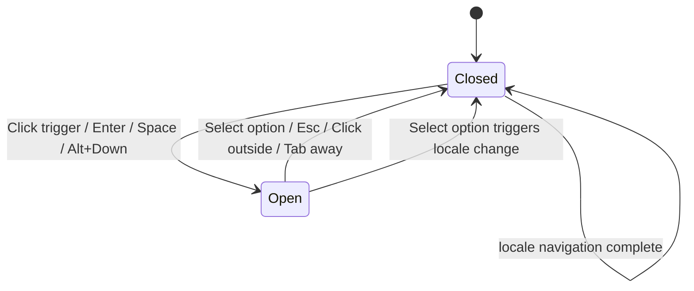

# 语言选择器组件规格 — LanguageSwitcher（version 0.1.13）


| 项       | 内容                                               |
| ------- | ------------------------------------------------ |
| 版本      | `0.1.13`                                         |
| 组件名（建议） | `LanguageSwitcher`                               |
| 宿主      | `PunkHomeHeader`                                 |
| 上游      | `design-spec-i18n.md` §4、`copy-home-en-zh.md` §3 |
| 对应 AC   | AC-B1–B4、AC-E1–E2                                |


---

## 1. 目标

在赛博 Punk 顶栏内提供**可访问**、**不占过多宽度**的中/英切换入口；切换后立即更新 URL（`/en` ↔ `/zh`）、cookie 与首页文案，无确认弹窗。

---

## 2. 位置与 DOM 顺序

```
<header> (PunkHomeHeader, h=56px)
  <BrandMark />
  <div> <!-- 右侧 flex -->
    <nav> Chat · Console </nav>
    <LanguageSwitcher />   ← 本组件
    Sign in | UserAvatarMenu
  </div>
</header>
```


| 规则       | 说明                             |
| -------- | ------------------------------ |
| 相对顺序     | **导航之后、账户区之前**（D1 定稿）          |
| 与 nav 间距 | `gap-2 sm:gap-3`，与现网 nav 内间距一致 |
| 可见性      | 未登录 / 已登录 / 会话加载中均显示（AC-B1）    |


---

## 3. 展示形式（Q6 定稿）

### 3.1 桌面（`sm` 及以上，≥640px）


| 元素    | 规格                                          |
| ----- | ------------------------------------------- |
| 触发器文案 | **当前语言全称**：`English` 或 `中文`                 |
| 辅助图标  | 可选 chevron-down，`h-3.5 w-3.5`，`aria-hidden` |
| 下拉列表  | **仅 1 项**——未选中的另一种语言                        |


### 3.2 移动端（`< sm`）


| 元素    | 规格                                                               |
| ----- | ---------------------------------------------------------------- |
| 触发器文案 | **缩写**：`EN` 或 `中文`（key：`langSwitcher.label.enShort` / `zhShort`） |
| 下拉列表  | 仍显示**全称**（`English` / `中文`），便于点选                                 |


### 3.3 明确不做

- ❌ 国旗图标（Q6）
- ❌ 分段控件同时展示两种语言（顶栏宽度不足）
- ❌ 地球图标 + 缩写（Q6 备选 D 未采纳）

---

## 4. 视觉规格

### 4.1 触发器

复用 `headerActionLinkClass`（与 `PunkHomeHeader` 中 nav 链接相同）：

```
inline-flex items-center gap-1 rounded-md px-2 py-1 text-sm outline-none
ring-cyan-400/80 transition hover:bg-white/10 focus-visible:ring-2
```

附加类：


| 属性       | class / 值                                                             |
| -------- | --------------------------------------------------------------------- |
| 文字色      | `text-zinc-300/90`                                                    |
| hover 文字 | `hover:text-cyan-200/90`                                              |
| 字体       | `font-mono`（与 nav 一致）                                                 |
| chevron  | `opacity-60 transition-transform`；`aria-expanded=true` 时 `rotate-180` |
| 最小触控     | 高度 ≥ 44px 触控区域（通过 `py-1` + 横向 padding 达成）                             |


### 4.2 下拉面板


| 属性        | 值                                                                                                                                      |
| --------- | -------------------------------------------------------------------------------------------------------------------------------------- |
| 定位        | 触发器下方 `right-0`，`mt-1`，`absolute`，`z-30`                                                                                               |
| 容器        | `min-w-[8.5rem] rounded-md border border-cyan-500/20 bg-zinc-950/95 py-1 shadow-lg backdrop-blur-md`                                   |
| 列表项       | `block w-full px-3 py-2 text-left font-mono text-sm text-zinc-300`                                                                     |
| 列表项 hover | `hover:bg-cyan-500/10 hover:text-cyan-100`                                                                                             |
| 列表项 focus | `focus-visible:bg-cyan-500/15 focus-visible:outline-none focus-visible:ring-1 focus-visible:ring-inset focus-visible:ring-cyan-400/50` |


### 4.3 选中态

- **当前语言**体现在触发器文案，**不在**下拉中重复出现。
- 下拉内唯一选项无 checkmark；选后面板关闭，触发器文案更新。

---

## 5. 交互

### 5.1 状态机




### 5.2 切换行为

1. 用户选择另一语言。
2. 写入 cookie（`NEXT_LOCALE` = `en`|`zh`）。
3. 导航至 `/{locale}`（next-intl `Link` 或 `router.replace`）。
4. 关闭下拉；可选 150ms main 区 fade（见 `design-spec-i18n.md` §7）。
5. **不**弹 toast / modal。

### 5.3 防连点

切换发起后 300ms 内禁用触发器，避免重复 navigation。

---

## 6. 可访问性（a11y）


| 要求              | 实现                                                      |
| --------------- | ------------------------------------------------------- |
| 触发器 role        | `button`（勿用 div）                                        |
| `aria-label`    | `t('langSwitcher.ariaLabel')` → "Language" / "语言"       |
| `aria-expanded` | `true` / `false`                                        |
| `aria-haspopup` | `listbox`                                               |
| 下拉容器            | `role="listbox"`                                        |
| 选项              | `role="option"` + `aria-selected`（唯一选项为 `false`，因非当前语言） |
| 键盘 · 触发器聚焦      | `Enter` / `Space` 切换展开                                  |
| 键盘 · 展开时        | `↓`/`↑` 聚焦选项；`Enter` 选中；`Esc` 关闭                        |
| 键盘 · Tab        | 关闭面板，焦点移至下一可聚焦元素（Sign in / Avatar）                      |
| 点击外部            | 关闭面板，焦点留在触发器                                            |
| 切换后             | 页面 `html lang` 更新；屏幕阅读器随新文档朗读                           |


---

## 7. 响应式与布局边界（AC-E1）


| 视口     | 预期                             |
| ------ | ------------------------------ |
| 320px  | 触发器用缩写；nav 可 wrap；语言控件不与登录按钮重叠 |
| 375px+ | 同左；主操作可点击                      |
| 768px+ | 触发器全称；单行顶栏                     |


**压力场景**：已登录 + 长昵称 — 语言选择器在 nav 与 avatar 之间，**不截断** BrandMark；必要时 nav 先 wrap，语言控件与 avatar 保持 `shrink-0`。

---

## 8. Props / 数据（建议接口）

```typescript
// 设计层类型示意，非实现代码
type LanguageSwitcherProps = {
  /** 当前 locale，来自 next-intl useLocale() 或等效 */
  locale: "en" | "zh";
  /** 可选：窄屏强制缩写，默认由 CSS sm: 断点控制 */
  compact?: boolean;
};
```

文案一律来自 `useTranslations('page.home')` 的 `langSwitcher.*` keys。

---

## 9. 与 i18n 路由集成


| 项         | 说明                                     |
| --------- | -------------------------------------- |
| 当前 locale | 从 URL segment 或 `useLocale()` 读取       |
| 切换目标      | `en` ↔ `zh` 互斥                         |
| URL       | `/en` ↔ `/zh`                          |
| 非首页       | 本期组件**仅挂载于 PunkHomeHeader**；其他页面无语言选择器 |


---

## 10. 验收检查表

- [ ] 桌面触发器显示 `English` / `中文` 全称
- [ ] 移动触发器显示 `EN` / `中文` 缩写
- [ ] 无国旗
- [ ] 选中态 = 触发器当前语言文案
- [ ] 单次选择后首页文案全部切换（AC-B2）
- [ ] Tab 可聚焦；Enter/Space/Esc/↑↓ 符合 §6
- [ ] 刷新后会话保持（cookie，AC-B5/B6）
- [ ] 窄屏无严重重叠（AC-E1）