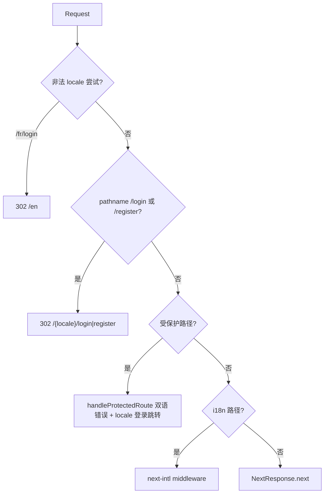

# API / HTTP 路由与 Middleware 行为规格（version 0.1.14）

| 项 | 内容 |
| --- | --- |
| 版本 | `0.1.14` |
| 阶段 | 3A 文档 |
| 说明 | 认证域 API **错误 message 双语**；middleware **路由与错误 message** 变更；REST **成功**响应 schema **不变** |
| 基线 | `../../0.1.13/backend/api-spec.md` |

---

## 1. REST API 变更声明

### 1.1 总览

| 项 | 结论 |
| --- | --- |
| 新增 Route Handler | **无** |
| 修改 Route Handler | **有** — 错误路径 message 本地化；**成功** JSON 不变 |
| 请求体 schema | **无** |
| 响应体 schema（成功） | **无** |
| 响应体 schema（错误） | **无结构变更** — 仍 `{ error: { code, message, details? } }`；`message` 随 locale 变化 |
| `error.messageKey` / `params` | **本期不加**（Q10） |
| 鉴权逻辑 | **无** |
| API URL 前缀 | **仍** `/api/...`，**无** `/en/api/...` |

**策略（Q1-A）**：服务端 `resolveRequestLocale` → `tApiMessage(locale, key, params?)` → `jsonError(code, translatedMessage, status)`。客户端继续 `readApiErrorPayload` + 展示 `error.message`。

### 1.2 本期双语范围

| 域 | 端点 | 双语 error.message |
| --- | --- | --- |
| 认证 | `POST /api/auth/login` | ✓ |
| 认证 | `POST /api/auth/register` | ✓ |
| 认证 | `GET /api/auth/me` | ✓（`UNAUTHORIZED`） |
| 认证 | `GET /api/auth/captcha` | ✓（`RATE_LIMITED`） |
| Middleware | 全站/路径频控、admin/console API 未登录 | ✓ |
| 共享 | `server/auth/admin.ts` `requireAdminApi` | ✓ |
| **非目标** | `/api/chat/*`、`/api/console/*` 业务错误（middleware 401 除外） | ✗ 仍中文 |
| **非目标** | `/api/admin/*` 业务错误（middleware 401 除外） | ✗ 仍中文 |

---

## 2. Locale 解析（API 与 Middleware 共用）

### 2.1 顺序（Q5-A）

```
1. Cookie NEXT_LOCALE     → 值 ∈ { en, zh }
2. Accept-Language        → 首个 tag：zh* → zh；否则 → en
3. 默认                   → en
```

**不读取**：URL path locale（API 无 prefix）；Referer 中的 locale（避免伪造，cookie 已足够）。

### 2.2 与 UI locale 同步

| 条件 | 期望 |
| --- | --- |
| 用户在 `/en/login`，cookie `NEXT_LOCALE=en` | `POST /api/auth/login` 错误为英文 |
| 用户切换至 `/zh/login`（LanguageSwitcher 写 cookie） | 下一请求错误为中文 |
| 无 cookie，`Accept-Language: zh-CN`，直接调 API | 中文错误 |
| `credentials: 'include'` | 前端 fetch **必须**携带，否则 cookie 不可用 |

---

## 3. 认证 API 端点规格

### 3.1 `POST /api/auth/login`

**成功响应（不变）**：

```json
{
  "ok": true,
  "user": { "id": "...", "email": "...", "nickName": "...", "telNo": null },
  "redirectUrl": "/chat"
}
```

**错误响应 — ErrorCode 与 message key 对照**：

| 触发条件 | ErrorCode | message key | HTTP |
| --- | --- | --- | --- |
| IP 频控 `allowRate('login:...')` | `RATE_LIMITED` | `rateLimited` | 429 |
| 请求体非 JSON | `VALIDATION_ERROR` | `validation.invalidJson` | 400 |
| 验证码缺失 | `CAPTCHA_REQUIRED` | `captchaRequired` | 400 |
| 验证码错误/过期 | `CAPTCHA_INVALID` | `captchaInvalid` | 400 |
| 邮箱格式无效 | `VALIDATION_ERROR` | `validation.invalidEmail` | 400 |
| 登录锁定 | `RATE_LIMITED` | `authLoginLocked` + `{ minutes }` | 429 |
| 密码为空 | `VALIDATION_ERROR` | `validation.passwordRequired` | 400 |
| 用户不存在 / 密码错误 | `AUTH_INVALID_CREDENTIALS` | `authInvalidCredentials` | 400 |
| 账号非 active | `AUTH_ACCOUNT_DISABLED` | `authAccountDisabled` | 403 |

**示例 — 凭据错误（en）**：

```json
{
  "error": {
    "code": "AUTH_INVALID_CREDENTIALS",
    "message": "Incorrect email or password. Please check and try again."
  }
}
```

**示例 — 凭据错误（zh）**：

```json
{
  "error": {
    "code": "AUTH_INVALID_CREDENTIALS",
    "message": "邮箱或密码错误，请检查后重试"
  }
}
```

**示例 — 登录锁定 1 分钟（en，ICU plural）**：

```json
{
  "error": {
    "code": "RATE_LIMITED",
    "message": "Too many failed sign-in attempts. Try again in 1 minute."
  }
}
```

**示例 — 登录锁定 5 分钟（en）**：

```json
{
  "error": {
    "code": "RATE_LIMITED",
    "message": "Too many failed sign-in attempts. Try again in 5 minutes."
  }
}
```

**示例 — 登录锁定（zh）**：

```json
{
  "error": {
    "code": "RATE_LIMITED",
    "message": "登录失败次数过多，请 5 分钟后再试"
  }
}
```

**示例 — 验证码错误（en）**：

```json
{
  "error": {
    "code": "CAPTCHA_INVALID",
    "message": "Verification code is incorrect or expired. Refresh and try again."
  }
}
```

---

### 3.2 `POST /api/auth/register`

**管理员 gate（先于 body 解析）**：

| 触发条件 | ErrorCode | message key | HTTP |
| --- | --- | --- | --- |
| 未登录 | `UNAUTHORIZED` | `authAdminLoginRequired` | 401 |
| 已登录非管理员 | `FORBIDDEN` | `authAdminOnly` | 403 |

**示例 — 未登录管理员（en）**：

```json
{
  "error": {
    "code": "UNAUTHORIZED",
    "message": "Sign in with an administrator account first."
  }
}
```

**其它错误对照**：

| 触发条件 | ErrorCode | message key | HTTP |
| --- | --- | --- | --- |
| IP 频控 | `RATE_LIMITED` | `rateLimited` | 429 |
| 请求体非 JSON | `VALIDATION_ERROR` | `validation.invalidJson` | 400 |
| 验证码缺失/无效 | `CAPTCHA_*` | `captchaRequired` / `captchaInvalid` | 400 |
| 邮箱格式 | `VALIDATION_ERROR` | `validation.invalidEmail` | 400 |
| 昵称 | `VALIDATION_ERROR` | `validation.nickNameLength` | 400 |
| 密码策略 | `VALIDATION_ERROR` | `validation.passwordMinLength` 等 | 400 |
| 两次密码不一致 | `VALIDATION_ERROR` | `validation.passwordMismatch` | 400 |
| 手机号 | `VALIDATION_ERROR` | `validation.telNoInvalid` | 400 |
| 邮箱已注册 | `AUTH_EMAIL_TAKEN` | `authEmailTaken` | 400 |
| 手机号占用 | `AUTH_TEL_TAKEN` | `authTelTaken` | 400 |

**示例 — 邮箱已占用（zh）**：

```json
{
  "error": {
    "code": "AUTH_EMAIL_TAKEN",
    "message": "该邮箱已注册，请直接登录"
  }
}
```

**成功响应（不变）**：`201` + `{ ok, user, redirectUrl }`。

---

### 3.3 `GET /api/auth/me`

| 触发条件 | ErrorCode | message key | HTTP |
| --- | --- | --- | --- |
| 无有效 session | `UNAUTHORIZED` | `unauthorized` | 401 |

**示例（en）**：

```json
{
  "error": {
    "code": "UNAUTHORIZED",
    "message": "You are not signed in."
  }
}
```

**示例（zh）**：

```json
{
  "error": {
    "code": "UNAUTHORIZED",
    "message": "未登录"
  }
}
```

**成功（不变）**：`200` + `{ user: PublicUser }`。

---

### 3.4 `GET /api/auth/captcha`

| 触发条件 | ErrorCode | message key | HTTP |
| --- | --- | --- | --- |
| IP 频控 | `RATE_LIMITED` | `rateLimited` | 429 |

**成功（不变）**：`200` + `{ captchaId, imageBase64 }`。

---

### 3.5 `server/auth/admin.ts` — `requireAdminApi`

| 触发条件 | ErrorCode | message key | HTTP |
| --- | --- | --- | --- |
| 未登录 | `UNAUTHORIZED` | `unauthorized` | 401 |
| 非管理员 | `FORBIDDEN` | `forbidden` | 403 |

**3B 注意**：`requireAdminApi` 无 `Request` 参数；须通过 `headers()` 读取 cookie 或扩展签名为 `requireAdminApi(req?: Request)`。**推荐**：新增 `getRequestLocaleFromHeaders(): AppLocale`，内部 `headers()` + `resolveRequestLocale` 等价逻辑。

**示例 — 非管理员（en）**：

```json
{
  "error": {
    "code": "FORBIDDEN",
    "message": "You do not have permission to access this resource."
  }
}
```

---

## 4. HTTP 路由行为规格（Middleware）

### 4.1 路由总表（相对 0.1.13 变更项）

| 路径 | 方法 | 0.1.14 行为 | locale |
| --- | --- | --- | --- |
| `/login` | GET | **302** → `/{resolvedLocale}/login`（保留 query） | 解析后 |
| `/register` | GET | **302** → `/{resolvedLocale}/register`（保留 query） | 解析后 |
| `/en/login`、`/zh/login` | GET | **200** 登录页（`[locale]/login`） | URL segment |
| `/en/register`、`/zh/register` | GET | **200** 注册页 | URL segment |
| `/chat` 等 | GET | 未登录 **302** → `/{resolvedLocale}/login?redirect=...` | cookie 链 |
| `/api/*` | * | **无 locale 前缀** | — |

**不存在**（勿误实现）：`/login` 直接 200 渲染（旧 page 删除或仅作 fallback）。

### 4.2 旧路径 302（Q3-A）

| 请求 | 响应 |
| --- | --- |
| `GET /login` | `302 Location: /en/login`（cookie=en 时） |
| `GET /login?redirect=/chat` | `302 Location: /en/login?redirect=/chat` |
| `GET /register` | `302 Location: /zh/register`（Accept-Language: zh 且无 cookie 时） |

- **无**过渡 HTML。
- Query string **原样保留**（`redirect` 等）。

### 4.3 受保护页未登录跳转（变更）

**之前**：`Location: /login?redirect=/chat`

**之后**：

```http
HTTP/1.1 302 Found
Location: /en/login?redirect=%2Fchat
```

`redirect` 参数值仍为**无 locale 前缀**的 app 路径（`/chat`、`/console/...`），与 `safeRedirectUrl` 兼容。

### 4.4 非法 locale（不变）

| 请求 | 行为 |
| --- | --- |
| `/fr/login` | 302 → `/en` |
| `/en-US/register` | 302 → `/en` |

---

## 5. Middleware 错误响应双语

### 5.1 错误对照

| 场景 | ErrorCode | message key | HTTP |
| --- | --- | --- | --- |
| 全站频控 `allowRate('site', ...)` | `RATE_LIMITED` | `rateLimitedSite` | 429 |
| 路径+IP 频控 | `RATE_LIMITED` | `rateLimited` | 429 |
| `/api/admin/*`、`/api/console/*` 无 session | `UNAUTHORIZED` | `unauthorized` | 401 |

### 5.2 示例 — 站点频控（en）

```json
{
  "error": {
    "code": "RATE_LIMITED",
    "message": "Too many visits to this site. Please try again later."
  }
}
```

### 5.2 示例 — 站点频控（zh）

```json
{
  "error": {
    "code": "RATE_LIMITED",
    "message": "站点访问过于频繁，请稍后再试"
  }
}
```

### 5.3 Middleware 内调用示意

```typescript
// 伪代码 — 3B 实现
const locale = resolveRequestLocale(request);
return jsonError(
  ErrorCode.RATE_LIMITED,
  tApiMessage(locale, "rateLimitedSite"),
  HttpStatus.TOO_MANY_REQUESTS,
);
```

**约束**：middleware 运行在 Edge；`tApiMessage` 须 **同步** 或预加载 message JSON（见 `implementation-plan.md` §3）。

---

## 6. Middleware 执行顺序（更新）



**顺序要点**：

1. 非法 locale 尝试 → `/en`
2. **旧 `/login`、`/register` 302**（在 `isI18nPath` 之前，避免 `next()` 落到已删 page）
3. 受保护路径 auth + 限流
4. `/(en|zh)/...` → next-intl

---

## 7. Matcher 规格（相对 0.1.13）

**变更**：

| 项 | 0.1.13 | 0.1.14 |
| --- | --- | --- |
| 显式 `/login`、`/register` | 无 | **新增** matcher 条目 |
| 负向预查排除 `login\|register` | 有 | **移除**（使 `/login` 进入 middleware） |
| `KNOWN_APP_SEGMENTS` | 含 login/register | **移除** |

**推荐 matcher**：

```typescript
export const config = {
  matcher: [
    "/",
    "/(en|zh)",
    "/(en|zh)/:path*",
    "/login",
    "/register",
    "/chat",
    "/chat/:path*",
    "/console",
    "/console/:path*",
    "/admin",
    "/admin/:path*",
    "/api/admin/:path*",
    "/api/console/:path*",
    "/api/auth/:path*",
    "/((?!api|_next|_vercel|chat|console|admin|knowledge|.*\\..*)[^/]+)",
  ],
};
```

---

## 8. 错误响应通用约定

### 8.1 Content-Type

```http
Content-Type: application/json; charset=utf-8
```

### 8.2 安全语义（双语须等价）

| key | 约束 |
| --- | --- |
| `authInvalidCredentials` | 中英文均不暗示邮箱是否存在 |
| `authLoginLocked` | 仅披露等待分钟数 |
| `authAccountDisabled` | 不披露内部 status 枚举 |

### 8.3 缺失 key 回退

| 层级 | 行为 |
| --- | --- |
| `tApiMessage` 未知 key | 回退 `en` message；仍未知则 key 字符串（开发期应 fail fast） |
| zh 缺失某 key | 回退 `en` 对应值（延续 0.1.13） |

---

## 9. 与前端对接要点

| 项 | 约定 |
| --- | --- |
| 展示 API 错误 | 直接 `error.message`（Q1-A） |
| 字段映射 | `mapLoginApiError` / `mapRegisterApiError` **优先 `error.code`**（Q4-B） |
| `readApiErrorPayload` | **不改**（Q10） |
| fetch 认证 API | `credentials: 'include'` |
| 客户端 fallback | `page.login.errors.*`（网络异常、无 message） |
| 登录 href | `/{locale}/login?redirect=...`（Frontend） |

---

## 10. 关联文档

- ErrorCode / message 文件结构：`data-models.md`
- 实现步骤与模块 API：`implementation-plan.md`
- 风险与 `map*ApiError` 技术债：`risks-and-open-items.md`
- 设计终稿：`../design/spec-api-message-auth.md`
