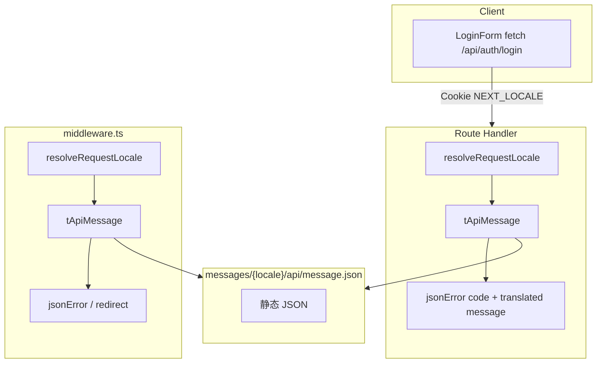

# 实现计划 — i18n 认证 API 与 middleware（version 0.1.14）

| 项 | 内容 |
| --- | --- |
| 版本 | `0.1.14` |
| 阶段 | **3A 文档**（本文供 **3B 代码实现**） |
| 范围 | 服务端 locale 解析、API message 翻译、认证 route/middleware/admin 改造；**无 DB 变更** |
| 上游 | `../product/`、`../design/spec-api-message-auth.md`、`../design/design-spec-routing-locale.md` |
| 基线 | `../../0.1.13/backend/implementation-plan.md` |

---

## 1. 目标与边界

### 1.1 本期 Backend（3B）职责

| 职责 | 说明 |
| --- | --- |
| `resolveRequestLocale` | cookie → Accept-Language → `en` |
| `tApiMessage` | 按 locale 读 `api/message.json` + ICU 格式化 |
| 填充 `messages/{en,zh}/api/message.json` | 设计终稿 JSON |
| 认证 route 改造 | login/register/me/captcha |
| `middleware.ts` | 旧路径 302、`KNOWN_APP_SEGMENTS`、双语错误、locale 登录跳转 |
| `server/auth/admin.ts` | 门禁错误双语 |
| **不做** | 页面组件、route 迁入 `[locale]`（Frontend 主责）；非认证 API 双语 |

### 1.2 与 Frontend 分工

| 项 | Backend 3B | Frontend 4 |
| --- | --- | --- |
| `src/app/[locale]/login|register/page.tsx` | — | ✓ 迁移 + i18n |
| `messages/page/login|register.json` | — | ✓ |
| `messages/api/message.json` | ✓ 填充 + 服务端读 | 消费 `error.message` |
| `map-api-errors.ts` keyword 补强 | 文档约定 | ✓ |
| `src/i18n/request.ts` 加载 page.login/register | 可选协助 | ✓ |

---

## 2. 架构总览



---

## 3. 新建模块（3B）

### 3.1 `@/common/utils/i18n.ts`（纯函数）

**职责**：`Accept-Language` 解析，供 middleware（Edge）与 server 共用。

```typescript
/**
 * 从 Accept-Language 请求头解析站点 locale。
 * 规则：首个 tag 主段以 zh 开头 → zh，否则 → en。
 */
export function localeFromAcceptLanguage(header: string | null): AppLocale;

/**
 * 合并 cookie 与 Accept-Language，得到最终 AppLocale。
 * 顺序：有效 cookie → Accept-Language → DEFAULT_LOCALE。
 */
export function resolveLocaleFromCookieAndHeader(
  cookieValue: string | undefined,
  acceptLanguage: string | null,
): AppLocale;
```

**中文注释要求**：文件顶说明与 next-intl URL 检测的差异（API 场景无 URL prefix）。

### 3.2 `@/server/i18n/resolve-request-locale.ts`

```typescript
import type { NextRequest } from "next/server";

/** 从 Request / NextRequest 解析 API 与 middleware 使用的 locale */
export function resolveRequestLocale(request: Request | NextRequest): AppLocale;
```

**实现要点**：

- 读 `request.cookies.get(LOCALE_COOKIE)?.value`（NextRequest）或 `Cookie` header 解析（裸 `Request`）。
- 读 `request.headers.get("accept-language")`。
- 委托 `resolveLocaleFromCookieAndHeader`。

**调用点清单**：

| 位置 | 说明 |
| --- | --- |
| `middleware.ts` | 302、jsonError、登录 redirect |
| `app/api/auth/login/route.ts` | 全部 error 分支 |
| `app/api/auth/register/route.ts` | 全部 error 分支 |
| `app/api/auth/me/route.ts` | UNAUTHORIZED |
| `app/api/auth/captcha/route.ts` | RATE_LIMITED |
| `server/auth/admin.ts` | requireAdminApi（via headers） |

### 3.3 `@/server/i18n/t-api-message.ts`

**职责**：服务端 API 错误文案翻译（Q1-A 核心）。

```typescript
type ApiMessageParams = Record<string, string | number | Date>;

/**
 * 读取 api.message 命名空间下 key 的译文。
 * @param key - 点分 key，如 "validation.invalidEmail"
 * @param params - ICU 参数，如 { minutes: 5 }
 */
export function tApiMessage(
  locale: AppLocale,
  key: string,
  params?: ApiMessageParams,
): string;
```

**实现选项（3B 择一并写入 implementation-notes）**：

| 方案 | 说明 | 推荐 |
| --- | --- | --- |
| **A** | 静态 `import` en/zh 两份 JSON；内存缓存；ICU 用 `next-intl` 的 `createTranslator` 或 `@formatjs/intl` | **推荐** — 与 message 源一致 |
| B | 每次动态 `import(\`../../../messages/${locale}/api/message.json\`)` | 简单但重复 IO |
| C | 复制 message 至 TS 常量 | 易漂移，**不推荐** |

**ICU（Q7）**：`authLoginLocked` 英文 plural 须正确渲染 `1 minute` vs `5 minutes`。使用 next-intl 服务端 `createTranslator({ locale, messages, namespace: 'api.message' })` 的 `t('authLoginLocked', { minutes: n })`。

**Edge 约束**：middleware 也调用 `tApiMessage` → 实现须 **Edge 兼容**（无 Node fs；静态 import JSON 可行）。

**嵌套 key**：`validation.invalidEmail` 对应 JSON `{ "validation": { "invalidEmail": "..." } }`；helper 内按点分路径取值。

### 3.4 `@/server/i18n/json-error-i18n.ts`（可选薄封装）

```typescript
/** 构造 locale 感知的 jsonError 响应 */
export function jsonErrorI18n(
  request: Request,
  code: ErrorCode,
  messageKey: string,
  status: HttpStatus,
  params?: ApiMessageParams,
): NextResponse;
```

**职责**：组合 `resolveRequestLocale` + `tApiMessage` + `jsonError`，减少 route 重复。**非必须**；route 内联亦可。

---

## 4. Message 文件（3B）

### 4.1 写入内容

将 `../design/spec-api-message-auth.md` §6–7 的 JSON **原样**写入：

- `messages/en/api/message.json`
- `messages/zh/api/message.json`

替换现网空对象 `{}`。

### 4.2 扩展 `src/i18n/request.ts`（Backend 可协助）

并行 import `page/login`、`page/register` 为 Frontend 准备（见 design §5.2）：

```typescript
const [pageHome, pageLogin, pageRegister, apiMessage] = await Promise.all([
  import(`../../messages/${locale}/page/home.json`),
  import(`../../messages/${locale}/page/login.json`),
  import(`../../messages/${locale}/page/register.json`),
  import(`../../messages/${locale}/api/message.json`),
]);
```

若 login/register JSON 尚未由 Frontend 创建，3B 可先仅改 `api/message.json`；request.ts 扩展可随 Frontend 同步。

---

## 5. Route Handler 改造点

### 5.1 通用模式

**之前**：

```typescript
return jsonError(ErrorCode.CAPTCHA_INVALID, "验证码错误或已过期，请刷新后重试", HttpStatus.BAD_REQUEST);
```

**之后**：

```typescript
const locale = resolveRequestLocale(req);
return jsonError(
  ErrorCode.CAPTCHA_INVALID,
  tApiMessage(locale, "captchaInvalid"),
  HttpStatus.BAD_REQUEST,
);
```

删除 `login/route.ts` 顶部 `GENERIC_LOGIN_FAIL` 常量，改用 `authInvalidCredentials` key。

### 5.2 `POST /api/auth/login` — 逐分支

| 行级逻辑（现网） | 改造 |
| --- | --- |
| IP 频控 | `rateLimited` |
| JSON parse catch | `validation.invalidJson` |
| captcha missing/invalid | `captchaRequired` / `captchaInvalid` |
| invalid email | `validation.invalidEmail` |
| lock remain | `authLoginLocked` + `{ minutes: Math.ceil(lockRemainMs / 60_000) }` |
| empty password | `validation.passwordRequired` |
| invalid credentials | `authInvalidCredentials` |
| account disabled | `authAccountDisabled` |

### 5.3 `POST /api/auth/register` — 逐分支

| 逻辑 | 改造 |
| --- | --- |
| !currentUser | `authAdminLoginRequired` + UNAUTHORIZED |
| !isAdminEmail | `authAdminOnly` + FORBIDDEN |
| 频控 | `rateLimited` |
| JSON / captcha | 同 login |
| invalid email | `validation.invalidEmail` |
| validateNickName | **不用** util 返回串；直接 `validation.nickNameLength` |
| validatePasswordPolicy | 按失败原因分支：`passwordMinLength` / `passwordNeedsLetterAndNumber` / `passwordSameAsEmail` |
| password mismatch | `validation.passwordMismatch` |
| invalid tel | `validation.telNoInvalid` |
| email/tel taken | `authEmailTaken` / `authTelTaken` |

**密码策略分支实现建议**：

```typescript
// 替代 validatePasswordPolicy 直接返回中文
if (password.length < 8) {
  return jsonError(..., tApiMessage(locale, "validation.passwordMinLength"), ...);
}
if (!/[a-zA-Z]/.test(password) || !/[0-9]/.test(password)) {
  return jsonError(..., tApiMessage(locale, "validation.passwordNeedsLetterAndNumber"), ...);
}
if (password.toLowerCase() === email) {
  return jsonError(..., tApiMessage(locale, "validation.passwordSameAsEmail"), ...);
}
```

**不修改** `validatePasswordPolicy` / `validateNickName` 本身（控制台 API 仍用中文 util 返回值）。

### 5.4 `GET /api/auth/me`

```typescript
// 需传入 req：withApiWrapper(async (req) => { ... })
return jsonError(
  ErrorCode.UNAUTHORIZED,
  tApiMessage(resolveRequestLocale(req), "unauthorized"),
  HttpStatus.UNAUTHORIZED,
);
```

### 5.5 `GET /api/auth/captcha`

频控分支 → `rateLimited`。

### 5.6 `server/auth/admin.ts`

```typescript
import { headers } from "next/headers";

function localeFromHeaders(): AppLocale {
  const h = headers();
  const cookie = /* 解析 Cookie 头中 NEXT_LOCALE */;
  return resolveLocaleFromCookieAndHeader(cookie, h.get("accept-language"));
}

// requireAdminApi 内：
return {
  ok: false,
  response: jsonError(
    ErrorCode.UNAUTHORIZED,
    tApiMessage(localeFromHeaders(), "unauthorized"),
    HttpStatus.UNAUTHORIZED,
  ),
};
```

**替代方案**：`requireAdminApi(request: Request)`  breaking change 较大；优先 `headers()` 方案。

---

## 6. Middleware 改造

### 6.1 `KNOWN_APP_SEGMENTS`

从 Set 中 **移除** `"login"`、`"register"`（见 `data-models.md` §6）。

### 6.2 旧路径 302

在 `middleware` 主函数内，**非法 locale 检查之后**、**受保护路径之前**：

```typescript
function handleLegacyAuthPageRedirect(request: NextRequest): NextResponse | null {
  const { pathname, search } = request.nextUrl;
  if (pathname === "/login" || pathname === "/register") {
    const locale = resolveRequestLocale(request);
    const target = pathname === "/login" ? "login" : "register";
    const url = new URL(`/${locale}/${target}`, request.url);
    url.search = search; // 保留 query
    return NextResponse.redirect(url, 302);
  }
  return null;
}
```

### 6.3 `handleProtectedRoute` 登录跳转

```typescript
const locale = resolveRequestLocale(request);
const login = new URL(`/${locale}/login`, request.url);
login.searchParams.set("redirect", `${pathname}${search}`);
return NextResponse.redirect(login);
```

### 6.4 双语 jsonError

| 现网中文 | message key |
| --- | --- |
| 站点访问过于频繁… | `rateLimitedSite` |
| 请求过于频繁… | `rateLimited` |
| 未登录 | `unauthorized` |

### 6.5 处理顺序（完整）

```typescript
export function middleware(request: NextRequest) {
  const { pathname } = request.nextUrl;

  if (isInvalidLocaleAttempt(pathname)) {
    return NextResponse.redirect(new URL("/en", request.url), 302);
  }

  const legacy = handleLegacyAuthPageRedirect(request);
  if (legacy) return legacy;

  if (isProtectedPath(pathname)) {
    return handleProtectedRoute(request);
  }

  if (isI18nPath(pathname)) {
    return intlMiddleware(request);
  }

  return NextResponse.next();
}
```

### 6.6 Matcher

见 `api-spec.md` §7。从负向预查中 **移除** `login|register`。

### 6.7 删除或精简旧 page（与 Frontend 协调）

- `src/app/login/page.tsx`、`src/app/register/page.tsx`：删除或改为 `redirect()` fallback。
- **middleware 302 优先**；即使 page 暂留，行为以 302 为准。

---

## 7. 3B 实现步骤（按优先级）

| 优先级 | 步骤 | 说明 |
| --- | --- | --- |
| **P0** | 填充 `messages/{en,zh}/api/message.json` | 设计终稿 |
| **P0** | 实现 `localeFromAcceptLanguage`、`resolveLocaleFromCookieAndHeader` | `@/common/utils/i18n.ts` |
| **P0** | 实现 `resolveRequestLocale`、`tApiMessage` | `@/server/i18n/*` |
| **P0** | 改造 `middleware.ts` | 302、KNOWN_APP_SEGMENTS、双语错误、locale 登录 URL |
| **P0** | 改造 auth routes（login/register/me/captcha） | 全部 error 分支 |
| **P1** | 改造 `server/auth/admin.ts` | UNAUTHORIZED / FORBIDDEN |
| **P1** | 扩展 `src/i18n/request.ts`（若 Frontend JSON 就绪） | page.login/register |
| **P2** | 可选 `jsonErrorI18n` 封装 | 减重复 |
| **P2** | `implementation-notes.md` | 实际方案、自测记录 |
| **P3** | 冒烟 / 可选单测 | §8 |

---

## 8. 测试要点

### 8.1 API 错误 locale（curl / Playwright）

| # | 场景 | 期望 message 语言 |
| --- | --- | --- |
| A1 | `POST /api/auth/login` 错误密码，cookie `NEXT_LOCALE=en` | 英文 `authInvalidCredentials` |
| A2 | 同上，cookie `NEXT_LOCALE=zh` | 中文 |
| A3 | 无 cookie，`Accept-Language: zh-CN`，验证码错误 | 中文 `captchaInvalid` |
| A4 | 登录锁定 minutes=1，locale=en | `Try again in 1 minute.` |
| A5 | 登录锁定 minutes=5，locale=en | `Try again in 5 minutes.` |
| A6 | `POST /api/auth/register` 未登录，locale=en | `authAdminLoginRequired` 英文 |
| A7 | 邮箱已占用，locale=zh | `authEmailTaken` 中文 |
| A8 | `GET /api/auth/me` 无 session，locale=en | `You are not signed in.` |
| A9 | `GET /api/auth/captcha` 频控，locale=en | `Too many requests...` |

**curl 示例**：

```bash
curl -s -X POST http://localhost:3000/api/auth/login \
  -H 'Content-Type: application/json' \
  -H 'Cookie: NEXT_LOCALE=en' \
  -d '{"email":"bad","password":"x","captchaId":"x","captcha":"x"}' | jq .
```

### 8.2 Middleware HTTP

| # | 场景 | 期望 |
| --- | --- | --- |
| M1 | `GET /login`，cookie=en | 302 `/en/login` |
| M2 | `GET /login?redirect=/chat` | 302 `/en/login?redirect=/chat` |
| M3 | 无 cookie，`Accept-Language: zh-CN` | 302 `/zh/login` |
| M4 | 无 session `GET /chat`，cookie=zh | 302 `/zh/login?redirect=/chat` |
| M5 | 全站频控触发 | 429 JSON 英文/中文 `rateLimitedSite` |
| M6 | `GET /api/console/*` 无 session，cookie=en | 401 JSON 英文 `unauthorized` |
| M7 | `GET /fr/login` | 302 `/en` |

### 8.3 回归

| # | 场景 |
| --- | --- |
| R1 | 登录成功 → redirect=/chat 正常 |
| R2 | `fetch('/api/auth/me')` 不受 locale 前缀影响 |
| R3 | 注册管理员流程 en/zh 冒烟 |
| R4 | 非法 locale 仍 302 `/en`，无 500 |

### 8.4 测试基础设施

- 延续 0.1.13：无强制 Vitest；优先 **curl 脚本** 或 Playwright。
- 纯函数 `localeFromAcceptLanguage` 可抽 Vitest（可选）。

---

## 9. 文件清单（3B 新建/修改）

### 9.1 新建

| 路径 | 职责 |
| --- | --- |
| `src/common/utils/i18n.ts` | Accept-Language + cookie 解析纯函数 |
| `src/server/i18n/resolve-request-locale.ts` | Request → AppLocale |
| `src/server/i18n/t-api-message.ts` | key → 译文 + ICU |
| `src/server/i18n/json-error-i18n.ts` | 可选封装 |

### 9.2 修改

| 路径 | 职责 |
| --- | --- |
| `messages/en/api/message.json` | 填充 |
| `messages/zh/api/message.json` | 填充 |
| `src/middleware.ts` | §6 全部 |
| `src/app/api/auth/login/route.ts` | 双语 error |
| `src/app/api/auth/register/route.ts` | 双语 error + validation key |
| `src/app/api/auth/me/route.ts` | 双语 UNAUTHORIZED |
| `src/app/api/auth/captcha/route.ts` | 双语 RATE_LIMITED |
| `src/server/auth/admin.ts` | 双语门禁 |
| `src/common/utils/index.ts` | 导出 i18n utils（若新建） |
| `src/i18n/request.ts` | 可选 page.login/register |

### 9.3 不修改（本期 Backend）

| 路径 | 原因 |
| --- | --- |
| `src/common/utils/validation.ts` | 控制台仍用中文；register route 内联 key |
| `src/server/http/json-response.ts` | schema 不变 |
| `src/components/auth/map-api-errors.ts` | Frontend 4 |
| TypeORM / SQLite | 无 DB 变更 |

---

## 10. 关联文档

- API 规格与 JSON 示例：`api-spec.md`
- 映射表与 message 结构：`data-models.md`
- 风险：`risks-and-open-items.md`
