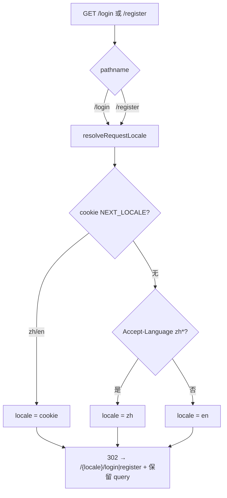
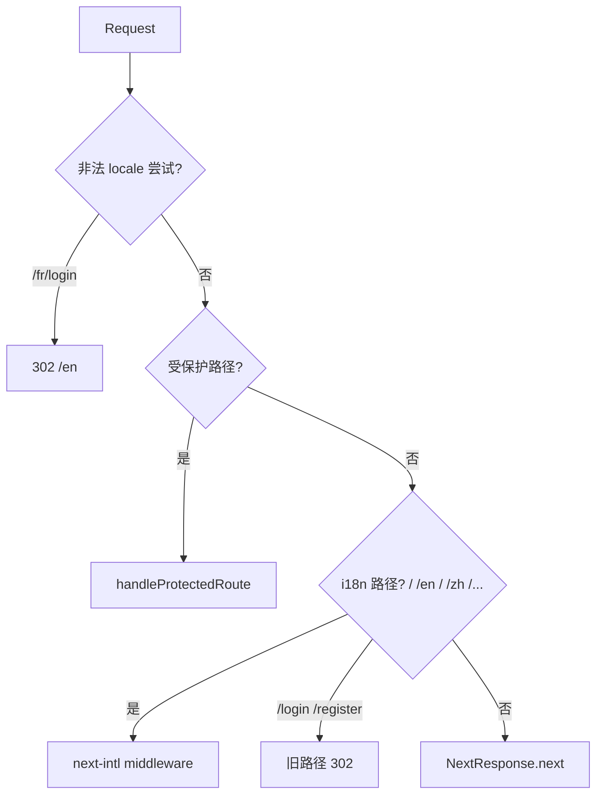

# 设计说明 — 路由迁移与 locale 一致性（version 0.1.14）

| 项 | 内容 |
| --- | --- |
| 版本 | `0.1.14` |
| 上游 | `user-stories-routing-locale.md`、`design-spec-i18n-auth.md` |
| 决策 | Q3-A 直接 302；Q5-A cookie → Accept-Language → en |

---

## 1. 路由变更摘要

| 变更项 | 之前 | 之后 |
| --- | --- | --- |
| 登录页 | `src/app/login/page.tsx` → `/login` | `src/app/[locale]/login/page.tsx` → `/{locale}/login` |
| 注册页 | `src/app/register/page.tsx` → `/register` | `src/app/[locale]/register/page.tsx` → `/{locale}/register` |
| 旧 URL | 直接渲染 | **302** 至 locale 前缀路径 |
| `KNOWN_APP_SEGMENTS` | 含 `login`、`register` | **移除** |
| 未登录跳转 | `/login?redirect=...` | `/{locale}/login?redirect=...` |
| 首页登录 href | `/login?redirect=...` | `/{locale}/login?redirect=...` |

---

## 2. 旧 URL 重定向（Q3-A / D4）

### 2.1 行为定稿

| 请求 | 响应 |
| --- | --- |
| `GET /login` | **302** `/{resolvedLocale}/login` |
| `GET /register` | **302** `/{resolvedLocale}/register` |
| `GET /login?redirect=/chat` | **302** `/{resolvedLocale}/login?redirect=/chat` |
| `GET /register?redirect=/console` | **302** `/{resolvedLocale}/register?redirect=/console` |

- **无过渡页**、无中间 HTML、无 meta refresh。
- Query string **完整保留**（编码不变）。
- `resolvedLocale` 解析链见 §3。

### 2.2 实现选项（开发选型，行为等价）

| 方案 | 说明 |
| --- | --- |
| **A（推荐）** | `middleware`：若 `pathname === '/login' \| '/register'`，解析 locale 后 `NextResponse.redirect` |
| B | 保留 `src/app/login/page.tsx` 为薄 redirect Server Component |
| C | `next.config` redirects（难读 cookie，**不推荐**） |

设计验收以 **middleware 方案** 为准；若用 B 作补充，行为须一致。

### 2.3 重定向流程图



---

## 3. Locale 解析链（Q5-A）

与 0.1.13 `design-spec-i18n.md` §2.2 **相同**：

| 优先级 | 来源 | 规则 |
| --- | --- | --- |
| 1 | Cookie `NEXT_LOCALE` | `zh` / `en` |
| 2 | `Accept-Language` | 首个 tag `zh*` → `zh`；否则 `en` |
| 3 | 默认 | `en` |

**适用场景**：

- `/` → `/{locale}`
- `/login`、`/register` → `/{locale}/login|register`
- middleware 未登录 → `/{locale}/login?redirect=...`

**不适用**：已带 locale 前缀的路径（`/en/login` 由 next-intl 处理）。

---

## 4. middleware 改造要点

### 4.1 `KNOWN_APP_SEGMENTS`（变更后）

```typescript
const KNOWN_APP_SEGMENTS = new Set([
  "chat",
  "console",
  "admin",
  "knowledge",
  "api",
  // login, register 已移除
]);
```

### 4.2 `handleProtectedRoute` 未登录跳转

```typescript
// 之前
const login = new URL("/login", request.url);

// 之后
const locale = resolveRequestLocale(request);
const login = new URL(`/${locale}/login`, request.url);
login.searchParams.set("redirect", `${pathname}${search}`);
```

`pathname` 仍为无 locale 的 app 路径（如 `/chat`），与现网 `safeRedirectUrl` 兼容。

### 4.3 middleware 错误 message

`jsonError` 调用改为 locale 感知（`rateLimitedSite`、`rateLimited`、`unauthorized`），见 `spec-api-message-auth.md`。

### 4.4 matcher 更新

在现有 matcher 基础上：

| 项 | 说明 |
| --- | --- |
| 保留 | `/(en|zh)/:path*` — 覆盖 `/{locale}/login` |
| 新增/确认 | `/login`、`/register` 进入 middleware（用于 302） |
| 保留 | `/api/auth/:path*` 受保护逻辑 |
| 调整 | `login|register` 从「排除非法 locale」段移除 |

参考现网 `config.matcher`：

```typescript
matcher: [
  "/",
  "/(en|zh)",
  "/(en|zh)/:path*",
  "/login",
  "/register",
  "/chat", "/chat/:path*",
  "/console", "/console/:path*",
  "/admin", "/admin/:path*",
  "/api/admin/:path*",
  "/api/console/:path*",
  "/api/auth/:path*",
  "/((?!api|_next|_vercel|chat|console|admin|knowledge|.*\\..*)[^/]+)",
]
```

（`login|register` 从负向预查中移除。）

### 4.5 处理顺序（保持现网逻辑）



**注意**：`/login` 须在 `isI18nPath` **之前**或**之内**单独分支处理，避免 `NextResponse.next()` 落到已删除的 page。

---

## 5. 跨页链接更新

| 位置 | 变更 |
| --- | --- |
| `PunkHomeHeader` | `href={\`/${locale}/login?redirect=${encodeURIComponent(`/${locale}`)}\`}` |
| `AuthShell` | `href={\`/${locale}\`}` |
| `RegisterForm` | `href={\`/${locale}/login\`}` |
| `register/page` gate | `redirect(\`/${locale}/login?redirect=/register\`)` |

使用 next-intl `Link` / `redirect` 时优先用库自带 locale 感知 API。

---

## 6. 注册页 Gate

| 场景 | 行为 |
| --- | --- |
| 未登录 `GET /en/register` | Server `redirect('/en/login?redirect=/register')` |
| 非管理员已登录 | 保持现网（`redirect` 登录页或 forbidden，实现保持语义） |
| locale 来源 | URL segment `en` / `zh`，**非** cookie 覆盖 |

---

## 7. 非法 locale

| 请求 | 行为 |
| --- | --- |
| `/fr/login` | 302 → `/en`（延续 0.1.13） |
| `/en-US/register` | 302 → `/en` |

---

## 8. 登录成功 redirect

| `redirect` 参数 | 成功后 |
| --- | --- |
| `/chat` | `/chat`（中文 UI，静默） |
| `/en` | `/en` |
| `/zh` | `/zh` |
| 空 | 现网默认（`/` 或 safe default） |

`safeRedirectUrl` **本期不强制**加 locale 前缀到 chat/console。

---

## 9. 验收用例

| # | 操作 | 期望 |
| --- | --- | --- |
| 1 | `GET /login`（cookie=en） | 302 `/en/login` |
| 2 | `GET /login?redirect=/chat` | 302 `/en/login?redirect=/chat` |
| 3 | 无 cookie，`Accept-Language: zh-CN` | 302 `/zh/login` |
| 4 | 无 session `GET /chat`（cookie=zh） | 302 `/zh/login?redirect=/chat` |
| 5 | `/en` 点 Sign in | `/en/login?redirect=%2Fen` |
| 6 | `/zh/login` 点返回首页 | `/zh` |
| 7 | `GET /en/register` 未登录 | `/en/login?redirect=/register` |
| 8 | 登录成功 redirect=/chat | 进入 `/chat`，不 404 |
| 9 | `GET /fr/login` | 302 `/en` |
