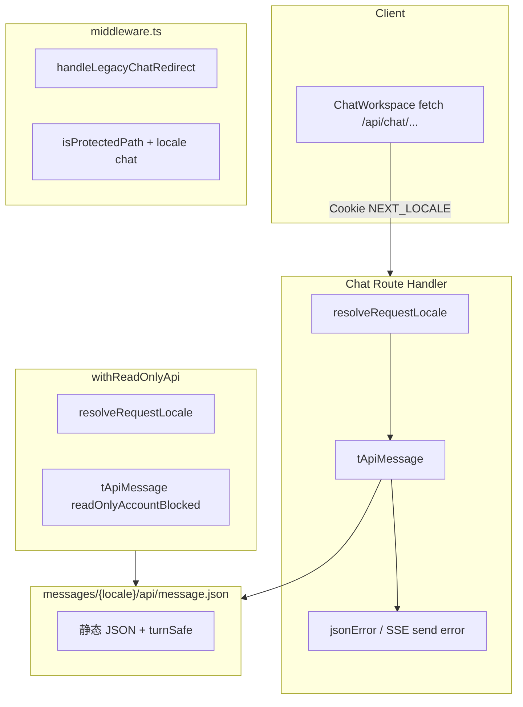

# 实现计划 — Chat 域 API i18n 与 middleware（version 0.1.15）

| 项 | 内容 |
| --- | --- |
| 版本 | `0.1.15` |
| 阶段 | **3A 文档**（供 **3B 代码实现**） |
| 范围 | Chat API 双语、withReadOnlyApi、SSE 错误、turn safeMessage、middleware chat 迁移；**无 DB 变更** |
| 上游 | `../product/`、`../design/spec-api-message-chat.md`、`../design/spec-routing-locale-chat.md` |
| 基线 | `../../0.1.14/backend/implementation-plan.md` |

---

## 1. 目标与边界

### 1.1 本期 Backend（3B）职责

| 职责 | 说明 |
| --- | --- |
| 填充 `messages/{en,zh}/api/message.json` | REST **13** key + `turnSafe.*` **12** key（见 data-models） |
| 4 个 chat route 改造 | 全部 `jsonError` → `tApiMessage` |
| `post-message-pipeline.ts` | `validatePostMessageBody(body, locale)` |
| `messages/route.ts` SSE | `error` 事件 + `safeMessage` + `mcpSafeMessage` |
| `with-readonly-api.ts` | `readOnlyAccountBlocked` |
| `middleware.ts` | legacy chat 302、`KNOWN_APP_SEGMENTS`、`isProtectedPath`、redirect 升级 |
| **不做** | Chat 页面/UI、route 迁入 `[locale]/chat`（Frontend 4）；console/admin API |

### 1.2 与 Frontend 分工

| 项 | Backend 3B | Frontend 4 |
| --- | --- | --- |
| `src/app/[locale]/chat/**` | — | ✓ 迁移 + UI i18n |
| `messages/page/chat.json` | — | ✓ |
| `messages/api/message.json` | ✓ 填充 + 服务端读 | 消费 `error.message` |
| `middleware.ts` chat 段 | ✓ | 联调验收 |
| `ChatWorkspace` 401 redirect | — | ✓ locale 感知 |
| SSE 客户端 fallback | 文档约定 | ✓ `errors.sseUnknown` |

---

## 2. 架构总览



---

## 3. 3B 文件清单

### 3.1 必改（Backend 3B）

| # | 文件 | 改造内容 |
| --- | --- | --- |
| 1 | `messages/en/api/message.json` | 追加 chat + turnSafe key |
| 2 | `messages/zh/api/message.json` | 对称追加 |
| 3 | `src/app/api/chat/conversations/route.ts` | 6 处 jsonError |
| 4 | `src/app/api/chat/conversations/[conversationId]/route.ts` | 4 处 jsonError |
| 5 | `src/app/api/chat/conversations/[conversationId]/messages/route.ts` | jsonError + SSE + safeMessage + mcpSafeMessage |
| 6 | `src/app/api/chat/conversations/[conversationId]/turns/route.ts` | 2 处 jsonError |
| 7 | `src/server/chat/post-message-pipeline.ts` | validatePostMessageBody(locale) |
| 8 | `src/server/auth/with-readonly-api.ts` | tApiMessage + resolveRequestLocale |
| 9 | `src/middleware.ts` | legacy chat、KNOWN_APP_SEGMENTS、isProtectedPath |

### 3.2 可选辅助（推荐）

| 文件 | 说明 |
| --- | --- |
| `src/server/i18n/turn-safe-message.ts` | 封装 `tTurnSafeMessage(locale, key, params?)`，避免 messages route 膨胀 |
| `src/server/i18n/locale-from-pathname.ts` | 从 `/en/chat` 解析 segment，供 middleware redirect 与 login URL 一致 |

### 3.3 不改（本期）

| 文件 | 原因 |
| --- | --- |
| `src/server/i18n/resolve-request-locale.ts` | 0.1.14 已实现 |
| `src/server/i18n/t-api-message.ts` | 追加 key 后自动生效（静态 import JSON） |
| `src/common/enums/http.ts` | ErrorCode 已含 chat 码 |
| Entity / migration | 无 DB 变更 |
| `/api/console/**`、`/api/admin/**` | 批次 2/3 |

---

## 4. 改造顺序（推荐）

### Phase 0 — Message 文件（阻塞后续）

1. 按 `../design/spec-api-message-chat.md` §7–8 写入 **13** 个 REST key。
2. 按 `data-models.md` §3.5 写入 **12** 个 `turnSafe.*` key（en/zh）。
3. 本地验证：`tApiMessage('en', 'conversationNotFound')` 非 key 字符串。

### Phase 1 — 横切基础设施

4. **`with-readonly-api.ts`** — 改动小、可独立验证；影响全站写 API。
5. **`post-message-pipeline.ts`** — 扩展 `validatePostMessageBody` 签名；更新 messages route 调用处。

### Phase 2 — Chat routes（由简到繁）

6. **`turns/route.ts`** — 仅 2 处，冒烟模板。
7. **`[conversationId]/route.ts`** — 4 处。
8. **`conversations/route.ts`** — 6 处 + details。
9. **`messages/route.ts`** — 最复杂：REST + 流式 + safeMessage。

**messages route 内部顺序**：

1. 文件顶 `const locale = resolveRequestLocale(req)`（GET/POST 各自）。
2. 替换所有 `jsonError` 硬编码。
3. POST 非流式 MODEL_ERROR catch。
4. 流式 `send("error")` + D1 failed `error.message`。
5. 提取/改写 `mcpSafeMessage(locale, ui)`。
6. 替换全部 `safeMessage` 常量为 `tApiMessage(locale, "turnSafe.*")`。

### Phase 3 — Middleware

10. **`middleware.ts`**：
    - 移除 `KNOWN_APP_SEGMENTS` 中 `"chat"`。
    - 新增 `handleLegacyChatRedirect`（放在 `handleLegacyAuthPageRedirect` **之后**或之前均可，二者路径互斥）。
    - 扩展 `isProtectedPath` 匹配 `/(en|zh)/chat`。
    - 确认 `handleProtectedRoute` 的 `redirect` 为完整 pathname（已含 locale 时不再剥离）。

### Phase 4 — 文档与自测

11. 补充 `iterations/0.1.15/backend/implementation-notes.md`（3B 完成后）。
12. 执行 §6 自测清单。

---

## 5. 依赖

| 依赖 | 说明 |
| --- | --- |
| 0.1.14 已上线 | `resolveRequestLocale`、`tApiMessage`、middleware 双语错误 |
| `use-intl/core` | ICU `contentTooLong`、`turnSafe.kbHit` 等 |
| Frontend 4 并行 | 页面 cookie 与 API 对齐；middleware 联调 |
| 设计 copy | `../design/spec-api-message-chat.md` en/zh 终稿 |

**无新 npm 依赖。**

---

## 6. 自测步骤

### 6.1 环境准备

```bash
npm run build
npm run dev
```

准备两个浏览器 profile 或 curl：cookie `NEXT_LOCALE=en` / `zh`。

### 6.2 REST 错误（curl 示例）

```bash
# 未登录（en）
curl -s -H 'Cookie: NEXT_LOCALE=en' \
  http://localhost:3000/api/chat/conversations | jq .error.message
# 期望: "You are not signed in."

# 未登录（zh）
curl -s -H 'Cookie: NEXT_LOCALE=zh' \
  http://localhost:3000/api/chat/conversations | jq .error.message
# 期望: "未登录"
```

登录后：

```bash
# 不存在会话（en）
curl -s -b '7ai_session=...; NEXT_LOCALE=en' \
  http://localhost:3000/api/chat/conversations/00000000-0000-0000-0000-000000000099 \
  | jq .error.message

# 空 content POST（en）
curl -s -X POST -b '...' -H 'Content-Type: application/json' \
  -H 'Cookie: NEXT_LOCALE=en' \
  -d '{"content":""}' \
  http://localhost:3000/api/chat/conversations/{id}/messages | jq .
```

### 6.3 只读账号

1. 使用只读测试账号登录 `/en/chat`。
2. `DELETE /api/chat/conversations/{id}` → 英文 `readOnlyAccountBlocked`。
3. cookie 改 `zh` → 中文等价文案。

### 6.4 SSE

1. `/en/chat` 发消息（流式开启）。
2. 模拟 MODEL_ERROR（如临时断开 model config）→ toast 展示英文 `modelError`，**无** provider 栈字符串。
3. DevTools Network → EventStream → 确认 `event: error` 的 `message` 为译文。

### 6.5 Middleware

| # | 操作 | 期望 |
| --- | --- | --- |
| 1 | 无 cookie `GET /chat` | 302 `/en/chat` |
| 2 | `Accept-Language: zh-CN` `GET /chat` | 302 `/zh/chat` |
| 3 | `GET /chat?x=1` | 302 `...?x=1` |
| 4 | 无 session `GET /en/chat` | 302 `/en/login?redirect=/en/chat` |
| 5 | `GET /fr/chat` | 302 `/en` |

### 6.6 回归

- [ ] 对话主流程：新建会话、发消息、删会话、清空消息
- [ ] GET 列表分页 limit 默认值正常
- [ ] retryUserMessageId 重试路径
- [ ] 非 chat API（如 login）错误仍正常
- [ ] `npm run build` 通过

---

## 7. 代码注释要求（3B）

新增/实质修改的服务端 TypeScript **须**中文注释：

| 模块 | 注释要点 |
| --- | --- |
| `turn-safe-message.ts` | 职责：turn 步骤 safeMessage 翻译；历史快照不 retro-translate |
| `messages/route.ts` SSE catch | 说明不透传 exception message 的产品/安全原因 |
| `middleware.ts` legacy chat | 302 优先于受保护逻辑，避免裸 `/chat` 进 login |
| `with-readonly-api.ts` | 全站写拦截；Bypass 路径 |

---

## 8. 关联文档

- API 规格与示例：`api-spec.md`
- 数据模型：`data-models.md`
- 风险：`risks-and-open-items.md`
