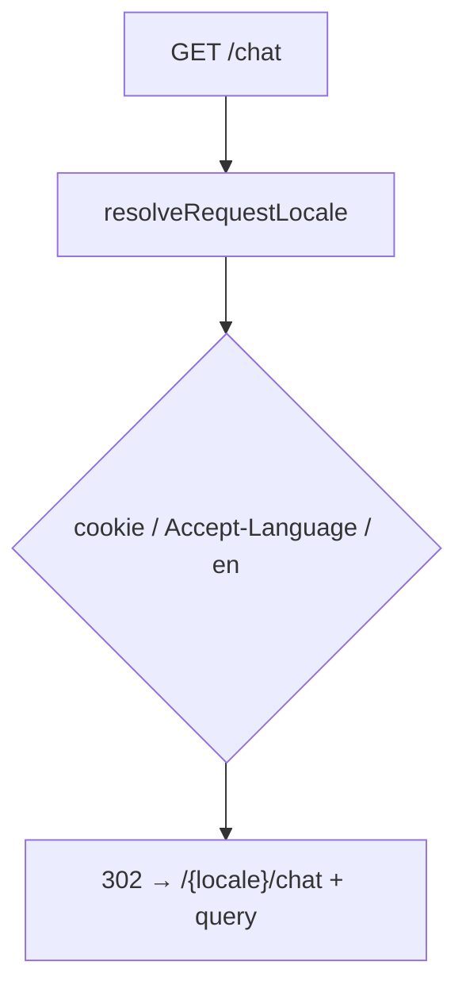

# 设计说明 — Chat 路由迁移与 locale 一致性（version 0.1.15）

| 项 | 内容 |
| --- | --- |
| 版本 | `0.1.15` |
| 上游 | `user-stories-routing-locale.md`、`design-spec-i18n-chat.md` |
| 前置 | `0.1.14/design/design-spec-routing-locale.md`（login/register 模式） |
| 决策 | Q3-A 直接 302；Q5-A 保留 query；Q9-A 迁入 `[locale]`；Q12-A locale 控制台链接 |

---

## 1. 路由变更摘要

| 变更项 | 之前 | 之后 |
| --- | --- | --- |
| 对话页 | `src/app/chat/page.tsx` → `/chat` | `src/app/[locale]/chat/page.tsx` → `/{locale}/chat` |
| 旧 URL | 直接渲染 | **302** → `/{resolvedLocale}/chat` |
| `KNOWN_APP_SEGMENTS` | 含 `chat` | **移除** `chat` |
| 未登录跳转（chat） | `/login?redirect=/chat` | `/{locale}/login?redirect=/{locale}/chat` |
| 首页 chat href | `/chat` | `/{locale}/chat` |
| Chat 401 客户端 | `/login?redirect=/chat` | `/{locale}/login?redirect=/{locale}/chat` |

**后续批次（非本期）：** `/console/**`、`/admin/**`、`/knowledge/[id]` 按 PRD 批次 2–4 同样模式迁移。

---

## 2. 旧 URL 重定向 — `/chat`（Q3-A）

### 2.1 行为定稿

| 请求 | 响应 |
| --- | --- |
| `GET /chat` | **302** `/{resolvedLocale}/chat` |
| `GET /chat?*` | **302** `/{resolvedLocale}/chat?*`（query 完整保留） |

- 无过渡页。
- `resolvedLocale`：cookie `NEXT_LOCALE` → `Accept-Language`（`zh*` → `zh`）→ `en`。

### 2.2 实现（推荐）

在 `middleware.ts` 新增 `handleLegacyChatRedirect`（或泛化为 `handleLegacyAppRedirect(segment, 'chat')`）：

```typescript
function handleLegacyChatRedirect(request: NextRequest): NextResponse | null {
  const { pathname, search } = request.nextUrl;
  if (pathname === "/chat" || pathname.startsWith("/chat/")) {
    const locale = resolveRequestLocale(request);
    const suffix = pathname.slice("/chat".length); // "" 或 "/..."
    const url = new URL(`/${locale}/chat${suffix}`, request.url);
    url.search = search;
    return NextResponse.redirect(url, 302);
  }
  return null;
}
```

**处理顺序：** 非法 locale → **legacy chat** → legacy auth → 受保护路径 → next-intl。

### 2.3 流程图



---

## 3. Locale 解析链（继承 0.1.14）

| 优先级 | 来源 |
| --- | --- |
| 1 | Cookie `NEXT_LOCALE` |
| 2 | `Accept-Language`（`zh*` → `zh`） |
| 3 | 默认 `en` |

**适用：** `/chat` legacy 302、middleware 未登录 redirect、API `resolveRequestLocale`。

**不适用：** 已带 `/en/chat` 的路径（locale 来自 URL segment）。

---

## 4. middleware 改造要点

### 4.1 `KNOWN_APP_SEGMENTS`（变更后）

```typescript
const KNOWN_APP_SEGMENTS = new Set([
  // "chat",  ← 移除
  "console",
  "admin",
  "knowledge",
  "api",
]);
```

### 4.2 `isProtectedPath`（扩展）

须同时匹配裸路径与 locale 前缀路径：

```typescript
function isProtectedPath(pathname: string): boolean {
  if (
    pathname.startsWith("/chat") ||
    pathname.startsWith("/console") ||
    pathname.startsWith("/admin") ||
    // ...
  ) {
    return true;
  }
  const localeChat = pathname.match(/^\/(en|zh)\/chat(\/|$)/);
  if (localeChat) return true;
  // 0.1.16+：/(en|zh)/console、/(en|zh)/admin
  return false;
}
```

### 4.3 未登录跳转 — redirect 值（**本期升级**）

| 场景 | redirect 参数 |
| --- | --- |
| `GET /chat`（无 session） | `/{locale}/login?redirect=/{locale}/chat` |
| `GET /en/chat`（无 session） | `/en/login?redirect=/en/chat` |

**变更点：** redirect 值为**完整目标路径（含 locale 前缀）**，不再使用裸 `/chat`。

`handleProtectedRoute` 伪代码：

```typescript
const locale = resolveRequestLocale(request);
// 若 pathname 已含 /en|zh 前缀，redirect 用完整 pathname+search
// 若 pathname 为 /chat（legacy 应先 302，不应走到此处）
const login = new URL(`/${locale}/login`, request.url);
login.searchParams.set("redirect", `${pathname}${search}`);
```

### 4.4 `[locale]/chat/layout.tsx` 服务端鉴权

```typescript
const locale = (await params).locale;
if (!reqCtx) {
  redirect(`/${locale}/login?redirect=/${locale}/chat`);
}
```

与 middleware 双保险；middleware 已拦截时 layout  rarely 触发。

### 4.5 matcher

保留现有 `/chat`、`/chat/:path*`；新增由 `/(en|zh)/:path*` 覆盖 `/{locale}/chat`。

---

## 5. 跨页链接更新（0.1.15 范围）

| 位置 | 之前 | 之后 |
| --- | --- | --- |
| `PunkHomeHeader` nav chat | `href="/chat"` | `Link` locale 感知 → `/chat`（next-intl）或 `` `/${locale}/chat` `` |
| `PunkLanding` CTA chat | `href="/chat"` | 同上 |
| `ChatWorkspace` 控制台 | `href="/console"` | `` `/${locale}/console` `` 或 `/console/profile` |
| `ChatWorkspace` 新建助手 / 偏好 | `href="/console/assistants"` 等 | `` `/${locale}/console/assistants` `` 等 |
| `newChat` 空列表链 | `/console/assistants` | locale 前缀 |
| `freeTierHint` 个人偏好 | `/console/profile` | `` `/${locale}/console/profile` `` |
| `ConsoleShell` 对话链 | `/chat` | **0.1.16** 改 `/{locale}/chat`（本期 preparatory 文档化） |
| `AdminShell` | — | 批次 3 |

**Q12-A（设计推荐）：** 0.1.15 即将 chat 内所有 console href 改为 locale 前缀；console 页 UI 仍中文属预期。

---

## 6. 登录 success redirect

| `redirect` 参数 | 成功后 |
| --- | --- |
| `/en/chat` | `/en/chat` |
| `/zh/chat` | `/zh/chat` |
| `/chat`（旧链接） | **建议** `safeRedirectUrl` 规范化 → `/{locale}/chat`（frontend login 可选增强；非阻塞） |
| `/en` | `/en` |

`safeRedirectUrl` **本期推荐**允许 `/(en|zh)/chat` 前缀路径。

---

## 7. LanguageSwitcher 与 URL

| 操作 | 结果 |
| --- | --- |
| `/en/chat` → 中文 | `/zh/chat` |
| `/en/chat?notice=x` | `/zh/chat?notice=x`（Q5-A） |

next-intl `router.replace(pathname, { locale })` 默认保留 search params。

**会话上下文：** 设计推荐 sessionStorage 保存 `selectedId`（见 `design-spec-i18n-chat.md` §4.5）。

---

## 8. 非法 locale

| 请求 | 行为 |
| --- | --- |
| `/fr/chat` | 302 → `/en`（延续 0.1.13；`chat` 已不在 KNOWN_APP_SEGMENTS） |
| `/en-US/chat` | 302 → `/en` |

---

## 9. `html lang` 与 metadata

| 页 | 机制 |
| --- | --- |
| `/en/chat` | `[locale]/layout` → `LocaleHtmlLang` → `lang="en"` |
| metadata | `page.chat.meta.title` / `description` |

---

## 10. 验收用例

| # | 操作 | 期望 |
| --- | --- | --- |
| 1 | `GET /chat`（cookie=en） | 302 `/en/chat` |
| 2 | `GET /chat?x=1` | 302 `/en/chat?x=1` |
| 3 | 无 cookie，`Accept-Language: zh-CN` | 302 `/zh/chat` |
| 4 | 无 session `GET /en/chat` | 302 `/en/login?redirect=/en/chat` |
| 5 | `/en` 点 Chat | `/en/chat` |
| 6 | `/en/chat` 切中文 | `/zh/chat`，UI 中文 |
| 7 | 登录 success `redirect=/en/chat` | 进入 `/en/chat` |
| 8 | `GET /fr/chat` | 302 `/en` |
| 9 | Chat 顶栏控制台 | `/en/console`（UI 可能仍中文） |
| 10 | 主流程冒烟 | 新建/发消息/删会话不回归 |
