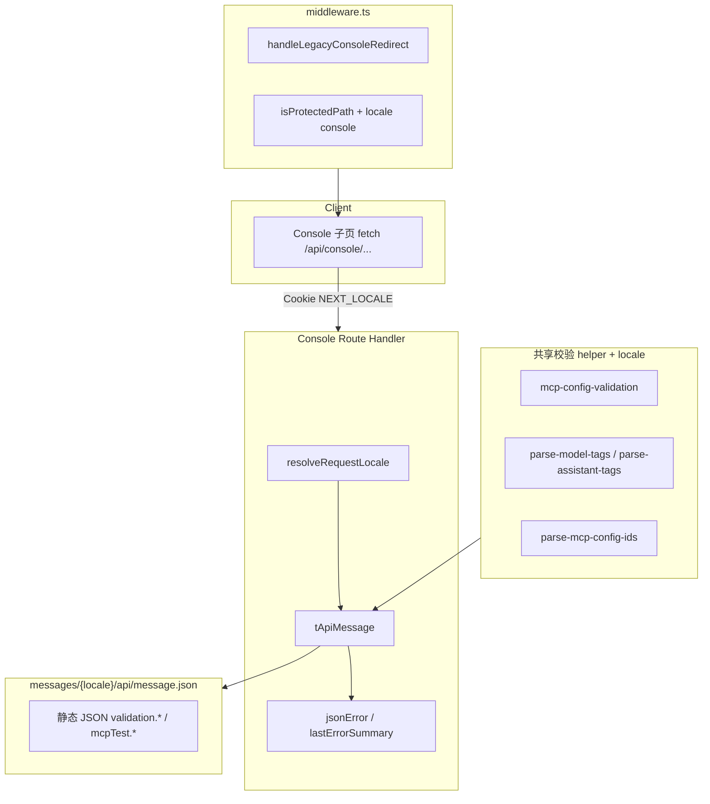

# 实现计划 — Console 域 API i18n 与 middleware（version 0.1.16）

| 项 | 内容 |
| --- | --- |
| 版本 | `0.1.16` |
| 阶段 | **3A 文档**（供 **3B 代码实现**） |
| 范围 | Console API 双语、共享校验 helper locale 化、test-connection lastErrorSummary、middleware console 迁移；**无 DB 变更** |
| 上游 | `../product/`、`../design/spec-api-message-console.md`、`../design/spec-routing-locale-console.md` |
| 基线 | `../../0.1.15/backend/implementation-plan.md` |

---

## 1. 目标与边界

### 1.1 本期 Backend（3B）职责

| 职责 | 说明 |
| --- | --- |
| 填充 `messages/{en,zh}/api/message.json` | 约 **59** 个 console 域 key（见 `data-models.md` §3） |
| 12 个 console route 改造 | 全部 `jsonError` + test-connection `lastErrorSummary` → `tApiMessage` |
| 共享校验 helper | `mcp-config-validation.ts`、`parse-mcp-config-ids.ts`、`parse-model-tags.ts`、`parse-assistant-tags.ts` 增加 `locale` |
| `middleware.ts` | `handleLegacyConsoleRedirect`、`KNOWN_APP_SEGMENTS` 移除 `console`、`isProtectedPath` 匹配 `/{locale}/console` |
| **不做** | Console 页面/UI、`page/console/*.json`、`src/i18n/request.ts` console 注册（Frontend 4） |
| **不做** | `/api/knowledge-bases/**` 双语（0.1.18+） |
| **不做** | `[locale]/console/layout.tsx` 实现（Frontend 4；规格见 `api-spec.md` §9） |

### 1.2 与 Frontend 分工

| 项 | Backend 3B | Frontend 4 |
| --- | --- | --- |
| 12 console API routes | ✓ | 消费 `error.message` |
| `messages/api/message.json` | ✓ 填充 + 服务端读 | 消费 |
| `middleware.ts` console 段 | ✓ | 联调 legacy redirect / 未登录 |
| `src/app/[locale]/console/**` | — | ✓ 迁移 + UI i18n |
| `messages/page/console/*.json` | — | ✓ |
| `src/i18n/request.ts` console 注册 | — | ✓ |
| `[locale]/console/layout.tsx` 鉴权 | — | ✓（Q10-A） |
| `parseApiError` / locale login redirect | — | ✓（Q4-A） |
| AdminShell 跳链 locale 化 | — | **0.1.17**（Q3-B） |

---

## 2. 架构总览



---

## 3. 3B 文件修改清单（按优先级排序）

### P0 — 阻塞（须最先完成）

| # | 文件 | 改造内容 |
| --- | --- | --- |
| 1 | `messages/en/api/message.json` | 追加 console 域 ~59 key |
| 2 | `messages/zh/api/message.json` | 对称追加（zh 与现网语义一致） |

### P1 — 横切基础设施

| # | 文件 | 改造内容 |
| --- | --- | --- |
| 3 | `src/server/mcp/mcp-config-validation.ts` | 全部 `details.push` message → `tApiMessage(locale, key)`；函数签名加 `locale` |
| 4 | `src/server/mcp/parse-mcp-config-ids.ts` | 同上 |
| 5 | `src/server/model-config/parse-model-tags.ts` | 返回 `{ ok: false, message }` → key 或 route 层 `tApiMessage` |
| 6 | `src/server/assistant/parse-assistant-tags.ts` | 同上 |
| 7 | `src/middleware.ts` | `handleLegacyConsoleRedirect`；`KNOWN_APP_SEGMENTS`；`isProtectedPath` |

### P2 — Console routes（由简到繁）

| # | 文件 | 改造内容 | 约 jsonError 处 |
| --- | --- | --- | --- |
| 8 | `src/app/api/console/profile/route.ts` | GET 2 处 | 2 |
| 9 | `src/app/api/console/profile/personal/route.ts` | PATCH 全分支 + details | 10 |
| 10 | `src/app/api/console/profile/preference/route.ts` | PATCH 全分支 | 10 |
| 11 | `src/app/api/console/models/[id]/route.ts` | GET/PATCH/DELETE | 12 |
| 12 | `src/app/api/console/models/route.ts` | GET/POST | 11 |
| 13 | `src/app/api/console/assistants/[id]/knowledge-bases/route.ts` | GET/PUT | 7 |
| 14 | `src/app/api/console/assistants/[id]/mcp-configs/route.ts` | GET/PUT | 7 |
| 15 | `src/app/api/console/assistants/[id]/route.ts` | GET/PATCH/DELETE | 11 |
| 16 | `src/app/api/console/assistants/route.ts` | GET/POST | 8 |
| 17 | `src/app/api/console/mcp-configs/[id]/test-connection/route.ts` | POST + **lastErrorSummary** | 4 + 2 summary |
| 18 | `src/app/api/console/mcp-configs/[id]/route.ts` | GET/PATCH/DELETE | 14 |
| 19 | `src/app/api/console/mcp-configs/route.ts` | GET/POST | 10 |

### P3 — 可选辅助（推荐）

| 文件 | 说明 |
| --- | --- |
| `src/server/i18n/console-validation-message.ts` | 封装高频 `tApiMessage(locale, 'validation.xxx', params)`，减少 route 重复 |
| `src/common/utils/validation.ts` | `validateNickName` 改为返回 key `validation.nickNameLength` 或在 route 映射（**勿**在 common 引 `tApiMessage`） |

### P3 — 不改（本期 Backend）

| 文件 | 原因 |
| --- | --- |
| `src/server/i18n/resolve-request-locale.ts` | 0.1.14 已实现 |
| `src/server/i18n/t-api-message.ts` | 追加 key 后自动生效 |
| `src/server/auth/with-readonly-api.ts` | 0.1.15 已双语；回归验证 |
| `/api/knowledge-bases/**` | 0.1.18+ |
| Entity / migration | 无 DB 变更 |

### Frontend 4 文件（Backend 文档索引，非 3B 代码）

| 优先级 | 文件 | 说明 |
| --- | --- | --- |
| P0 | `src/app/[locale]/console/layout.tsx` | 服务端鉴权（Q10-A） |
| P0 | `src/components/console/ConsoleShell.tsx` | Shell i18n + infra |
| P0 | `src/i18n/request.ts` | 注册 `page/console/*` |
| P1 | `messages/{en,zh}/page/console/*.json` | 7 个子模块 |
| P1 | 迁移 `src/app/console/**` → `[locale]/console/**` | 删除旧树 |
| P2 | 各子页 + 跨页链接 | 见 `../design/design-spec-i18n-console.md` |

---

## 4. 改造顺序（推荐）

### Phase 0 — Message 文件（阻塞后续）

1. 按 `data-models.md` §3 写入 en/zh **全部** console key。
2. 本地 smoke：`tApiMessage('en', 'modelConfigNotFound')` 返回英文而非 key 字符串。

### Phase 1 — 共享 helper locale 化

3. **`mcp-config-validation.ts`** — 所有 validator 增加 `locale`；details message 全 `tApiMessage`。
4. **`parse-mcp-config-ids.ts`** — 同上。
5. **`parse-model-tags.ts` / `parse-assistant-tags.ts`** — 返回 error key 或接受 `locale` 直接翻译。
6. 更新所有 MCP route 调用处传入 `locale`。

### Phase 2 — Middleware

7. **`middleware.ts`**：
   - 新增 `handleLegacyConsoleRedirect`（在 `handleLegacyChatRedirect` 之后）。
   - 从 `KNOWN_APP_SEGMENTS` 移除 `"console"`。
   - `isProtectedPath` 增加 `/^\/(en|zh)\/console(\/|$)/`。
   - 确认 `handleProtectedRoute` redirect 含 locale 前缀。

### Phase 3 — Console routes（由简到繁）

8. **`profile/route.ts`** — 2 处，冒烟模板。
9. **`profile/personal/route.ts`** — details + AUTH_TEL_TAKEN。
10. **`profile/preference/route.ts`** — 偏好字段范围校验 key。
11. **`models/[id]/route.ts`** — CRUD 模板。
12. **`models/route.ts`** — 分页 + POST。
13. **`assistants/[id]/knowledge-bases/route.ts`** + **`mcp-configs/route.ts`**（子 resource）。
14. **`assistants/[id]/route.ts`** + **`assistants/route.ts`**。
15. **`mcp-configs/[id]/test-connection/route.ts`** — jsonError + **lastErrorSummary**（Q5-A）。
16. **`mcp-configs/[id]/route.ts`** + **`mcp-configs/route.ts`** — 最复杂 MCP 校验。

**单文件改造模式**：

1. handler 顶 `const locale = resolveRequestLocale(request)`。
2. 替换所有 `jsonError(..., "中文", ...)` → `tApiMessage(locale, key, params?)`。
3. `details` 数组内 `message` 同步 `tApiMessage`。
4. 调用共享 helper 时传入 `locale`。

### Phase 4 — 验证与文档

17. `grep` 12 个 route **零**中文硬编码 `jsonError` message（注释除外）。
18. `grep` helper 文件 **零**中文硬编码 validation message。
19. 执行 §6 自测清单。
20. 补充 `iterations/0.1.16/backend/implementation-notes.md`（3B 完成后）。

---

## 5. 依赖

| 依赖 | 说明 |
| --- | --- |
| 0.1.15 已上线 | `resolveRequestLocale`、`tApiMessage`、`withReadOnlyApi`、`handleLegacyChatRedirect` 模式 |
| 0.1.16 设计定稿 | Q1-A / Q5-A / Q9-A / Q10-A |
| Frontend 4 并行 | 页面 cookie 与 API 对齐；middleware + layout 联调 |
| 设计 copy | `../design/spec-api-message-console.md` en/zh 终稿 |

**无新 npm 依赖。**

---

## 6. 自测步骤

### 6.1 环境准备

```bash
npm run build
npm run dev
```

准备 cookie `NEXT_LOCALE=en` / `zh` 的 curl 或浏览器 profile。

### 6.2 REST 错误（curl 示例）

```bash
# 未登录 profile（en）
curl -s -H 'Cookie: NEXT_LOCALE=en' \
  http://localhost:3000/api/console/profile | jq .error.message
# 期望: "You are not signed in."

# 未登录 profile（zh）
curl -s -H 'Cookie: NEXT_LOCALE=zh' \
  http://localhost:3000/api/console/profile | jq .error.message
# 期望: "未登录"
```

登录后：

```bash
# 无效 model id（en）
curl -s -b '7ai_session=...; NEXT_LOCALE=en' \
  http://localhost:3000/api/console/models/not-a-uuid | jq .error.message

# 重复 MCP 名称 POST（zh）
# → mcpConfigNameConflict 中文

# MCP test-connection 频控（en）
# → rateLimited 英文

# 只读账号 POST model（en）
# → readOnlyAccountBlocked 英文
```

### 6.3 Validation details（en）

```bash
curl -s -X POST -b '...' \
  -H 'Content-Type: application/json' -H 'Cookie: NEXT_LOCALE=en' \
  -d '{"provider":"X","modelName":"","apiKey":""}' \
  http://localhost:3000/api/console/models | jq '.error.details'
# 期望 details[].message 均为英文
```

### 6.4 MCP test-connection lastErrorSummary

1. 配置含加密凭证的 MCP；临时破坏主密钥或 cipher。
2. POST test-connection，`Cookie: NEXT_LOCALE=en`。
3. 响应 `item.lastErrorSummary` 为英文 `mcpTest.credentialsDecryptFailed` 等价文案。
4. cookie 改 `zh` → 中文等价。

### 6.5 Middleware

| # | 操作 | 期望 |
| --- | --- | --- |
| 1 | 无 cookie `GET /console/profile` | 302 `/en/console/profile` |
| 2 | `Accept-Language: zh-CN` `GET /console/mcp` | 302 `/zh/console/mcp` |
| 3 | `GET /console?notice=admin_forbidden` | 302 保留 query |
| 4 | 无 session `GET /en/console/models` | 302 `/en/login?redirect=/en/console/models` |
| 5 | `GET /fr/console` | 302 `/en` |
| 6 | 已登录 `GET /console/assistants` | 302 `/en/console/assistants` → 200 |

### 6.6 回归

- [ ] profile GET/PATCH personal/preference 主流程
- [ ] models CRUD
- [ ] assistants CRUD + KB/MCP 关联 PUT
- [ ] mcp-configs CRUD + test-connection
- [ ] 只读账号写操作 → `readOnlyAccountBlocked`
- [ ] chat API 错误仍正常（0.1.15 回归）
- [ ] **`/api/knowledge-bases/**` 仍中文**（已知限制，非回归失败）
- [ ] `npm run build` 通过

### 6.7 grep 验收（3B 完成门控）

```bash
# 12 route 无中文 jsonError message
rg 'jsonError\([^)]*"[\u4e00-\u9fff]' src/app/api/console/

# helper 无中文 validation message
rg 'message: "[\u4e00-\u9fff]' src/server/mcp/mcp-config-validation.ts \
  src/server/mcp/parse-mcp-config-ids.ts \
  src/server/model-config/parse-model-tags.ts \
  src/server/assistant/parse-assistant-tags.ts
```

---

## 7. 风险

| ID | 风险 | 影响 | 缓解 |
| --- | --- | --- | --- |
| R1 | **validation key 数量多**（~45） | 漏翻 / JSON  typo | Phase 0 一次性写入；grep 验收；对照 `api-spec.md` §4 |
| R2 | **共享 helper 签名变更** | 编译失败或遗漏调用 | 全仓 grep `validateMcpName(` 等；TypeScript build gate |
| R3 | **mcp-config-validation 体量大** | MCP route 漏改 | Phase 1 先改 helper，再改 3 个 mcp route |
| R4 | **knowledge 页调 knowledge-bases API** | 英文 UI + 中文 API 错误 | PRD 已知限制 #8；0.1.18 补齐 |
| R5 | **middleware + layout 双鉴权** | 重复 redirect | 行为等价即可；与 0.1.15 chat 同模式 |
| R6 | **test-connection sanitize 英文栈** | `connectionFailed` 的 `{detail}` 仍可能英文 | Q5-A 接受；外层包装已本地化 |
| R7 | **ICU 参数与常量漂移** | pagination/maxLength 文案与校验不一致 | key 参数从 `@/common/constants` 传入 |
| R8 | **admin 裸链 `/console?notice=...`** | locale 依赖 cookie | legacy redirect 兜底；0.1.17 改 admin 链 |

---

## 8. 代码注释要求（3B）

新增/实质修改的服务端 TypeScript **须**中文注释：

| 模块 | 注释要点 |
| --- | --- |
| `middleware.ts` legacy console | 302 优先于受保护逻辑；与 chat 并列 |
| `mcp-config-validation.ts` | locale 参数约定；details 与 tApiMessage 关系 |
| `test-connection/route.ts` | lastErrorSummary 写入前翻译；不透传裸 exception |
| 各 route 文件 | 模块顶职责说明（若尚无） |

---

## 9. 验收阻塞条件（Backend 3B）

以下任一未满足则 **3B 不得标为完成**：

1. 12 个 console route **零**中文硬编码 `jsonError` message。
2. `test-connection` **零**中文硬编码 `lastErrorSummary`。
3. 共享 helper validation message **零**中文硬编码。
4. `messages/{en,zh}/api/message.json` 含 `data-models.md` 定义的全部 console key。
5. middleware `/console` → 302、`/en/console` 未登录 → locale 感知 login。
6. `npm run build` 通过。

**非阻塞 Frontend**：`page/console/*.json`、Shell UI、layout 鉴权（Frontend 4 门控）。

---

## 10. 关联文档

- API 规格与逐 route 表：`api-spec.md`
- 数据模型与 key 清单：`data-models.md`
- 设计终稿：`../design/spec-api-message-console.md`、`../design/spec-routing-locale-console.md`
