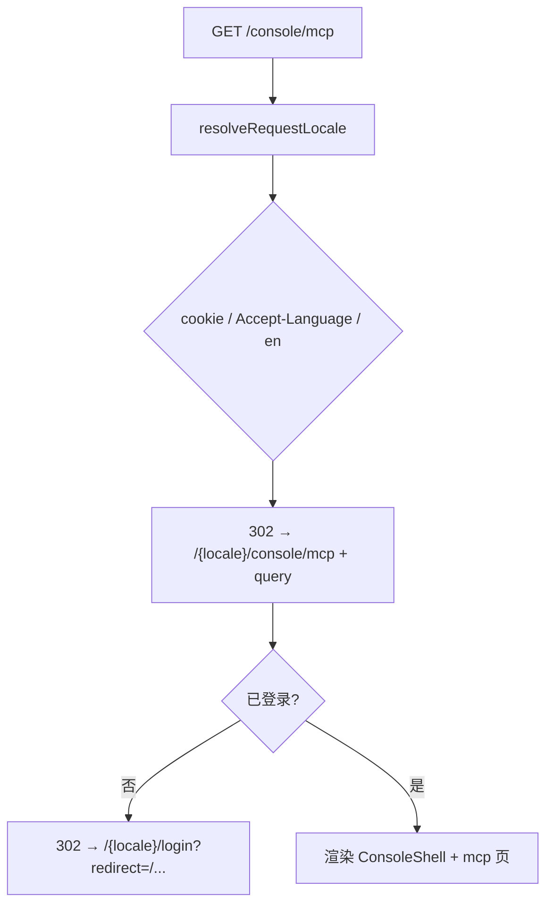

# 设计说明 — Console 路由迁移与 locale 一致性（version 0.1.16）

| 项 | 内容 |
| --- | --- |
| 版本 | `0.1.16` |
| 上游 | `prd.md` 模块 A、`user-stories-console.md` Epic A/H |
| 前置 | `0.1.15/design/spec-routing-locale-chat.md`（chat 迁移模式） |
| 决策 | Q3-B admin 链延至 0.1.17；legacy 302；redirect 含 locale 前缀 |

---

## 1. 路由变更摘要

| 变更项 | 之前 | 之后 |
| --- | --- | --- |
| 控制台页 | `src/app/console/**` → `/console/**` | `src/app/[locale]/console/**` → `/{locale}/console/**` |
| 旧 URL | 直接渲染 | **302** → `/{resolvedLocale}/console/**` |
| `KNOWN_APP_SEGMENTS` | 含 `console` | **移除** `console` |
| 未登录跳转（console） | `/login?redirect=/console/...` | `/{locale}/login?redirect=/{locale}/console/...` |
| 根路径 `/console` | redirect `/console/profile` | legacy 302 → `/{locale}/console` → page redirect `/{locale}/console/profile` |
| Chat 控制台入口 | 部分仍裸 `/console`（0.1.15 deviation） | `/{locale}/console/profile` |

**未迁移（后续批次）：** `/admin/**`、`/knowledge/[id]` 裸路径。

---

## 2. 旧 URL 重定向 — `/console`（对齐 chat）

### 2.1 行为定稿

| 请求 | 响应 |
| --- | --- |
| `GET /console` | **302** `/{resolvedLocale}/console` |
| `GET /console/profile` 等 | **302** `/{resolvedLocale}/console/profile` 等 |
| `GET /console?notice=admin_forbidden` | **302** `/{resolvedLocale}/console?notice=admin_forbidden` |
| `GET /console/settings` | **302** `/{resolvedLocale}/console/settings` → page redirect profile |

- 无过渡页。
- `resolvedLocale`：cookie `NEXT_LOCALE` → `Accept-Language`（`zh*` → `zh`）→ `en`。
- path + query **完整保留**。

### 2.2 实现（推荐）

在 `middleware.ts` 新增 `handleLegacyConsoleRedirect`（可与 chat 并列或泛化）：

```typescript
function handleLegacyConsoleRedirect(request: NextRequest): NextResponse | null {
  const { pathname, search } = request.nextUrl;
  if (pathname === "/console" || pathname.startsWith("/console/")) {
    const locale = resolveRequestLocale(request);
    const suffix = pathname.slice("/console".length); // "" 或 "/profile" 等
    const url = new URL(`/${locale}/console${suffix}`, request.url);
    url.search = search;
    return NextResponse.redirect(url, 302);
  }
  return null;
}
```

**处理顺序：** 非法 locale → legacy auth → **legacy chat** → **legacy console** → 受保护路径 → next-intl。

### 2.3 流程图



---

## 3. Locale 解析链（继承 0.1.14）

| 优先级 | 来源 |
| --- | --- |
| 1 | Cookie `NEXT_LOCALE` |
| 2 | `Accept-Language`（`zh*` → `zh`） |
| 3 | 默认 `en` |

**适用：** `/console` legacy 302、middleware 未登录 redirect、API `resolveRequestLocale`。

**不适用：** 已带 `/en/console` 的路径（locale 来自 URL segment）。

---

## 4. middleware 改造要点

### 4.1 `KNOWN_APP_SEGMENTS`（变更后）

```typescript
const KNOWN_APP_SEGMENTS = new Set([
  // "chat",    ← 0.1.15 已移除
  // "console", ← 0.1.16 移除
  "admin",
  "knowledge",
  "api",
]);
```

移除 `console` 后，`/fr/console` 等非法 locale 尝试 → 302 `/en`（与 chat 一致）。

### 4.2 `isProtectedPath`（扩展）

```typescript
function isProtectedPath(pathname: string): boolean {
  // 裸路径（legacy，须在 redirect 前或之后不再依赖裸路径直达）
  if (
    pathname.startsWith("/chat") ||
    pathname.startsWith("/console") ||
    pathname.startsWith("/admin") ||
    pathname.startsWith("/api/admin") ||
    pathname.startsWith("/api/console") ||
    pathname.startsWith(AUTH_API_PREFIX)
  ) {
    return true;
  }
  // locale 前缀
  if (/^\/(en|zh)\/chat(\/|$)/.test(pathname)) return true;
  if (/^\/(en|zh)\/console(\/|$)/.test(pathname)) return true;  // 新增
  return false;
}
```

**说明：** legacy console 请求应先被 `handleLegacyConsoleRedirect` 302 为 locale 路径；受保护逻辑作用于 locale 路径与 API。

### 4.3 未登录跳转 — redirect 值

| 场景 | redirect 参数 |
| --- | --- |
| `GET /en/console/models`（无 session） | `/en/login?redirect=/en/console/models` |
| `GET /console/mcp`（无 session） | 先 302 `/en/console/mcp`，再 redirect `/en/login?redirect=/en/console/mcp` |

`handleProtectedRoute`：pathname 已含 `/en|zh` 时，`redirect` = **完整** `pathname + search`。

### 4.4 `[locale]/console/layout.tsx` 服务端鉴权（Q10-A）

```typescript
export default async function ConsoleLayout({
  children,
  params,
}: {
  children: React.ReactNode;
  params: Promise<{ locale: string }>;
}) {
  const { locale } = await params;
  if (!hasLocale(routing.locales, locale)) {
    return null;
  }
  const reqCtx = await getRequestUserContext();
  if (!reqCtx) {
    redirect(`/${locale}/login?redirect=/${locale}/console/profile`);
    // 注：更精确 redirect 可用 headers x-pathname；或依赖 middleware 已拦截
  }
  return (
    <AntdRegistry>
      <ConsoleShell>{children}</ConsoleShell>
    </AntdRegistry>
  );
}
```

与 chat layout 同模式；middleware 双保险。

### 4.5 matcher

保留并继续使用：

```typescript
"/console",
"/console/:path*",
```

迁移后仍保留，以支持旧书签 302。`/(en|zh)/:path*` 覆盖 `/{locale}/console/**`。

### 4.6 子页 redirect

| 文件 | 行为 |
| --- | --- |
| `[locale]/console/page.tsx` | `redirect(\`/${locale}/console/profile${noticeQs}\`)` |
| `[locale]/console/settings/page.tsx` | `redirect(\`/${locale}/console/profile\`)` |

`notice` query 在根路径 redirect 时保留（admin 无权跳转场景）。

---

## 5. 跨页链接更新（0.1.16 范围）

| 位置 | 之前 | 之后 |
| --- | --- | --- |
| `ConsoleShell` 对话 | `href="/chat"` | `Link` → `/{locale}/chat`（`@/i18n/navigation` 或模板） |
| `PunkLanding` 控制台 | `/console` 或 `/console/profile` | `/{locale}/console/profile` |
| `ChatWorkspace` 控制台 | 裸 `/console`（deviation D1） | `/{locale}/console/profile` |
| `ChatWorkspace` freeTierHint | `/console/profile` | `/{locale}/console/profile` |
| `ChatWorkspace` newChat 空链 | `/console/assistants` | `/{locale}/console/assistants` |
| console profile → models | `/console/models` | `/{locale}/console/models` |
| console assistants → mcp | `/console/mcp` | `/{locale}/console/mcp` |
| knowledge 预览 | `/knowledge/{id}` | `/{locale}/knowledge/{id}` |
| **AdminShell** 控制台 | `/console` | **0.1.17**（Q3-B）；legacy redirect 兜底 |
| **admin/users** 无权跳转 | `/console?notice=admin_forbidden` | **0.1.17**；本期 console 端正确展示 query |

**链接实现推荐：**

- Shell / 子页 client 组件：`useLocale()` + `` `/${locale}/console/...` ``
- 或 next-intl `Link` + `pathname`（若 routing 表扩展 console 路由）

### 5.1 客户端 401 跳转（统一）

替换所有：

```typescript
window.location.href = "/login?redirect=" + encodeURIComponent("/console/...");
```

为：

```typescript
import { useLocale } from "next-intl";
// 或从 pathname 解析 locale
const loginUrl = `/${locale}/login?redirect=${encodeURIComponent(`${pathname}${search}`)}`;
window.location.href = loginUrl;
```

**工具函数（推荐）：** `buildLocaleLoginRedirect(locale, returnPath)` in `@/common/utils/locale-login-redirect.ts`。

---

## 6. 登录 success redirect

| `redirect` 参数 | 成功后 |
| --- | --- |
| `/en/console/profile` | `/en/console/profile` |
| `/zh/console/mcp` | `/zh/console/mcp` |
| `/console/models`（旧） | login 页应规范化；若传入裸路径，`safeRedirectUrl` **建议** 补 locale（frontend 可选增强） |

`safeRedirectUrl` **本期推荐**允许 `/(en|zh)/console` 前缀路径。

---

## 7. LanguageSwitcher 与 URL

| 操作 | 结果 |
| --- | --- |
| `/en/console/models` → 中文 | `/zh/console/models` |
| `/zh/console?notice=admin_forbidden` | `/en/console?notice=admin_forbidden` |

`router.replace(pathname, { locale })` 保留 search params（0.1.15 Q5-A）。

---

## 8. 非法 locale

| 请求 | 行为 |
| --- | --- |
| `/fr/console/profile` | 302 → `/en`（`console` 已不在 KNOWN_APP_SEGMENTS） |
| `/en-US/console` | 302 → `/en` |

---

## 9. `html lang` 与 metadata

| 页 | 机制 |
| --- | --- |
| `/en/console/*` | `[locale]/layout` → `LocaleHtmlLang` → `lang="en"` |
| metadata | `page.console.{module}.meta.title` / `description` |

---

## 10. 验收用例

| # | 操作 | 期望 |
| --- | --- | --- |
| 1 | `GET /console/profile`（cookie=en） | 302 `/en/console/profile` |
| 2 | `GET /console?notice=admin_forbidden` | 302 `/en/console?notice=admin_forbidden` → redirect profile 保留 notice |
| 3 | 无 cookie，`Accept-Language: zh-CN`，`GET /console/mcp` | 302 `/zh/console/mcp` |
| 4 | 无 session `GET /en/console/models` | 302 `/en/login?redirect=/en/console/models` |
| 5 | `/en/chat` 点控制台 | `/en/console/profile` |
| 6 | `/en/console/models` 切中文 | `/zh/console/models`，ProTable 分页中文 |
| 7 | 登录 success `redirect=/en/console/profile` | 进入 profile |
| 8 | `GET /fr/console` | 302 `/en` |
| 9 | admin 裸链 `/console?notice=...`（0.1.17 前） | legacy → locale 路径；Forbidden 与 URL locale 一致 |
| 10 | CRUD 冒烟 | profile/models/assistants/knowledge/mcp 主流程不回归 |
