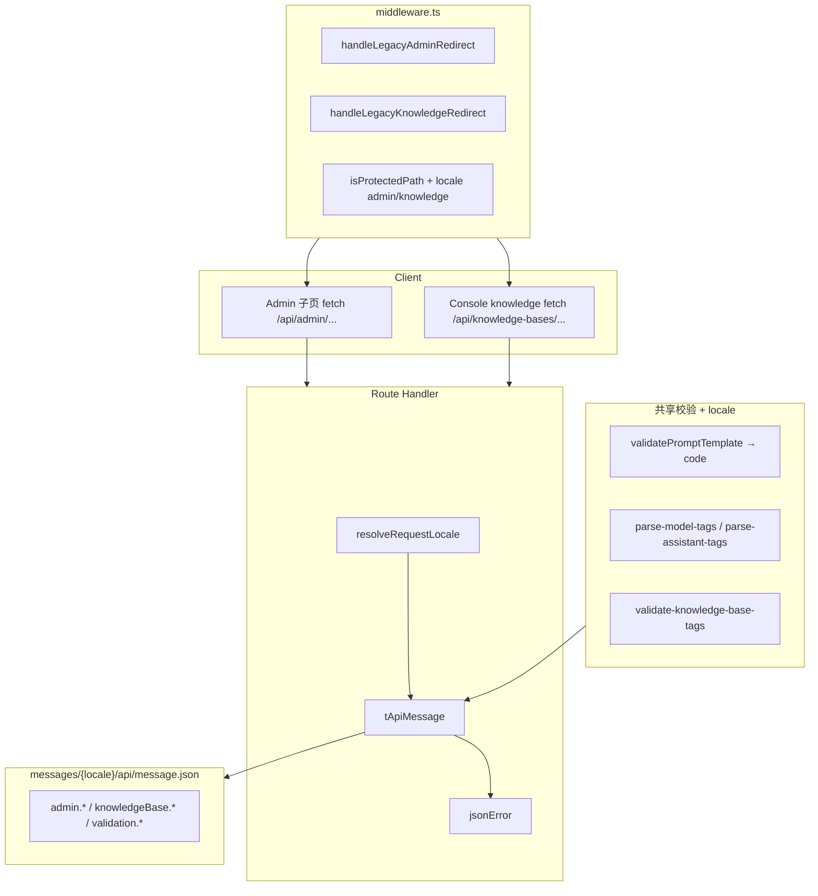

# 实现计划 — Admin + knowledge-bases API i18n 与 middleware（version 0.1.17）

| 项 | 内容 |
| --- | --- |
| 版本 | `0.1.17` |
| 阶段 | **3A 文档**（供 **3B 代码实现**） |
| 范围 | Admin API 双语、knowledge-bases API 双语、middleware admin/knowledge 迁移；**无 DB 变更** |
| 上游 | `../product/`、`../design/spec-api-message-*.md`、`../design/spec-routing-locale-admin-knowledge.md` |
| 基线 | `../../0.1.16/backend/implementation-plan.md` |
| 产品决策 | Q1=A；Q2=B；Q3=A；Q4-B；Q7-B；Q11=A |

---

## 1. 目标与边界

### 1.1 本期 Backend（3B）职责

| 职责 | 说明 |
| --- | --- |
| 填充 `messages/{en,zh}/api/message.json` | 约 **38** 个新增 key（见 `data-models.md` §3） |
| admin 9 route 改造 | 全部 `jsonError` → `tApiMessage`；prompt-config GET 移除 `fileHint`（Q2-B） |
| knowledge-bases 5 route 改造 | 全部 `jsonError` → `tApiMessage` |
| 共享校验 helper | `validatePromptTemplate` 返回 code；标签 helper locale 化；admin 路由传入 `locale` 至 tags parser |
| `middleware.ts` | `handleLegacyAdminRedirect`、`handleLegacyKnowledgeRedirect`；`KNOWN_APP_SEGMENTS`；`isProtectedPath`；移除 `x-admin-login-redirect` |
| **不做** | Admin / knowledge **页面** UI、`page/admin/*.json`、`page/knowledge.json`、`src/i18n/request.ts` 注册（Frontend 4） |
| **不做** | `[locale]/admin/layout.tsx`、`[locale]/knowledge/[id]/page.tsx` 迁移（Frontend 4） |
| **不做** | `getConsoleForbiddenUrl` 消费方替换（Frontend 4）；3B 可**新建**该 util 供前端导入 |

### 1.2 与 Frontend 4 分工

| 项 | Backend 3B | Frontend 4 |
| --- | --- | --- |
| admin 9 + KB 5 API routes | ✓ `tApiMessage` | 消费 `error.message` |
| `messages/api/message.json` | ✓ 填充 + 服务端读 | 消费（无二次翻译） |
| `middleware.ts` admin/knowledge 段 | ✓ | 联调 legacy / 未登录 redirect |
| `validatePromptTemplate` code 枚举 | ✓ | prompts 页表单映射 `template.*` |
| prompt/config GET `fileState` | ✓ 移除 `fileHint` | ✓ `invalidJsonAlert` 映射（Q2-B） |
| `src/app/[locale]/admin/**` 迁移 | — | ✓ 6 子页 + Shell + menu |
| `src/app/[locale]/knowledge/[id]` | — | ✓ 预览页 + metadata + 返回链 |
| `messages/page/admin/*.json` + `knowledge.json` | — | ✓ |
| `src/i18n/request.ts` admin/knowledge 注册 | — | ✓ |
| `[locale]/admin/layout.tsx` 鉴权 | — | ✓ `gateAdminPageAccess` + locale redirect |
| Knowledge 预览鉴权 redirect | — | ✓ page 内联 |
| `AdminShell` i18n + infra | — | ✓ LanguageSwitcher、antd/dayjs |
| 403 / 401 客户端跳转 | — | ✓ `getConsoleForbiddenUrl`、`buildLocaleLoginRedirect` |
| 跨页链 Q3-A | — | ✓ Shell、layout、各子页 `window.location.replace` |
| `KnowledgeClient` 预览链 | — | ✓ next-intl `Link` |
| 删除 `src/app/admin/`、`src/app/knowledge/` | — | ✓（迁移完成后） |

---

## 2. 架构总览



---

## 3. 3B 文件修改清单（P0→P2）

### P0 — 阻塞（须最先完成）

| # | 文件 | 改造内容 |
| --- | --- | --- |
| 1 | `messages/en/api/message.json` | 追加 ~38 admin + knowledge-bases key |
| 2 | `messages/zh/api/message.json` | 对称追加（zh 与现网语义一致） |

### P1 — 横切基础设施

| # | 文件 | 改造内容 |
| --- | --- | --- |
| 3 | `src/common/prompt/validatePromptTemplate.ts` | 返回 `code` 枚举而非中文 `message`（Q4-B） |
| 4 | `src/server/prompt-config/map-template-error.ts` | **新建**：code → `tApiMessage(locale, key, params?)` |
| 5 | `src/server/knowledge-base/validate-tags.ts` | **新建**：抽 `normalizeTags` + `locale` / key 返回 |
| 6 | `src/middleware.ts` | legacy admin/knowledge；`KNOWN_APP_SEGMENTS`；`isProtectedPath`；移除 `x-admin-login-redirect`；可选 `x-pathname` |
| 7 | `src/common/utils/console-forbidden-url.ts` | **新建**：`getConsoleForbiddenUrl`（供 Frontend 4 导入） |

### P2 — Admin routes（由简到繁）

| # | 文件 | 约 jsonError 处 |
| --- | --- | --- |
| 8 | `src/app/api/admin/users/route.ts` | 1 |
| 9 | `src/app/api/admin/users/[id]/route.ts` | 7 |
| 10 | `src/app/api/admin/users/[id]/reset-password/route.ts` | 5 |
| 11 | `src/app/api/admin/model-configs/[id]/route.ts` | 12 |
| 12 | `src/app/api/admin/model-configs/route.ts` | 11 |
| 13 | `src/app/api/admin/assistants/[id]/route.ts` | 11 |
| 14 | `src/app/api/admin/assistants/route.ts` | 8 |
| 15 | `src/app/api/admin/config/conversation-summary/route.ts` | 8 + GET 移除 fileHint |
| 16 | `src/app/api/admin/prompt-config/route.ts` | 16 + GET 移除 fileHint + tmpl 映射 |

### P2 — knowledge-bases routes

| # | 文件 | 约 jsonError 处 |
| --- | --- | --- |
| 17 | `src/app/api/knowledge-bases/[id]/vectorization/route.ts` | 2 |
| 18 | `src/app/api/knowledge-bases/[id]/vectorization/retry/route.ts` | 2 |
| 19 | `src/app/api/knowledge-bases/[id]/chunk-tests/route.ts` | 8 |
| 20 | `src/app/api/knowledge-bases/[id]/route.ts` | 14 |
| 21 | `src/app/api/knowledge-bases/route.ts` | 8 |

### P3 — 可选辅助（推荐）

| 文件 | 说明 |
| --- | --- |
| `src/server/i18n/admin-validation-message.ts` | 封装高频 admin `tApiMessage` 调用 |
| `src/common/constants/admin.ts` | `ADMIN_USER_LIST_MAX_PAGE_SIZE = 100`（pagination ICU 参数单点） |

### P3 — 不改（本期 Backend）

| 文件 | 原因 |
| --- | --- |
| `src/server/i18n/resolve-request-locale.ts` | 已实现 |
| `src/server/i18n/t-api-message.ts` | 追加 key 后自动生效 |
| `src/server/auth/admin.ts` / `with-admin-api.ts` | 门禁已双语；回归验证 |
| Entity / migration | 无 DB 变更 |

### Frontend 4 文件（索引，非 3B）

| 优先级 | 文件 | 说明 |
| --- | --- | --- |
| P0 | `src/app/[locale]/admin/layout.tsx` | 服务端鉴权（Q5-A） |
| P0 | `src/app/[locale]/admin/AdminShell.tsx` 等 | Shell i18n + infra |
| P0 | `src/i18n/request.ts` | 注册 `page/admin/*`、`page/knowledge` |
| P0 | `messages/{en,zh}/page/admin/*.json`、`knowledge.json` | 文案 |
| P1 | 迁移 `src/app/admin/**` → `[locale]/admin/**` | 删除旧树 |
| P1 | `src/app/[locale]/knowledge/[id]/page.tsx` | 预览迁移 + metadata |
| P2 | 各子页 ProTable i18n + 403 跳转 | `getConsoleForbiddenUrl` |

---

## 4. 改造顺序（推荐）

### Phase 0 — Message 文件（阻塞后续）

1. 按 `data-models.md` §3 写入 en/zh **全部**新增 key。
2. Smoke：`tApiMessage('en', 'admin.cannotResetOwnPassword')` 返回英文而非 key 字符串。

### Phase 1 — 共享 helper + middleware

3. **`validatePromptTemplate.ts`** — 改返回 `code`；更新 `map-template-error.ts`。
4. **`validate-tags.ts`** — 从 knowledge-bases route 抽出；locale 化。
5. 确认 admin model-configs/assistants 调用 `parseModelConfigTags` / `parseAssistantTags` 时传入 `locale`（0.1.16 已改签名则直接传参）。
6. **`middleware.ts`**：
   - 新增 `handleLegacyAdminRedirect`、`handleLegacyKnowledgeRedirect`（在 `handleLegacyConsoleRedirect` 之后）。
   - 从 `KNOWN_APP_SEGMENTS` 移除 `"admin"`、`"knowledge"`。
   - `isProtectedPath` 增加 `/{locale}/admin`、`/{locale}/knowledge` 与裸 `/knowledge`。
   - **移除** `x-admin-login-redirect` 逻辑。
   - matcher 增加 `/knowledge`、`/knowledge/:path*`。
7. **`console-forbidden-url.ts`** — 新建 util。

### Phase 2 — Admin routes（由简到繁）

8. `users/route.ts` — 分页模板。
9. `users/[id]/route.ts` + `reset-password/route.ts`。
10. `model-configs/[id]/route.ts` + `route.ts`。
11. `assistants/[id]/route.ts` + `route.ts`。
12. `conversation-summary/route.ts` — validation details + 移除 GET `fileHint`。
13. `prompt-config/route.ts` — 最复杂；tmpl 枚举 + 移除 GET `fileHint`。

**单文件改造模式**：

1. handler 顶 `const locale = resolveRequestLocale(request)`。
2. 替换所有 `jsonError(..., "中文", ...)` → `tApiMessage(locale, key, params?)`。
3. `details` 数组内 `message` 同步 `tApiMessage`。
4. 共享 helper 传入 `locale` 或使用 `map-template-error`。

### Phase 3 — knowledge-bases routes

14. `vectorization/route.ts` + `retry/route.ts`（简单）。
15. `chunk-tests/route.ts`。
16. `[id]/route.ts`。
17. `route.ts`（POST 校验最多）。

### Phase 4 — 验证与文档

18. `grep` 14 个 route **零**中文硬编码 `jsonError` message（注释除外）。
19. 执行 §6 自测清单。
20. 补充 `iterations/0.1.17/backend/implementation-notes.md`（3B 完成后）。

---

## 5. 依赖

| 依赖 | 说明 |
| --- | --- |
| 0.1.16 已上线 | console API 双语、`handleLegacyConsoleRedirect`、`parse-api-error`、console layout 模式 |
| 0.1.15 共享 infra | `resolveRequestLocale`、`tApiMessage`、`LanguageSwitcher` 模式 |
| Frontend 4 并行 | 页面 cookie 与 API 对齐；middleware + layout 联调 |
| 设计 copy | `../design/copy-admin-en-zh.md`、`copy-knowledge-en-zh.md` |

**无新 npm 依赖。**

---

## 6. 自测步骤

### 6.1 环境准备

```bash
npm run build
npm run dev
```

准备 cookie `NEXT_LOCALE=en` / `zh` 的 curl 或浏览器 profile；管理员 session + 普通用户 session。

### 6.2 Admin REST 错误（curl 示例）

```bash
# 非管理员（en）
curl -s -b '7ai_session=...; NEXT_LOCALE=en' \
  http://localhost:3000/api/admin/users | jq .error.message

# 无效分页（en）
curl -s -b '7ai_session=admin...; NEXT_LOCALE=en' \
  'http://localhost:3000/api/admin/users?page=0' | jq .error.message

# 重置自己密码（zh）
curl -s -X POST -b '7ai_session=admin...; NEXT_LOCALE=zh' \
  http://localhost:3000/api/admin/users/{self-id}/reset-password | jq .error.message

# prompt-config 缺 key PUT（zh）
# → validation.promptConfig.missingKey 中文
```

### 6.3 knowledge-bases REST 错误

```bash
# 未登录 GET（en）
curl -s -H 'Cookie: NEXT_LOCALE=en' \
  http://localhost:3000/api/knowledge-bases | jq .error.message

# 不存在 id（en）
curl -s -b '7ai_session=...; NEXT_LOCALE=en' \
  http://localhost:3000/api/knowledge-bases/not-a-uuid | jq .error.message

# 分片测试向量化未完成（en）
# POST chunk-tests → knowledgeBaseChunkTestUnavailable 英文

# 删除仍被助手引用（zh）
# DELETE → knowledgeBaseReferencedByAssistant 中文
```

### 6.4 Validation details（en）

```bash
curl -s -X POST -b '...' \
  -H 'Content-Type: application/json' -H 'Cookie: NEXT_LOCALE=en' \
  -d '{"name":"","content":"","contentFormat":"x"}' \
  http://localhost:3000/api/knowledge-bases | jq '.error.details'
# 期望 details[].message 均为英文
```

### 6.5 Middleware

| # | 操作 | 期望 |
| --- | --- | --- |
| 1 | `GET /admin/config`（cookie=en） | 302 `/en/admin/config` |
| 2 | `GET /knowledge/uuid`（Accept-Language: zh） | 302 `/zh/knowledge/uuid` |
| 3 | 无 session `GET /en/admin/users` | 302 `/en/login?redirect=/en/admin/users` |
| 4 | 无 session `GET /zh/knowledge/id` | 302 `/zh/login?redirect=/zh/knowledge/id` |
| 5 | `GET /fr/admin` | 302 `/en` |
| 6 | `GET /admin?notice=x` | 302 保留 query |
| 7 | 已登录 `GET /admin/assistants` | 302 locale 路径 → 200 |

### 6.6 prompt-config GET（Q2-B）

1. 破坏 `data/promptConfig.json` 为非法 JSON。
2. GET `Cookie: NEXT_LOCALE=en` → 200，`fileState: "invalid_json"`，**无** `fileHint` 字段。
3. Frontend 4 联调：英文 admin prompts 页展示 `page.admin.prompts.invalidJsonAlert`。

### 6.7 回归

- [ ] `withAdminApi` unauthorized/forbidden 仍双语
- [ ] console API 错误仍正常（0.1.16 回归）
- [ ] chat API 错误仍正常
- [ ] `npm run build` 通过

### 6.8 grep 验收（3B 完成门控）

```bash
# admin + knowledge-bases 无中文 jsonError message
rg 'jsonError\([^)]*"[\u4e00-\u9fff]' src/app/api/admin/ src/app/api/knowledge-bases/

# validatePromptTemplate 无中文返回 message（改 code 后）
rg 'message:.*[\u4e00-\u9fff]' src/common/prompt/validatePromptTemplate.ts
```

---

## 7. 风险

| ID | 风险 | 影响 | 缓解 |
| --- | --- | --- | --- |
| R1 | **prompt-config 分支多** | 漏翻 / tmpl 仍中文 | 对照 `api-spec.md` §4.8；`map-template-error` 单点 |
| R2 | **users/config 体量大（Frontend）** | 漏翻 UI | 与 3B 解耦；grep 中文残留验收 |
| R3 | **middleware + layout 双鉴权** | 重复 redirect | 行为等价；对齐 0.1.16 console |
| R4 | **Q2-B 前后端契约** | GET 移除 fileHint 后旧前端无 Alert | Frontend 4 同步发版；联调 §6.6 |
| R5 | **tags helper 签名变更** | 编译失败 | TypeScript build gate；grep 调用点 |
| R6 | **admin users pageSize 100** | ICU 参数与 console 常量不一致 | 抽常量或文档注明硬编码 100 |
| R7 | **x-pathname 不可用** | login redirect 落默认 config | layout fallback + middleware 注入 header |
| R8 | **vectorization route 仅 GET** | 文档与 PRD POST 表述不一致 | 以现网代码为准（本 spec 已注明） |

---

## 8. 代码注释要求（3B）

新增/实质修改的服务端 TypeScript **须**中文注释：

| 模块 | 注释要点 |
| --- | --- |
| `middleware.ts` legacy admin/knowledge | 302 优先于受保护逻辑；与 chat/console 并列 |
| `map-template-error.ts` | Q4-B tmpl 枚举与 `tApiMessage` 映射 |
| `validate-tags.ts` | locale 参数约定 |
| `prompt-config/route.ts` | GET 仅返回 `fileState`（Q2-B） |
| 各 route 文件 | 模块顶职责说明（若尚无） |

---

## 9. 验收阻塞条件（Backend 3B）

以下任一未满足则 **3B 不得标为完成**：

1. admin 9 + knowledge-bases 5 route **零**中文硬编码 `jsonError` message。
2. `messages/{en,zh}/api/message.json` 含 `data-models.md` 定义的全部新增 key。
3. middleware `/admin`、`/knowledge` → 302；`/{locale}/admin|knowledge` 未登录 → locale 感知 login。
4. `KNOWN_APP_SEGMENTS` 已移除 `admin`、`knowledge`。
5. prompt-config / conversation-summary GET **无** `fileHint`。
6. `npm run build` 通过。

**非阻塞 Frontend**：`page/admin/*.json`、Shell UI、layout 鉴权、预览页（Frontend 4 门控）。

---

## 10. 关联文档

- API 规格与逐 route 表：`api-spec.md`
- 数据模型与 key 清单：`data-models.md`
- 设计终稿：`../design/spec-api-message-admin.md`、`../design/spec-api-message-knowledge-bases.md`、`../design/spec-routing-locale-admin-knowledge.md`
