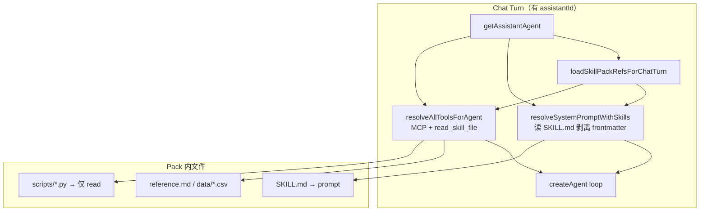

# 设计说明（总览）— Skill Pack 目录包（version 0.1.19）

| 项 | 内容 |
| --- | --- |
| 版本 | `0.1.19` |
| 阶段 | 设计（阶段 2） |
| 上游 | `iterations/0.1.19/product/prd.md`、`user-stories-skill-pack.md`、`open-questions.md` |
| 前置设计 | `iterations/0.1.18/design/`（单正文 Skills，**本期替换**） |
| 风格基线 | `iterations/0.1.9/design/`（MCP 控制台）、`iterations/0.1.16/design/`（console i18n） |

---

## 1. 已确认产品决策（设计定稿）

| ID | 决策 | 设计落点 |
| --- | --- | --- |
| D1 | Skill 形态 = **目录包 Skill Pack** | 文件树 + 多文件编辑；废弃单 `content` TextArea |
| D2 | **直接替换** 0.1.18，不长期双轨 | 迁移 UX 见 `spec-migration-0.1.18.md` |
| D3 | **`scripts/` MVP 仅可读、不执行** | 控制台 Alert/徽章/帮助抽屉；Turn **不**展示执行态 |
| D4 | 挂载链：Pack → 助手 → 会话 `assistantId` → Turn | 文案强化；无会话直挂 |
| D5 | zip / 文件夹导入（Cursor 同构） | `spec-skill-pack-console.md` §5 |
| D6 | `SKILL.md` → system prompt + **`read_skill_file`** | `spec-chat-agent-skill-pack.md` |
| D7 | 助手挂载语义不变（pack id 多选） | `spec-assistant-skill-bindings.md`（增量） |
| Q1 | 2MB / 512KB / 100 文件 | 导入与保存校验、进度提示 |
| Q2 | 常见文本扩展名白名单 | 导入过滤、新建文件后缀建议 |
| Q4 | Tool 名 **`read_skill_file`** | LangChain schema、Turn 文案 |
| Q5 | 参数 **`packId`（UUID）** | Tool description 附 id→name 映射 |
| Q6 | frontmatter **覆盖**表单项 | 保存 `SKILL.md` 后元数据联动 |
| Q10 | 保留 `/console/skills` 路由 | 文案改为「技能包」语义 |
| Q11 | 沿用 `user_skill_configs` + 新 `skill_pack_files` | API 路径不变 |
| Q13 | Turn 展示 **read 调用次数**（纳入 MVP） | `skills_resolution` details 扩展 |

---

## 2. 信息架构（IA）

```
个人控制台 (/[locale]/console)
├── 账号与偏好      (/console/profile)
├── 模型管理        (/console/models)
├── 助手管理        (/console/assistants)     ← Pack 多选挂载（语义不变）
├── 知识库管理      (/console/knowledge)
├── MCP 管理        (/console/mcp)
└── 技能包管理      (/console/skills)         ← 本期改造：目录包 CRUD + 导入

对话 (/[locale]/chat)
└── 助手会话 → SKILL.md 合并 system prompt + read_skill_file tool（与 MCP 并行）
```

**心智模型（UI 须反复强化）：**

| 能力 | 用户理解 | 运行时效果 |
| --- | --- | --- |
| **Skill Pack** | 可复用的 **目录型技能包**（`SKILL.md` + 附属文件） | `SKILL.md` 正文 → system prompt；其他文件 → **`read_skill_file`** |
| **MCP** | 可连接的 **外部工具 / API** | LangChain tools（可 invoke） |
| **知识库** | 可检索的 **文档片段** | RAG 上下文 |

**与 Cursor 本地 Skill 的关系（文案区分）：**

| | Cursor IDE `.cursor/skills/` | 本平台 Skill Pack |
| --- | --- | --- |
| 存储 | 本机目录 | 服务端用户私有 Pack |
| 脚本 | 可在 IDE Agent 环境执行 | **0.1.19 仅可读源码，不执行** |
| 导入 | — | 支持 zip 导入同构目录 |

---

## 3. 与 0.1.18 差异（设计重点）

| 维度 | 0.1.18 | 0.1.19 |
| --- | --- | --- |
| 数据形态 | 单字段 `content` | `SkillPackFile` 多行（`path` + `content`） |
| 列表列 | 正文摘要 | **文件数**、可选「含 scripts」徽章 |
| 编辑 UI | Modal + 单 TextArea | **Drawer/全屏 Modal + 文件树 + 编辑器分栏** |
| 导入 | 无 | **Zip 上传** + 文件夹选择（webkitdirectory） |
| 运行时 prompt | 整块 `content` | **`SKILL.md` 正文（剥离 frontmatter）** |
| 运行时 tools | 无 Skill tool | **`read_skill_file`** + MCP tools |
| `scripts/` | 无 | 存储、树展示、Agent **可读不可 run** |
| Turn 步 | 仅「已合并 N 项」 | + **「已读取文件 · N 次」**（Q13） |

**保留不变：** 路由 `/console/skills`、API `/api/console/skill-configs`、助手 `skill-configs` 子资源、删除 409、inactive 警告、侧栏顺序、ProTable/Modal 壳体模式。

---

## 4. 运行时架构（read tool + 脚本不执行）



**ui-ux-pro-max 类 Pack 在 MVP 下的行为（示例）：**

| 文件 | Agent 能力 | 用户预期管理 |
| --- | --- | --- |
| `SKILL.md` | 正文合并进 prompt；指引「运行 `python3 scripts/search.py`」 | 控制台说明：Agent **不会**执行，只会尝试 read |
| `scripts/search.py` | `read_skill_file(packId, 'scripts/search.py')` 返回源码 | 文件树节点带 **「只读 · 不执行」** 徽章 |
| `data/*.csv` | `read_skill_file` 返回文本内容 | 正常可读 |
| `__pycache__/*.pyc` | 导入时 **拒绝**（Q2/Q3 非 UTF-8 或二进制） | 导入结果列出跳过文件 |

**无 `run_skill_script` tool**；Turn 面板 **禁止**「脚本已执行」类文案。

---

## 5. 关键页面与文档索引

| 页面/区块 | 路由或宿主 | 子规格 |
| --- | --- | --- |
| 技能包列表 + 详情编辑 | `/console/skills` | `spec-skill-pack-console.md` |
| 助手 Pack 挂载 | `/console/assistants` | `spec-assistant-skill-bindings.md` |
| 对话运行时 + Turn | `/chat` | `spec-chat-agent-skill-pack.md` |
| 0.1.18 迁移 | 部署 + 首次登录 | `spec-migration-0.1.18.md` |
| Console i18n | — | `copy-console-en-zh.md` |
| Chat Turn i18n | — | `copy-chat-en-zh.md` |

---

## 6. 全局状态矩阵（跨页）

| 场景 | 表现 |
| --- | --- |
| Pack 列表为空 | Empty + CTA「新建技能包」+「导入 Zip」 |
| 导入缺 `SKILL.md` | Modal 错误列表 + 不创建 Pack |
| 导入含 `scripts/` | 成功 + **warning Alert**「MVP 不支持脚本执行」 |
| Pack 无 `SKILL.md` 保存 | 字段级错误，阻止启用 |
| 删除被助手引用 | 409 + `Modal.warning`（同 0.1.18） |
| 助手挂载已禁用 Pack | warning Alert（同 MCP inactive） |
| 无助手会话 | 无 prompt 合并、无 `read_skill_file`、Turn 步隐藏 |
| Agent read 失败 | Tool 返回错误字符串；Turn 计数仍累加尝试次数（可选仅计成功） |
| 部分 Pack 缺 SKILL.md | 静默 skip；Turn 仍显示成功合并数 |

---

## 7. 布局与组件基线

- **列表页**：沿用 `PageContainer` + `ProTable`（对齐 MCP）
- **详情编辑**：推荐 **`Drawer` `width="90%"` `maxWidth={1200}`** 或 **`Modal` `width={960}`** + 左右分栏（`Row`/`Col` 或 flex）
- **文件树**：antd **`Tree`** 或轻量自定义列表（路径排序）；文件夹由 `path` 前缀推导
- **编辑器**：`Input.TextArea`（MVP）；`SKILL.md` 用 `font-mono`；代码文件同；**不做** Markdown 预览（延续 0.1.18 Q9）
- **导入**：`Upload.Dragger`（zip）+ 次要按钮「选择文件夹」
- **断点**：`< md` 文件树折叠为 `Select` 切换当前文件；编辑器全宽
- **主题**：`shellDarkTheme`；树选中态与 MCP 侧栏一致

---

## 8. 用户故事 / AC 映射

| 编号 | 设计落点 |
| --- | --- |
| US-A1~A6, AC-P1~P8 | `spec-skill-pack-console.md` |
| US-B1~B2, AC-P6、P12 | `spec-assistant-skill-bindings.md` |
| US-C1~C4, AC-P9~P12 | `spec-chat-agent-skill-pack.md` |
| US-D1~D2, AC-P13 | `spec-migration-0.1.18.md` |
| US-E1, AC-P14 | `copy-console-en-zh.md`、`copy-chat-en-zh.md` |

---

## 9. 修订记录

| 日期 | 说明 |
| --- | --- |
| 2026-06-19 | 初稿：Skill Pack 替换 0.1.18 单正文 |
