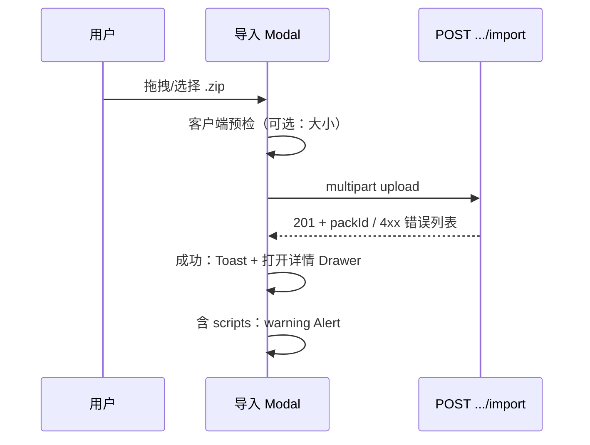

# 规格：控制台 — Skill Pack 管理页（version 0.1.19）

**路由**：`/[locale]/console/skills`（Q10 保留）  
**API 基址**：`/api/console/skill-configs` + 子资源 `/api/console/skill-configs/:id/files`（backend 定稿）  
**参考实现**：`src/app/[locale]/console/skills/SkillsClient.tsx`（0.1.18 单 TextArea，**本期替换**）  
**模式参考**：`iterations/0.1.9/design/spec-mcp-console.md`（ProTable、409 删除）  
**i18n**：`page.console.skills`（文案升级为「技能包」）

---

## 1. 页面结构

```
PageContainer（title: 技能包管理）
├── 说明区 Alert（info，closable）
│   ├── 服务端目录型技能包；可 zip 导入 `.cursor/skills/` 同构目录
│   └── MVP：scripts/ 仅存储与读取，不执行（链到帮助 Drawer）
├── 工具栏（列表上方或 ProTable toolbar）
│   └── 搜索 | 刷新 | 新建技能包 | 导入 Zip
└── ProTable
    ├── columns：名称、描述、文件数、启用、更新时间、助手引用、操作
    └── row actions：编辑 | 删除
```

**废弃：** 0.1.18 新建/编辑 Modal 内单字段 `content` TextArea。

---

## 2. 列表（ProTable）

### 2.1 列定义

| 列 key | 数据字段 | 宽度 | 展示 |
| --- | --- | --- | --- |
| `name` | `name` | 180 | 主文案 + `ellipsis` + `Tooltip` |
| `description` | `description` | 200 | 截断 80 字；空 `—` |
| `fileCount` | `fileCount` | 88 | 数字；0 时橙色提示（缺包文件） |
| `hasScripts` | `hasScripts` | 100 | 有 `scripts/` 下文件时：`Tag`「含脚本」+ Tooltip「MVP 不执行」 |
| `enabled` | `enabled` | 88 | 绿「启用」/ 默认「停用」 |
| `updatedAt` | `updatedAt` | 160 | `YYYY-MM-DD HH:mm` |
| `assistantRefs` | `referencedAssistantCount` | 110 | 数字 |
| `actions` | — | 160 | 编辑、删除 |

**移除列：** `contentPreview`（0.1.18）。

### 2.2 工具栏

| 按钮 | 行为 |
| --- | --- |
| 新建技能包 | 创建空 Pack（预置 `SKILL.md` 模板）→ 打开详情 Drawer |
| 导入 Zip | 打开导入 Modal（§5） |
| 搜索 / 刷新 | 同 MCP |

### 2.3 列表 API 响应（设计假设）

```typescript
type SkillPackListItem = {
  id: string;
  name: string;
  description: string | null;
  enabled: boolean;
  fileCount: number;
  hasScripts: boolean;
  createdAt: string;
  updatedAt: string;
  referencedAssistantCount: number;
};
```

---

## 3. Pack 详情 / 编辑（核心改造）

### 3.1 承载形态

- **`Drawer`** `placement="right"` `width="min(1200px, 92vw)"` `destroyOnClose`
- 或全屏 **`Modal`**（窄屏可考虑 Drawer 优先）
- 模式：`detailMode: "create" | "edit"`

**布局（桌面 ≥ md）：**

```
┌─────────────────────────────────────────────────────────────┐
│ 顶栏：Pack 名称（可 inline 编辑）| 启用 Switch | 保存 | 关闭 │
├──────────────┬──────────────────────────────────────────────┤
│ 文件树 28%   │ 编辑器区 72%                                  │
│ Tree         │ 路径 breadcrumb + 未保存 * 标记               │
│ + 新建文件   │ TextArea（monospace）                         │
│ + 新建文件夹 │ 底部：保存当前文件 | 保存全部                  │
│ + 删除       │                                               │
├──────────────┴──────────────────────────────────────────────┤
│ 元数据折叠 Panel：名称、描述（与 frontmatter 同步说明）         │
│ scripts 警告条（若 hasScripts）                               │
└─────────────────────────────────────────────────────────────┘
```

**窄屏（< md）：** 文件树收进 `Select`「当前文件」+ 可选 `Dropdown`「文件操作」。

### 3.2 文件树（Tree）

**数据来源：** `GET /api/console/skill-configs/:id/files` → `{ path, updatedAt? }[]`

**树构建规则：**

1. 按 `path` POSIX 排序（`SKILL.md` 置顶优先）
2. `/` 分段构建文件夹节点；叶子为文件
3. 选中节点 → 右侧加载 `GET .../files/:path` 或 bulk 详情中的 `content`

**节点图标（`@ant-design/icons`）：**

| 类型 | 图标 | 备注 |
| --- | --- | --- |
| 文件夹 | `FolderOutlined` | |
| `SKILL.md` | `FileMarkdownOutlined` | 必填标记 `*` |
| `scripts/*` | `CodeOutlined` | 后缀 Badge「只读」 |
| 其他 | `FileOutlined` | |

**行内操作（树工具栏）：**

| 操作 | UI | 校验 |
| --- | --- | --- |
| 新建文件 | Modal 输入相对路径 | 禁止 `..`、`\`、绝对路径；扩展名建议 Q2 白名单 |
| 新建文件夹 | 输入文件夹名 → 可选在该目录下新建文件 | 同路径规则 |
| 重命名 | 选中文件 → 「重命名」→ 改 `path` | API `PATCH` move |
| 删除 | `Popconfirm` | 禁止删 `SKILL.md`（或删后阻止保存/启用） |

### 3.3 多文件编辑器

| 项 | 规格 |
| --- | --- |
| 组件 | `Input.TextArea` `rows={20}` `className="font-mono text-sm"` |
| 未保存 | 切换文件时：若有 dirty → `Modal.confirm`「放弃修改？」 |
| 保存当前 | `PUT/PATCH .../files` 单文件 |
| 保存全部 | 批量提交 dirty 文件；失败列出 path |
| `SKILL.md` | `extra` 说明 frontmatter 格式 + 合并时剥离 frontmatter |
| 大小限制 | 单文件 512KB；超限 `Form` 提示 + API 422 |

**新建 Pack 默认 `SKILL.md` 模板：**

```markdown
---
name: my-skill-pack
description: Short description for lists and assistant picker.
---

# Instructions

Write skill instructions here…
```

### 3.4 frontmatter 与元数据同步（Q6）

| 事件 | UX |
| --- | --- |
| 保存 `SKILL.md` 成功 | 若 frontmatter 含 `name`/`description` → **覆盖**顶栏/元数据区字段；Toast「已从 SKILL.md 同步名称/描述」 |
| 用户仅改元数据区未改 SKILL | 以表单项为准直至下次保存 SKILL |
| frontmatter 解析失败 | Warning「frontmatter 格式无效，未同步」；不阻塞保存文件内容 |

**元数据区字段：**

| 字段 | 组件 | 规则 |
| --- | --- | --- |
| `name` | `Input` | 必填；max 64；用户级唯一 |
| `description` | `TextArea` rows={2} | 可选；max 500 |
| `enabled` | `Switch` | 启用前校验 `SKILL.md` 非空 |

### 3.5 scripts/ 不可执行 UX（AC-P11）

**触发条件：** Pack 内存在 `path` 以 `scripts/` 开头的文件。

| 位置 | 组件 | 内容 |
| --- | --- | --- |
| 详情顶栏下 | `Alert` `type="warning"` `showIcon` `closable` | `alert.scriptsReadOnly.message` |
| `scripts/` 树节点 | `Badge`「只读」 | Tooltip `alert.scriptsReadOnly.tooltip` |
| 页面说明区 | 链接「了解脚本能力」 | 打开 **帮助 Drawer**（§3.6） |
| 导入成功 | 同上 Alert | 持续至用户关闭 |

**帮助 Drawer 要点：**

- 0.1.19 Agent 可通过 `read_skill_file` **阅读** `scripts/` 源码
- **不会**执行 Python/shell；无命令输出
- 0.1.20 计划沙箱 + `run_skill_script`
- 示例：ui-ux-pro-max 中 `search.py` 在 MVP 下仅作参考文本

---

## 4. 校验与配额（Q1）

| 常量 | UI 落点 |
| --- | --- |
| 100 文件 / Pack | 新建文件前检查；超限 Toast |
| 2MB 总大小 | 保存/导入前汇总；进度条旁展示 `{used}/{max}` |
| 512KB 单文件 | 编辑器 `showCount`（字节估算） |
| 32KB SKILL.md 正文（去 frontmatter） | 保存 SKILL 时校验；拒绝静默截断（Q9） |
| 50 Pack / 用户 | 新建/导入 409 |

---

## 5. 导入流程（US-A4）

### 5.1 入口

- 列表工具栏「导入 Zip」→ **`Modal` `width={520}`**
- 内容：`Upload.Dragger` `accept=".zip"` + 次要链接「选择文件夹」（`<input webkitdirectory>`）

### 5.2 Zip 流程



| 阶段 | UI |
| --- | --- |
| 上传中 | `Progress` + 「正在解压…」 |
| 成功 | Toast `toast.imported`；可选跳转编辑 |
| 缺 SKILL.md | `Modal.error` 列出「缺少根目录 SKILL.md」 |
| 非法路径/扩展名 | 结果 Panel：「已跳过 N 个文件」表格（path + 原因） |
| 同名 Pack | 409 `SKILL_PACK_NAME_CONFLICT`；建议改名后重试（Q12） |
| UTF-8 失败 | 列出无法解码文件（Q3） |

### 5.3 文件夹导入

- 浏览器选择目录 → 前端遍历 `webkitRelativePath` → 组装 **客户端 zip** 或直接 **multipart 多文件 POST**（backend 选型；UI 行为一致）
- 默认 Pack 名：frontmatter `name` > 顶层文件夹名 > zip 文件名（Q7）

### 5.4 导入后

- 文件树完整展示（过滤掉跳过项）
- 若含 `scripts/` → §3.5 warning Alert
- **不**自动打开「脚本执行」相关功能

---

## 6. 删除（延续 0.1.18）

1. `Popconfirm` → `DELETE /api/console/skill-configs/:id`
2. 409 `SKILL_CONFIG_REFERENCED_BY_ASSISTANT` → `Modal.warning` + 链至助手管理
3. 204 → 级联删除 `skill_pack_files`；Toast

---

## 7. 状态矩阵

| 状态 | UI |
| --- | --- |
| 详情加载 | Drawer `Spin` 包裹树+编辑器 |
| 空 Pack（仅模板 SKILL） | 树仅一项；编辑器聚焦 SKILL |
| 当前文件加载失败 | 编辑器区 `Result` status="error" + 重试 |
| 网络错误 | `message.error` + `errors.networkRetry` |
| 401 | `redirectToLocaleLogin` |

---

## 8. 实现文件清单（供 frontend）

| 文件 | 说明 |
| --- | --- |
| `src/app/[locale]/console/skills/SkillsClient.tsx` | 列表 + Drawer 详情（重构） |
| `src/app/[locale]/console/skills/components/PackFileTree.tsx` | 文件树（可选拆分） |
| `src/app/[locale]/console/skills/components/PackFileEditor.tsx` | 编辑器 + 未保存状态 |
| `src/app/[locale]/console/skills/components/PackImportModal.tsx` | Zip/文件夹导入 |
| `messages/{en,zh}/page/console/skills.json` | 增量文案 |
| `src/i18n/request.ts` | 已注册则仅扩 key |

---

## 9. 故事映射

| 故事/AC | 本节 |
| --- | --- |
| US-A1, AC-P1、P2 | §2 列表 |
| US-A2, AC-P3、P4 | §3 文件树与编辑器 |
| US-A3 | §3.4 frontmatter |
| US-A4, AC-P5、P11 | §5 导入 + §3.5 scripts 警告 |
| US-A5, AC-P8 | §3.4 enabled |
| US-A6, AC-P7 | §6 删除 |
| US-E1, AC-P14 | `copy-console-en-zh.md` |
