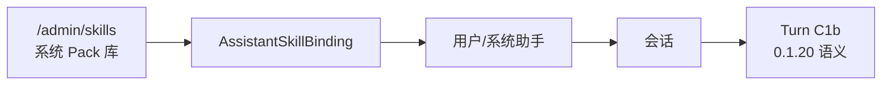
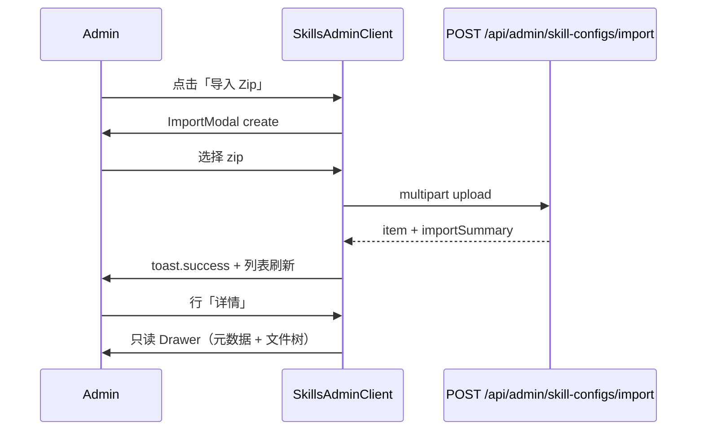
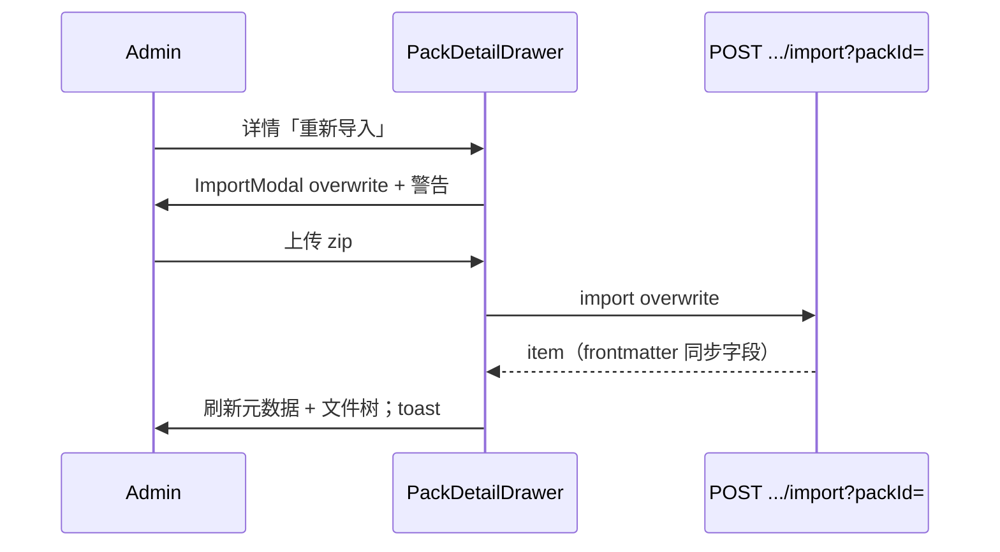
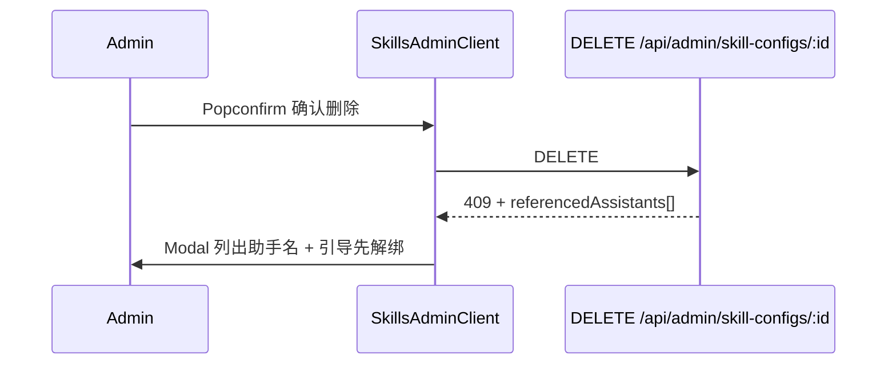
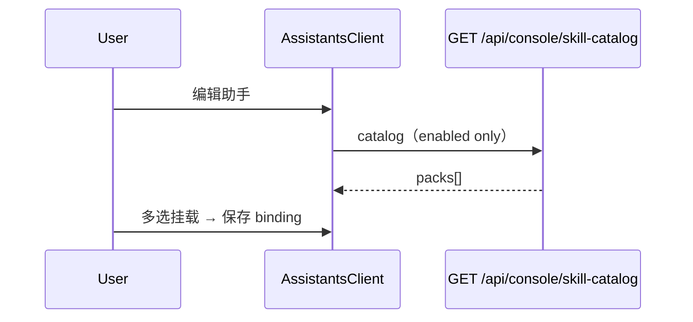
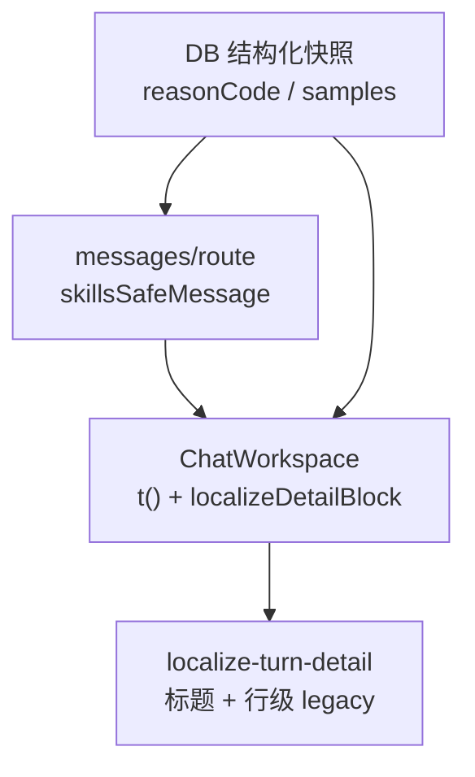

# 设计说明（总览）— Skills 治理与体验优化（version 0.1.21）

| 项 | 内容 |
| --- | --- |
| 版本 | `0.1.21` |
| 阶段 | 设计（阶段 2） |
| 上游 | `iterations/0.1.21/product/` 全套 |
| 前置设计 | `iterations/0.1.20/design/`（运行时语义 **不变**）、`iterations/0.1.17/design/`（admin 壳层） |
| 详细 spec | `spec-admin-skills.md`、`spec-console-skills-retirement.md`、`spec-chat-turn-i18n.md` |
| 文案 | `copy-admin-en-zh.md`、`copy-chat-en-zh.md` |

---

## 1. 设计目标与范围

本期在 **不改变 0.1.20 运行时语义** 的前提下完成：

| 主题 | 用户价值 | 优先级 |
| --- | --- | --- |
| Admin Skills 迁移 | 平台资产集中治理 | P0-A |
| 导入为主、零保存 | 降低操作负担，对齐 Cursor zip 工作流 | P0-B |
| 控制台退场 | 普通用户不再误以为 Pack 是个人资源 | P0-A |
| Turn i18n | 语言切换后历史 Turn 全本地化 | P0-C |
| description 回退 / failed_safe details | 列表可读性、失败可理解性 | P1 |

**非目标：** 在线 IDE、用户私有 Pack、Intent 快模型、沙箱加固、script_runs 审计 UI。

---

## 2. 信息架构

### 2.1 路由树（变更后）

```text
/[locale]/admin/skills          ← 新增：系统技能库管理（admin only）
/[locale]/admin/assistants      ← 技能包多选数据源改 catalog
/[locale]/console/assistants    ← 技能包多选数据源改 catalog；无 Skills 菜单
/[locale]/console/skills        ← 移除页面；见退场 spec
/api/admin/skill-configs/**     ← 新建：CRUD + import + files 只读
/api/console/skill-catalog      ← 新建：enabled Pack 只读列表（登录用户）
/api/console/skill-configs/**   ← 废弃写操作；路由可 410 或移除
```

### 2.2 Admin 侧栏（增量）

在 `admin-menu.tsx` **models 与 prompts 之间** 插入「技能包」项（Q25：`AppstoreOutlined`）。

```text
配置 → 用户 → 模型 → [技能包] → 提示词 → 日志 → 系统助手
```

i18n：`page.admin.shell.menu.skills` → en `Skill Packs` / zh `技能包`。

### 2.3 挂载链（不变）



---

## 3. 页面线框描述

### 3.1 Admin Skills 列表 `/admin/skills`

对齐 `ModelsClient` / `AssistantsClient`：**PageContainer ghost + 顶部 Alert + ProTable**。

```
┌─────────────────────────────────────────────────────────────────┐
│ PageContainer title: 技能包                                        │
├─────────────────────────────────────────────────────────────────┤
│ [ℹ Alert] 产品说明：导入 zip；按需加载；沙箱脚本（无「在线编辑」）      │
├─────────────────────────────────────────────────────────────────┤
│ Toolbar: [导入 Zip  primary]  [刷新]     Search: 按名称搜索        │
├─────────────────────────────────────────────────────────────────┤
│ ProTable                                                         │
│ 名称 | 描述 | 文件数 | 含脚本 | 始终加载 | 启用 | 更新时间 | 操作    │
│ ...  | ...  |   12   | [Tag]  | [Tag]    | 启用 | 2026-... | 详情   │
│                                                      重新导入 删除  │
└─────────────────────────────────────────────────────────────────┘
```

- **无主按钮「新建」**（Q9）。
- 列「始终加载」独立列（Q26），非嵌在名称下（与 0.1.20 console 名称旁 Tag 区分，提高扫描性）。
- 移除「助手引用数」列（管理员删 Pack 时由 API 返回引用列表即可；列表密度对齐 models）。

详见 `spec-admin-skills.md`。

### 3.2 Admin Pack 详情 Drawer（只读）

```
┌─ Drawer: {packName} ─────────────────────── [重新导入] [×] ─┐
│ 元数据（Descriptions 只读，2 列）                              │
│   名称 / 描述 / 启用(Tag) / 始终加载(Tag) / 更新时间            │
│   提示：修改元数据请编辑 zip 内 SKILL.md frontmatter 后重新导入   │
├──────────────────────────────────────────────────────────────┤
│ [Alert 沙箱]（hasScripts 时）                                  │
├──────────────┬───────────────────────────────────────────────┤
│ 文件树       │ 预览区（pre/code，只读）                        │
│ SKILL.md *   │ 无 Save / 无新建 / 无重命名                     │
│ scripts/     │ 超大文件：截断 +「仅显示前 N KB」                 │
└──────────────┴───────────────────────────────────────────────┘
```

**零保存按钮**（Q10）：无 Switch、无「保存设置」、无「保存文件」、无 dirty 提示。

### 3.3 导入 Modal

两种模式共用 `PackImportModal`：

| 模式 | 触发 | 标题 | 额外警告 |
| --- | --- | --- | --- |
| `create` | 列表「导入 Zip」 | Import Skill Pack | 无 |
| `overwrite` | 行操作 / 详情「重新导入」 | Re-import Skill Pack | Alert warning：替换全部文件，id 与绑定不变 |

### 3.4 控制台助手 — 技能包多选（改造）

```
┌─ 编辑助手 Drawer ─────────────────────────────────────────┐
│ … 知识库 / MCP …                                           │
│ ─── 技能包挂载 ───                                         │
│ [Alert info] 无系统 Pack 时：请联系管理员导入技能包           │
│ [Alert warning] 已选但 Pack 已禁用                         │
│ 技能包  [管理技能包 →]  ← admin 用户链至 /admin/skills      │
│ [多选 Select] name + fileCount + scripts Tag               │
│ extra: 仅加载与问题相关的包…（沿用 0.1.20）                  │
└────────────────────────────────────────────────────────────┘
```

普通用户：**无**「管理技能包」链接；空状态不提 console/skills。

### 3.5 Chat Turn C1b（i18n 改造，无新路由）

- 摘要与详情继续 SSE + `localize-turn-detail`。
- `skipped` 行 reason 改 `reasonCode` → i18n。
- `failed_safe` details 增加一行说明块（P1）。

详见 `spec-chat-turn-i18n.md`。

---

## 4. 组件与状态矩阵

### 4.1 Admin Skills 列表

| 状态 | 表现 |
| --- | --- |
| 默认 | ProTable 展示系统 Pack |
| 加载 | `loading` + 骨架由 ProTable 处理 |
| 空态 | `empty.noPacks` + 引导点「导入 Zip」 |
| 搜索无结果 | ProTable 内置 empty |
| 403 | layout 已 gate；API 403 → `getConsoleForbiddenUrl` |
| 删除成功 | toast + reload |
| 删除被引用 | Modal 错误 + 助手名列表（非 Popconfirm 内嵌） |
| 导入冲突（同名新建） | Modal error `import.conflict` |
| 导入成功 | toast + 可选 skipped 文件表 |

### 4.2 只读详情 Drawer

| 状态 | 表现 |
| --- | --- |
| 打开加载 | 全 Drawer Spin |
| 元数据 | Descriptions 只读 Tag |
| 文件树空 | Result `empty.noFiles` |
| 文件加载失败 | 预览区 Alert error + 重试 |
| 大文件 | 预览截断 + `preview.truncated` |
| 关闭 | 无 unsaved 拦截（只读） |

### 4.3 导入 Modal

| 状态 | 表现 |
| --- | --- |
| 上传中 | Progress + 禁止关闭 |
| 校验失败 | message.error（缺 SKILL.md 等） |
| 覆盖警告 | 顶部 Alert type=warning |
| skipped 文件 | Modal 内 Table 展示 path + reason |

### 4.4 控制台助手技能多选

| 状态 | 表现 |
| --- | --- |
| catalog 加载 | Select `loading` |
| catalog 空 | info Alert |
| 仅 disabled Pack 曾挂载 | warning Alert（沿用） |
| 非 admin | 无管理链接 |
| admin | `form.skills.manageLink` → `/admin/skills` |

---

## 5. 关键交互流

### 5.1 管理员导入新 Pack



### 5.2 覆盖更新



### 5.3 删除被挂载 Pack



### 5.4 普通用户配置助手



### 5.5 历史 Turn 语言切换



---

## 6. 视觉与布局规范

| 项 | 定稿 |
| --- | --- |
| 壳层 | 复用 `AdminShell` 深色 ProLayout（0.1.17） |
| 列表 | `PageContainer ghost`；`max-w-[1400px]` 与 models 一致 |
| 主 CTA | `type="primary"` + `ImportOutlined` |
| Tag 色 | enabled=green；disabled=default；hasScripts=gold；alwaysLoad=purple |
| Drawer 宽 | `width={isWide ? 920 : "100%"}`（沿用 console） |
| 文件树 | 左 240px / 预览 flex-1；`md` 以下纵向堆叠 |
| 只读预览 | `font-mono text-sm`；背景 `bg-black/20`；无 Input border |
| 无障碍 | 操作按钮保留 `aria-label`；Alert `role="alert"` |

---

## 7. 与需求 / AC 对应

| PRD / 故事 | 设计落点 |
| --- | --- |
| G1–G2 迁 admin + 控制台退场 | §2、§3.1、`spec-console-skills-retirement` |
| G3–G4 导入为主、零保存 | §3.2–3.3、`spec-admin-skills` §4–6 |
| G5 治理模型 | `spec-admin-skills` §8 |
| G6 Turn i18n | `spec-chat-turn-i18n` |
| G7 failed_safe details | `spec-chat-turn-i18n` §6 |
| G8 description 回退 | `spec-admin-skills` §7 |
| AC-1–AC-9 | 各 spec 验收表 |

---

## 8. 文件与组件迁移（frontend 指引，非本期实现）

| 源 | 目标 | 改造要点 |
| --- | --- | --- |
| `console/skills/SkillsClient.tsx` | `admin/skills/SkillsAdminClient.tsx` | API base、列、移除 create/edit |
| `console/skills/components/PackDetailDrawer.tsx` | `admin/skills/components/PackDetailDrawer.tsx` | 只读；移除 create mode |
| `console/skills/components/PackImportModal.tsx` | 同上目录 | +overwrite 模式 |
| `console/skills/pack-utils.ts` | 同上或 `src/common/skill/` | 可复用无改 |
| `messages/.../console/skills.json` | `messages/.../admin/skills.json` | 见 `copy-admin-en-zh` §9 |

---

## 9. 待 backend 3A 决策项（摘要）

| # | 议题 | 设计建议 |
| --- | --- | --- |
| B1 | 表/实体命名 | `user_skill_configs` 保留表名 vs 重命名 `skill_packs` |
| B2 | name 迁移冲突 | 后缀 `(migrated-{userId短})` 或合并策略文档化 |
| B3 | catalog API 路径 | `GET /api/console/skill-catalog` 独立 vs admin 列表子集 |
| B4 | import overwrite | `POST /import` body `packId` vs `POST /:id/import` |
| B5 | admin 文件写 API | UI 不暴露；是否 403 禁用 PATCH 文件 |
| B6 | `reasonCode` 枚举全集 | 见 `spec-chat-turn-i18n` §4.2 |
| B7 | 旧 Turn `reason` 文本 | legacy 映射表 vs 展示时忽略 reason |
| B8 | `/console/skills` 重定向 | admin 302 → `/admin/skills`；其他 404 |

---

## 10. 修订记录

| 日期 | 说明 |
| --- | --- |
| 2026-06-20 | 初稿 |
