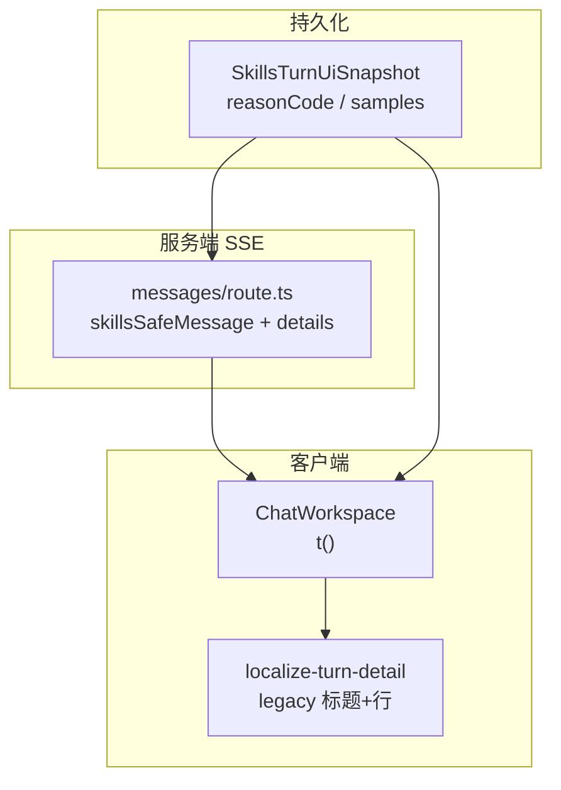

# Chat / Turn i18n 详细设计（version 0.1.21）

| 项 | 内容 |
| --- | --- |
| 版本 | `0.1.21` |
| 范围 | C1b 技能包步骤摘要、详情块、skip reason、failed_safe |
| 用户故事 | US-C1–C6 |
| 文案 | `copy-chat-en-zh.md` |
| 基线 | `iterations/0.1.20/design/copy-chat-en-zh.md` |

---

## 1. 原则

| 原则 | 说明 |
| --- | --- |
| 结构化持久化 | DB 存 `reasonCode`、path、exitCode 等；**不**存 locale 字符串 |
| 展示时 i18n | SSE 组装 + `ChatWorkspace` `t()` + `localize-turn-detail` |
| 历史兼容 | legacy 标题 + **行级**字符串映射 |
| 无新增硬编码 | 消除 `ChatWorkspace` 中英 Set |

---

## 2. 消除 ChatWorkspace 硬编码 Set（US-C2）

### 2.1 现状

`ChatWorkspace.tsx` 使用：

- `TURN_SAFE_KB_MISS`、`TURN_SAFE_MCP_*`、`TURN_SAFE_SKILLS_NOT_MOUNTED` — 中英 `safeMessage` 全文 Set
- `MCP_DISABLED_MARKERS` — 硬编码 `["未启用 MCP", "MCP not enabled"]`

用于 `shouldHideUnboundMcpStep`、`shouldHideKbMissStep`、`shouldHideUnboundSkillsStep` 等。

### 2.2 目标方案：**semantic key 匹配**

在 Turn 子步骤持久化/传输中增加可选字段 `safeMessageKey: string | null`（与现有 `safeMessage` 并存，迁移期双读）。

| 字段 | 说明 |
| --- | --- |
| `safeMessage` | 写入时的 locale 字符串（legacy；新 Turn 仍可写便于调试） |
| `safeMessageKey` | 稳定枚举，如 `turnSafe.skillsNotMounted` |

**ChatWorkspace 判断逻辑改为：**

```typescript
function stepMatchesKey(step: SubStep, key: string): boolean {
  if (step.safeMessageKey === key) return true;
  // legacy fallback：对比 en/zh 全文（迁移期保留一版 helper，集中在一文件）
  return legacySafeMessageMatches(step.safeMessage, key);
}
```

`legacySafeMessageMatches` 实现于 `src/common/chat/turn-safe-message-keys.ts`（新建），**唯一**维护 en/zh 全文对照；`ChatWorkspace` 不再内联 Set。

**MCP disabled：** 详情块 title 走 `localizeDetailBlock`；隐藏逻辑改匹配 `safeMessageKey === "turnSafe.mcpDisabled"` 或 legacy `MCP_DISABLED_MARKERS` 迁入 legacy map。

### 2.3 messages/route.ts

`skillsSafeMessage`、`mcpSafeMessage`、`kbHitSafeMessage` 返回值同时设置 `safeMessageKey`（与 `tApiMessage` key 路径一致，如 `turnSafe.skillsLoaded`）。

### 2.4 验收

- `ChatWorkspace.tsx` 无 `new Set([en..., zh...])` 硬编码
- Turn 卡片折叠/隐藏行为与 0.1.20 一致

---

## 3. localize-turn-detail 扩展（US-C1、US-C3）

### 3.1 标题级 legacy（已有）

继续维护 `LEGACY_DETAIL_STRING_TO_KEY` 对 `skillsMountedTitle` 等映射。

### 3.2 行级 legacy（缺口补齐）

详情 `content` 为多行文本。切换 locale 时需解析每一行。

**新增函数：**

```typescript
export function localizeDetailContentLines(
  content: string,
  t: ChatTranslator,
): string;
```

**行模式与 i18n key：**

| 模式 | regex / 规则 | i18n key |
| --- | --- | --- |
| 已加载名 | `^· (.+)$` 且在 loaded 块上下文 | `turn.detail.skillsLoadedNameLine` |
| 未选用（有 reason） | `^· (.+) — (.+)$` | `skillsSkippedLine` + reason 本地化 |
| 未选用（无 reason） | `^· (.+)$` 在 skipped 块 | `skillsSkippedLineNoReason` |
| 已读文件 | `^· (.+)[：:](.+)$` | `skillsReadLine` |
| 已运行脚本 | `^· (.+)[：:](.+)（退出码 (\d+)）$` 等 | `skillsScriptRunLine` |

**块上下文：** 优先依赖结构化快照渲染（新 Turn）；legacy 仅当 `content` 为纯文本时，按行启发式 + 父块 `title` 已本地化后的语义。

**更优路径（推荐 backend 3A）：** 详情块增加 `lines: Array<{ type, ... }>` 结构化行；前端直接 `t()` — legacy 仅服务旧数据。

设计 **P0 最低交付：** 文本行级 `localize-turn-detail` 扩展 + 结构化行 **P1 可选**。

### 3.3 legacy 中文 reason 行

历史 Turn `skipped` 行 reason 为 LLM 中文自由文本：

| 策略 | 说明 |
| --- | --- |
| 有 `reasonCode` | `t(turnSafe.detail.skillsSkipReason.{code})` |
| 仅旧中文 reason | 映射不到 code 时 **仅显示包名**（`skillsSkippedLineNoReason`） |
| 可选 | 常见中文 reason 短语 → code 的 legacy 表（小规模） |

---

## 4. reasonCode 枚举（Q16）

### 4.1 持久化字段

`SkillsTurnUiSnapshot.skipped[]` 项演进：

```typescript
type SkippedPackSnapshot = {
  id: string;
  name: string;
  reasonCode?: SkillPackSkipReasonCode | null;  // 新增
  reason?: string | null;                       // legacy only，新 Turn 不写
};

type SkillPackSkipReasonCode =
  | "unrelated"           // 与问题无关
  | "low_confidence"      // 模型判断不需要
  | "user_small_talk"     // 寒暄
  | "duplicate_coverage"  // 已被其他包覆盖
  | "other";              // 兜底
```

### 4.2 Intent agent 改造（backend）

- Prompt 要求 `reasons` 输出 **code** 而非自由文本：`{"uuid":"unrelated"}`
- 解析失败时 **不** 落库自由文本；省略 reasonCode
- `skill-pack-intent-agent.ts` system prompt 中英改为 code 列表说明

### 4.3 i18n keys

命名空间：`api.message.turnSafe.detail.skillsSkipReason.*`  
镜像：`page.chat.turn.detail.skillsSkipReason.*`

| code | en | zh |
| --- | --- | --- |
| `unrelated` | Unrelated to this question | 与当前问题无关 |
| `low_confidence` | Not needed for this turn | 本轮不需要 |
| `user_small_talk` | Small talk | 寒暄闲聊 |
| `duplicate_coverage` | Covered by another pack | 已由其他包覆盖 |
| `other` | Not selected | 未选用 |

**展示：**

```typescript
const reasonLabel = item.reasonCode
  ? t(`turn.detail.skillsSkipReason.${item.reasonCode}`)
  : null;
// skillsSkippedLine: · {name} — {reason}
```

### 4.4 SSE / details 组装

`skillsDetailsFromUi`（`messages/route.ts`）skipped 块：

- 新数据：用 `reasonCode` 查 i18n 得 `{reason}`
- legacy：走 §3.3

---

## 5. failed_safe 详情（P1 — Q17）

### 5.1 触发

`intentSource === "failed_safe"` 且 `mounted.length > 0`。

### 5.2 摘要（不变）

`turnSafe.skillsSelectionFailed`

### 5.3 详情增量

在「未选用」块之后或 `skillsNote` 块内增加 **一行** body：

| Key | en | zh |
| --- | --- | --- |
| `skillsIntentFailedBody` | Selection service was unavailable (timeout or parse error). Optional packs were skipped this turn. | 选用服务暂不可用（超时或解析失败），已跳过可选技能包。 |

**禁止暴露：** `timeout`、`intent_json_parse_failed`、stack。

### 5.4 UI 密度

不新增折叠组件；作为 details 内普通文本块（与 `skillsNoAssistantBody` 同级）。

可选：`Typography.Text type="secondary"` 单行。

---

## 6. messages en/zh parity（US-C3）

### 6.1 扫描范围

| 文件 | 前缀 |
| --- | --- |
| `messages/{en,zh}/page/chat.json` | `turn.*`、`messages.*` |
| `messages/{en,zh}/api/message.json` | `turnSafe.*` |
| `messages/{en,zh}/page/admin/skills.json` | 全量（新） |

### 6.2 同步规则

- `page.chat.turn.detail.*` 与 `api.message.turnSafe.detail.*` **key 集合一致**（0.1.20 模式）
- 新增 `skillsSkipReason.*`、`skillsIntentFailedBody` 双端同步
- CI 或脚本 diff key 集合（frontend 实施）

### 6.3 turn.stage / turn.status（US-C6）

确认 `page.chat.json` 中 `turn.stage.skill`、`turn.status.*` en/zh 齐全；无新增 key 若已对齐。

---

## 7. 数据流总览



---

## 8. 验收对照

| AC | 满足方式 |
| --- | --- |
| AC-C1-1–4 | §2–§4、§3 |
| AC-C2-1–3 | §2 |
| AC-C3-1–3 | §6 |
| AC-C4-1–4 | §4 |
| AC-C5-1–3 | §5 |
| AC-C6-1–3 | §6.3 |
| 测试 #17 | en UI 历史 Turn 全英文 |

---

## 9. 待 backend 3A 决策

| # | 议题 |
| --- | --- |
| T1 | `safeMessageKey` 是否写入 DB 或仅 SSE 透传 |
| T2 | 详情 `lines[]` 结构化是否本期做 |
| T3 | `reasonCode` 枚举是否扩展 `policy_excluded` 等 |
| T4 | 旧 Turn 批量迁移 reasonCode 与否（默认不迁移） |
| T5 | `failed_safe` 是否持久化 `failureKind: timeout \| parse` 供细分 copy（默认否，统一一句） |

---

## 10. 修订记录

| 日期 | 说明 |
| --- | --- |
| 2026-06-20 | 初稿 |
