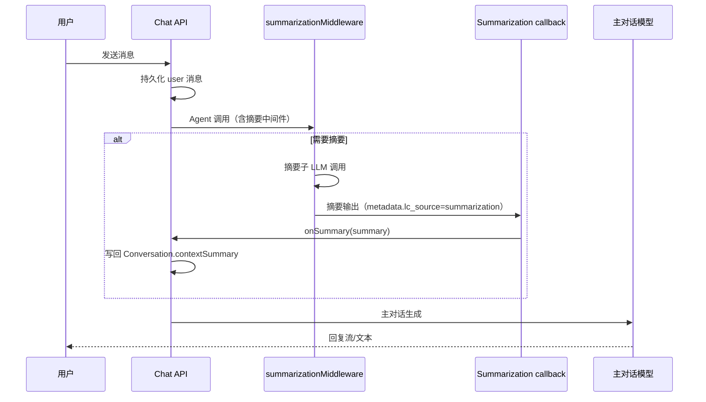

# 设计说明：多轮对话摘要（会话存储 + 配置管理 Card + LangChain 摘要中间件）

## 文档信息

| 项 | 内容 |
| --- | --- |
| 版本 | `0.1.4` |
| 对应 PRD | [`iterations/0.1.4/product/prd-conversation-summary.md`](../product/prd-conversation-summary.md) |
| 管理后台壳 | [`iterations/0.0.3/design/spec-admin-console.md`](../../0.0.3/design/spec-admin-console.md)（ProLayout、深色主题、PageContainer、`/admin` 鉴权） |
| 参考实现风格 | [`iterations/0.0.4/design/spec-prompt-management.md`](../../0.0.4/design/spec-prompt-management.md)（`data/*.json`、原子写、表单校验与告警） |
| 范围 | **配置管理页**增量、**运行时 JSON** 与 **constants 默认值**、**会话摘要字段**与 **LangChain `summarizationMiddleware` + callback 落库** 的职责划分（API 细节见后端文档） |

---

## 1. 设计结论摘要（相对 PRD 的定稿）

| PRD 待定项 | 本设计结论 |
| --- | --- |
| 7.2 触发时机 | **默认**：摘要由 LangChain `summarizationMiddleware` 在主对话调用链路中**同步**触发；失败则**保留旧摘要**并记录日志，**不阻塞**主对话流（用户侧不出现单独「摘要加载中」状态）。后续若需异步队列，可在不改变 Card 字段结构的前提下扩展。 |
| 提示词与业务 JSON 分工 | **沿用 PRD 推荐**：`contextSummarySystem` / `summarySystemPrefix` 的**文案与占位符**继续走现有 **`data/promptConfig.json` + `DEFAULT_PROMPT_CONFIG` 合并**（见 `src/server/prompt-config/`）。**`data/conversationSummaryConfig.json`** 承载 **enabled、`maxChars`、mode、summaryTrigger/Keep（tokens 与 messages 两套）**与 `summaryMinRecentMessages`；`maxChars` 由服务端替换，`{messages}` 由 middleware 运行时注入。 |
| 7.3 会话 API | **不**在 `GET /api/chat/conversations/:id` 响应体中增加摘要字段；聊天列表与详情**无**摘要展示需求。 |

---

## 2. 信息架构：`/admin/config`

### 2.1 现状与目标

- **现状（历史）**：`/admin/config` 曾为占位页。
- **目标**：同一路由下使用 **`PageContainer` + 纵向多 Card** 布局：**首张 Card 为本迭代「对话摘要」**；页面底部可保留一行次要说明（持久化路径、与提示词模版关系），便于运营理解。

### 2.2 页面结构（自上而下）

| 区域 | 内容 | 组件建议 |
| --- | --- | --- |
| 标题区 | `title="配置管理"`；**可选** `subTitle`：一句「系统级运行时参数（JSON 持久化至 data 目录）」 | `PageContainer` `ghost` 与 [`spec-admin-console`](../../0.0.3/design/spec-admin-console.md) 一致 |
| 条件告警 | 当 **`conversationSummaryConfig.json` 损坏或无法解析** 时，顶部 **`Alert` type="warning"**，说明已回退内置默认、保存后将写回合法文件 | 与提示词页「整文件级 JSON 错误」一致 |
| **Card：对话摘要** | 见 §3 | `Card`，`size` 与 admin 内其他表单页协调 |
| 页尾说明（可选） | 文案：摘要**提示词**在「提示词模版」页编辑；本 Card 仅管**开关与数值** | `Typography.Paragraph type="secondary"` |

**未来扩展**：新增系统配置时**追加 Card**，**不**新增侧栏菜单项（与 PRD「配置管理中单独一张 Card」一致，且避免菜单膨胀）。

### 2.3 鉴权与深链

- 与壳文档一致：未登录 **redirect** ` /login?redirect=/admin/config`。
- 无子路由；深链即 `/admin/config`。

---

## 3. Card「对话摘要」— 字段与交互

### 3.1 表单字段（建议）

以下字段对应 **`DEFAULT_CONVERSATION_SUMMARY_CONFIG`（constants）** 与 **`data/conversationSummaryConfig.json`** 合并后的**可编辑子集**（实现可用 **antd Form**：`Switch`、`InputNumber`、可选 `Select`）。

| 字段 key（建议） | 类型 | 说明 |
| --- | --- | --- |
| `enabled` | boolean | 总开关；关闭时不挂载摘要中间件，不更新会话摘要字段。 |
| `maxChars` | number | 传给 `contextSummarySystem` 的 `{maxChars}`（摘要生成提示词参数）；**正整数**，上限可在常量中设封顶（如 ≤ 32000）防止误填。 |
| `mode` | `tokens \| messages` | 摘要触发口径：**tokens** 或 **messages**（与 `summaryTrigger*` / `summaryKeep*` 配对使用）。 |
| `summaryTriggerTokens` / `summaryKeepTokens` | number | **tokens 模式**下：触发阈值与保留窗口（token 预算）。 |
| `summaryTriggerMessages` / `summaryKeepMessages` | number | **messages 模式**下：触发阈值与保留消息条数。 |
| `summaryMinRecentMessages` | number | 摘要后最少保留的最近原文消息条数（跨模式生效，保障近几轮细节）。 |

### 3.2 与「提示词模版」的交叉说明

- Card 内 **不**嵌入整段 `contextSummarySystem` 编辑区（避免与 `/admin/prompts` 重复）；提供 **文字链接** `href="/admin/prompts"`（新标签打开可选）：「编辑摘要相关提示词（contextSummarySystem / summarySystemPrefix）」。
- `maxChars` 在本 Card 修改后，**下次**摘要生成时传入合并后的模板。

### 3.3 校验与保存

- **客户端**：`enabled` 为真时，`maxChars`、模式字段与对应 trigger/keep 必填；范围校验与后端一致。
- **服务端**：PUT 前 **zod（或等价）** 校验；非法返回 400，**不**覆盖磁盘文件。
- **持久化**：与 `promptConfig` 相同模式 — **原子写入** `data/conversationSummaryConfig.json`（见后端实现）。

### 3.4 加载与重置

- 进入页面：GET 合并后的配置（内置默认 ⊕ 文件覆盖）。
- **重置**：「恢复默认」= 用内置常量重新填充表单；**保存**后才写入文件（与提示词页「重置为当前已加载值」区分，可在实现说明中二选一文案）。

---

## 4. 运行时配置：文件与常量

### 4.1 路径与命名

| 用途 | 路径 |
| --- | --- |
| 用户可编辑 JSON | 项目根 `data/conversationSummaryConfig.json` |
| 内置默认 | `src/common/constants/defaultConversationSummaryConfig.ts`（文件名以最终实现为准，须从 `@/common/constants` 导出） |

### 4.2 JSON 形状（建议，与后端 schema 一致）

```json
{
  "enabled": true,
  "maxChars": 2000,
  "mode": "messages",
  "summaryTriggerTokens": 6000,
  "summaryKeepTokens": 2000,
  "summaryTriggerMessages": 30,
  "summaryKeepMessages": 12,
  "summaryMinRecentMessages": 6
}
```

缺省键由合并逻辑补全为常量默认。

### 4.3 合并规则

1. 读取文件；不存在或 `null` → 视为**无覆盖**。
2. 与 `DEFAULT_*` **深合并**（对象一层即可，本结构无嵌套对象）。
3. 校验失败 → 告警 + 表单展示默认；**不**自动写盘修复（与 prompt 页一致，可选「一键保存默认」由产品决定）。

---

## 5. 会话（Conversation）数据模型（设计层）

| 列（建议名） | 类型 | 说明 |
| --- | --- | --- |
| `contextSummary` | `text`，nullable | 当前滚动摘要正文；无则 `null`。 |
| `contextSummaryUpdatedAt` | `datetime`，nullable | 上次成功写入摘要的时间。 |

**可选（排障）**：`contextSummaryModelSnapshot`（varchar，nullable）— 记录生成时模型 id 片段；首期可省略以减复杂度。

**删除会话**：随会话删除一并清除（与消息清理策略一致）。

---

## 6. 对话链路中的行为（概念）

### 6.1 上下文组装顺序（逻辑）

1. 读取合并后的 `conversationSummaryConfig` 与 prompt 模板（`contextSummarySystem`、`summarySystemPrefix`）。
2. 创建主对话 Agent：当 `enabled` 为真时挂载 `summarizationMiddleware`（`trigger` / `keep` 与 `mode` 对齐）。
3. 摘要子调用完成后，通过 callback 将摘要文本写回 `Conversation.contextSummary`（供下次加载读取）。
4. 主对话继续执行；对用户侧 API **不暴露**摘要字段（PRD 7.3）。

### 6.2 流程图



### 6.3 失败与可观测性

- 摘要子调用失败：**不**阻断主对话；可不更新 `contextSummary`；建议结构化日志（conversationId、阶段）。
- 不在用户侧展示摘要失败 toast（避免噪音）；管理端排障依赖日志与未来「日志查询」模块。

---

## 7. 实现对齐（代码路径）

| 能力 | 路径 |
| --- | --- |
| 摘要中间件 | `src/server/llm/assistant.ts` |
| 摘要落库 callback | `src/server/llm/callback.ts`、`src/server/chat/assistant.ts` |
| 消息路由写库 | `src/app/api/chat/conversations/[conversationId]/messages/route.ts` |
| 配置读取 | `src/server/chat/conversation-summary.ts` |

---

## 8. 验收（设计侧）

| 项 | 标准 |
| --- | --- |
| IA | `/admin/config` 可见「对话摘要」Card，且页面仍为 admin 深色壳内一致体验 |
| 配置 | 修改 `enabled` / `maxChars` / `mode` / `summaryTrigger*` / `summaryKeep*` 可保存并在重启后从文件恢复 |
| 追溯 | 运营能区分「提示词模版」与「对话摘要数值配置」的职责（链接与说明文案） |

---

## 9. 下游文档

- **后端**：见 `iterations/0.1.4/backend/api-spec-conversation-summary.md`、`data-models.md`、`implementation-notes.md`。
- **前端**：见 `iterations/0.1.4/frontend/implementation-notes.md`；**不**改 `GET conversation` 消费侧（无摘要字段）。

---

**本阶段产出路径**：`iterations/0.1.4/design/spec-conversation-summary.md`
