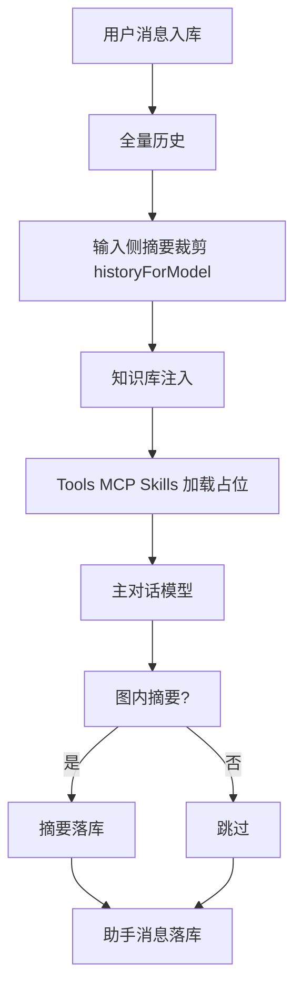
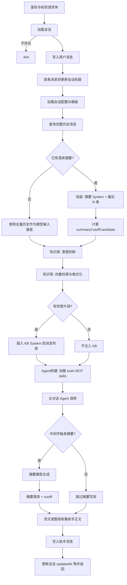
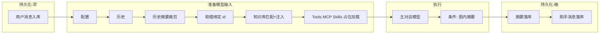
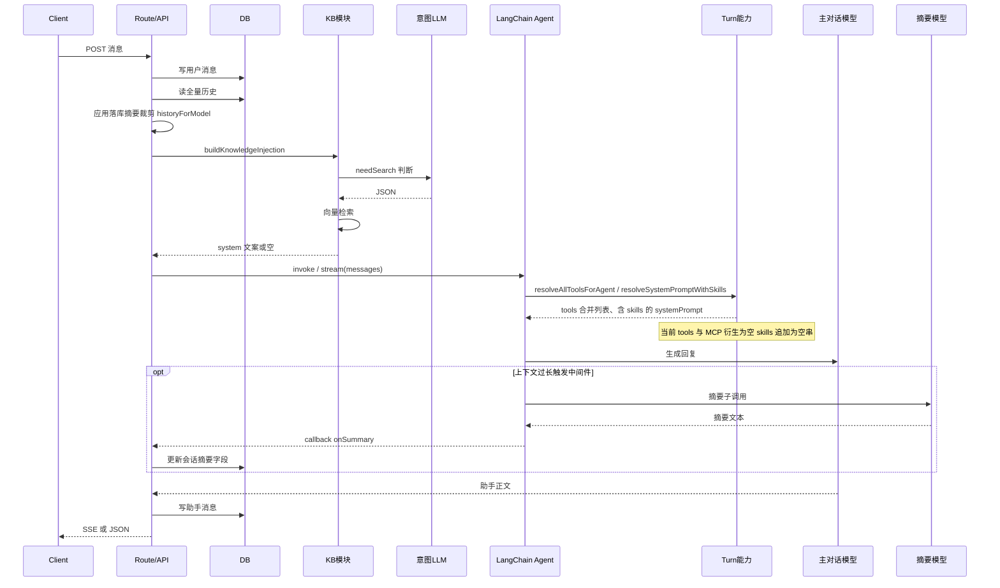

# 设计规格：对话单轮链路（Turn Pipeline）

**迭代版本**：`0.1.7`  
**对应需求**：[`../product/prd-chat-turn-pipeline.md`](../product/prd-chat-turn-pipeline.md)

本文描述「用户发送一条消息 → 服务端生成助手回复 → 持久化」的**阶段划分**、**数据依赖**、**与当前代码的映射**，并给出 **Mermaid 图表**（流程图、主路径图、时序图、数据依赖图）。实现重构时以本文与代码联调为准；若代码变更，应同步更新本文「实现映射」一节。

本迭代实现策略为“**文档先行 + 最小重构试点**”：保留路由层主分支（A/F）与 Agent 层（D）职责边界，仅将 B→C 收敛为可复用编排入口（`prepareModelInputForPostMessage`，`RunnableSequence`）。

---

## 1. 术语

| 术语 | 含义 |
|------|------|
| **Turn** | 用户一次发送消息并触发服务端处理直到返回（含流式）的完整回合。 |
| **输入侧摘要** | 会话已持久化 `contextSummary` 时，在构造模型输入时用「摘要 system + 最近 N 条消息」替代全量历史，降低 tokens。 |
| **图内摘要** | LangChain `summarizationMiddleware` 在上下文超过阈值时触发的摘要子调用；使用独立摘要模型，并通过 tag 与主回复流区分。 |
| **知识库注入** | 检索结果仅作为**额外 System 消息**进入本轮模型输入，**不写入**消息表。 |
| **Tools 加载** | 解析本 Turn 可用的 LangChain 原生工具列表（当前为空数组，保留加载函数）。 |
| **MCP 加载** | 解析 MCP 绑定并转为 LangChain Tool（当前绑定与衍生工具均为空，保留加载链路）。 |
| **Skills 加载** | 解析服务端技能包引用，将额外系统文案合并进最终 `systemPrompt`（当前为空，保留加载函数）。 |

---

## 2. 阶段清单与顺序

| 序号 | 阶段 | 产出 / 副作用 |
|------|------|----------------|
| 1 | 请求与校验 | 鉴权失败则 401；body 非法则 422 |
| 2 | 加载会话 | 会话不存在则 404 |
| 3 | 用户消息落库 | 生成用户 `Message` 记录，`sortOrder` 递增 |
| 4 | 会话标题 / 时间 | 首条用户消息可更新 `title`；更新 `updatedAt` |
| 5 | 加载配置与模板 | `getConversationSummaryConfig`、`getSummaryPromptTemplates` |
| 6 | 加载全量历史 | 按 `sortOrder` ASC 查询该会话全部消息（含刚写入的用户消息） |
| 7 | 输入侧摘要组装 | 若存在 `contextSummary`：构造 `historyForModel = [摘要System, ...recent]`，并计算 `summaryCutoffCandidate` |
| 8 | 助理绑定 | `conversation.assistantId`；基础系统提示在 Agent 构建前解析 |
| 9 | 知识库 | `buildKnowledgeInjectionForChat`：意图 LLM → 向量检索 → 可选插入 KB System |
| 10 | **Tools / MCP / Skills 加载** | `resolveAllToolsForAgent`、`resolveSystemPromptWithSkills`：合并原生工具、MCP 工具、技能包追加文案（**当前均为空实现**） |
| 11 | 主对话 | `invokeAssistantReply` / `streamAssistantReply` → `getAssistantAgent` → `createAgent({ tools })` |
| 12 | 图内摘要（条件） | `summarizationMiddleware` 触发时对摘要模型调用；流式响应中过滤摘要 tag |
| 13 | 摘要落库（条件） | `onSummary` → 更新 `contextSummary`、`contextSummaryCutoffSortOrder` 等 |
| 14 | 助手消息落库 | 写入助手 `Message`；返回前可读会话以带上 `title` / `updatedAt` |

---

## 3. 数据依赖（逻辑）

```text
用户消息入库 → 全量历史查询 → 输入侧摘要裁剪（若有） → 知识库注入（若有）
       → Agent 构建：tools + MCP + skills 解析（当前空） → 主对话 Agent
       → [可选] 图内摘要子调用 → 摘要落库 → 助手消息落库
```



---

## 4. 流程图（整体）



---

## 5. 主路径简化图



---

## 6. 时序图



---

## 7. 实现映射（当前代码，便于对照）

| 概念 | 代码位置（示例） |
|------|------------------|
| POST 路由、历史、输入侧摘要、KB 注入、摘要/助手落库 | `src/app/api/chat/conversations/[conversationId]/messages/route.ts` |
| 消息转 LangChain、invoke/stream | `src/server/chat/assistant.ts` |
| `createAgent`、摘要中间件、流式过滤摘要 | `src/server/chat/langchain-agent.ts`（`server/llm` 仅 model/callback） |
| **Tools / MCP / Skills 占位加载** | `src/server/chat/turn-capabilities.ts` |
| 摘要回调落库 | `src/server/llm/callback.ts`（`SummarizationLlmCallbackHandler`） |
| 对话模型 / 摘要模型解析 | `src/server/chat/llm-runtime.ts` |
| 知识库注入与意图 | `src/server/knowledge-base/injection.ts`、`knowledge-retrieval-intent-agent.ts`、`search.ts` |

---

## 8. 扩展原则（tools / MCP / skills）

- **Tools**：在 `loadToolsForChatTurn` 中按 `assistantId`、用户权限返回 LangChain `Tool[]`；由 `resolveAllToolsForAgent` 与 MCP 衍生工具合并后传入 `createAgent`。
- **MCP**：在 `loadMcpBindingsForChatTurn` 返回绑定列表，在 `mcpBindingsToLangChainTools` 中适配为 Tool（或官方 MCP 桥接），**不**在路由直接调用 MCP。
- **Skills（产品语义）**：在 `loadSkillPackRefsForChatTurn` 与 `skillRefsToExtraSystemText` 中解析注册表，合并进系统提示（或后续改为独立 System 消息）；与 Cursor 编辑器内的 Skill 文件不是同一层级。

后续实现迭代应在 `backend/` 文档中补充具体 API 变更与迁移说明。

---

## 9. Branch 迁移 Step 清单（名称与职责）

若以 **branch** 方式重构路由与 Agent 编排，可按命名 step 对齐实现，详见 **[pipeline-branch-steps.md](./pipeline-branch-steps.md)**（与本文阶段表互补，粒度更贴近函数拆分）。

---

## 10. 0.1.7 落地对齐（文档与代码）

- 已落地：A1/A3/B/C/E1 抽到 `src/server/chat/post-message-pipeline.ts`。
- 已落地：`prepareModelInputForPostMessage`（`RunnableSequence`）串联 B→C。
- 已落地：`server/llm` 目录收敛为 `model.ts` / `callback.ts`；`createAgent` 编排在 `src/server/chat/langchain-agent.ts`。
- 未在本期落地：F3（流式响应构造进一步抽离为独立 responder）与前端阶段状态事件协议（`stage` telemetry）。
