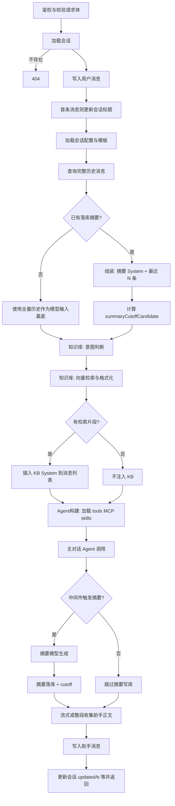
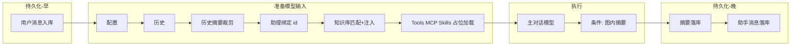
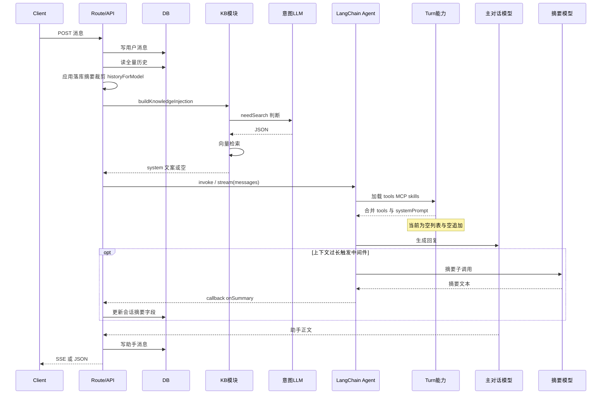

# PRD：对话单轮链路编排（文档化）

**迭代版本**：`0.1.7`

## 1. 背景

当前聊天链路包含多类步骤：配置解析、历史与摘要裁剪、助手绑定、知识库意图与检索、主对话模型、图内摘要与摘要落库、用户/助手消息与会话字段持久化等。逻辑分散在 API 路由、知识库模块与 LangChain Agent 层，**缺少统一、可引用的阶段说明**，不利于排障、成本核算与后续扩展（tools、MCP、服务端 skills 等）。

## 2. 目标 / 非目标

### 2.1 目标

- 在迭代文档中建立**单轮对话（Turn）**的**阶段清单**与**数据依赖**，并与现有实现大致对齐。
- 保留可渲染的 **Mermaid 流程图、简化主路径图、时序图**（与 [`../design/spec-chat-turn-pipeline.md`](../design/spec-chat-turn-pipeline.md) 一致），作为后续重构或扩展的共识基础。
- 标明两类「摘要」：**输入侧使用已落库摘要** vs **运行期图内摘要生成与落库**，避免概念混淆。

### 2.2 非目标（本期不做）

- 不做全链路“全量图化”或大规模目录迁移；仅允许围绕可读性与复用性的最小试点重构（见 2.3）。
- 不在此 PRD 中规定具体 tools/MCP 清单（仅给出扩展落点原则，见设计文档）。

### 2.3 本期实现策略（统一口径）

- 采用“**文档先行 + 最小落地试点**”策略：
  - 文档层：固化 A→F 阶段、图表与步骤清单；
  - 代码层：在不改变业务语义前提下，落地最小重构（B→C 组合编排）。
- 服务端已落地：
  - `src/server/chat/post-message-pipeline.ts`：抽出 A1/A3/B/C/E1 步骤函数；
  - `prepareModelInputForPostMessage`（`RunnableSequence`）：串联 B（历史+摘要窗口）→ C（知识库注入）；
  - `server/llm` 目录收敛为 `model.ts` / `callback.ts`，Agent 编排在 `src/server/chat/langchain-agent.ts`。

## 3. 用户与受众

- **主要受众**：后端/全栈研发、技术负责人（维护与扩展对话链路）。
- **次要受众**：产品/测试（理解「为何有多段模型调用」与持久化顺序）。

## 4. 功能范围（文档交付）

### 4.1 本期要做

- 需求文档（本文件）：背景、目标、阶段表、与图表交叉引用。
- 设计文档：完整流程图、时序图、实现映射表、扩展原则。

### 4.2 验收标准（AC）

- [ ] `iterations/0.1.7/product/` 与 `iterations/0.1.7/design/` 均包含**可渲染的 Mermaid 图表**（与下文「5. 图表索引」一致或设计文档为权威全文）。
- [ ] 文中明确：**用户消息**先于模型调用持久化；**助手消息**在模型输出完成后持久化；**会话摘要字段**在摘要子调用完成后更新（若启用）。
- [ ] 知识库路径写清：**意图判断（额外 LLM）**与**向量检索**的顺序。
- [ ] 服务端最小重构试点已记录：`post-message-pipeline.ts` 与 `prepareModelInputForPostMessage`（`RunnableSequence`）覆盖 B→C。
- [ ] 文档口径与实现一致：`server/llm` 仅保留 `model.ts` / `callback.ts`，Agent 编排位于 `chat/langchain-agent.ts`。

## 5. 图表索引

以下图表的完整版本与说明见 **[设计规格：对话单轮链路](../design/spec-chat-turn-pipeline.md)**。本 PRD 保留相同图表副本，便于只读需求侧时自洽。

### 5.1 阶段总表

| 阶段 | 内容 |
|------|------|
| 请求与校验 | 鉴权、body 校验 |
| 用户消息落库 | 写入用户消息后再拉历史 |
| 配置与模板 | 会话摘要配置、摘要模板 |
| 历史加载 | 全量消息按 sortOrder |
| 输入侧摘要 | 若有 `contextSummary`，组装「摘要 system + 最近 N 条」 |
| 助理 | `assistantId` 绑定；系统提示在 Agent 内解析 |
| 知识库 | 意图 LLM → 向量检索 → 可选 system 注入（不落库） |
| Tools / MCP / Skills | Agent 构建时：`resolveAllToolsForAgent`、`resolveSystemPromptWithSkills`（**当前均为空列表/空追加，保留加载机制**） |
| 主对话 | LangChain `createAgent({ tools })` |
| 图内摘要 | `summarizationMiddleware` 条件触发、摘要模型 |
| 摘要落库 | 回调写入会话摘要与 cutoff |
| 助手消息落库 | 写入助手回复 |

### 5.2 流程图（整体）

### 5.3 主路径简化图

### 5.4 时序图

## 6. 待设计 / 后续迭代（提示）

- 将路由内编排收敛为单一 `prepareChatTurn`（或等价模块）仅为**建议**；落地时以设计文档中的扩展原则为准。
- tools、MCP、服务端「技能包」已在链路中占位：`src/server/chat/turn-capabilities.ts`；实现具体注册表时在上述函数内扩展并更新本链路图（若有行为变化）。

